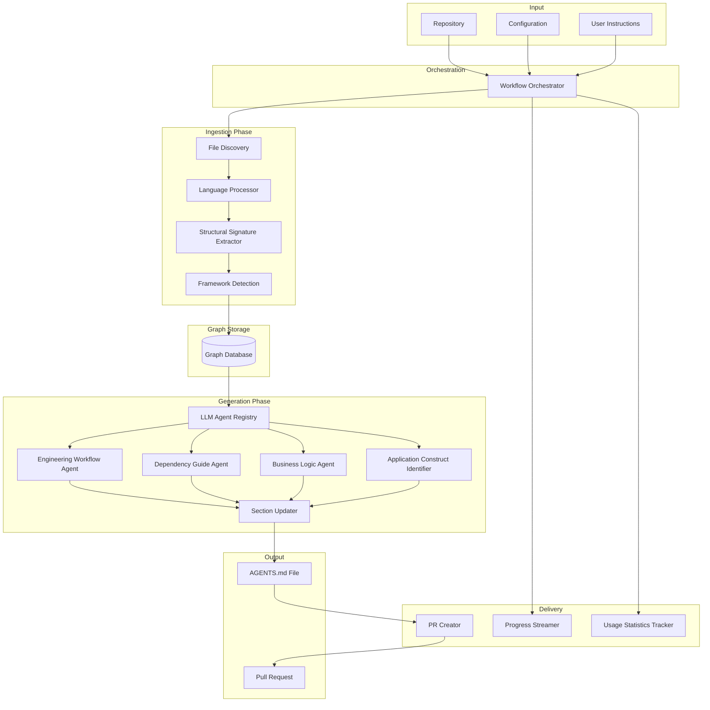

# Design Document: Unoplat Code Confluence

## Overview

The Unoplat Code Confluence Context Engine is a system that automatically analyzes code repositories and generates machine-readable AGENTS.md files containing structured context about codebases. The system operates in two phases: an **Ingestion Phase** that parses source code into structural signatures and detects framework-specific patterns, and a **Generation Phase** that uses LLM-based agents as the primary extraction mechanism to produce AGENTS.md sections.

The engine is built around four pillars:

1. **Accurate context** — Generates AGENTS.md files containing engineering workflow commands, dependency guides, business logic domain analysis, and application construct identification
2. **Trusted commands** — Engineering commands validated with confidence scoring and evidence-based extraction
3. **Right skills** — Agent recommendations matched to codebase context
4. **Self-hostable, reliable, and auditable** — Fully self-hostable with durable workflows, retry policies, structured audit logs, and complete traceability

The engine addresses the challenge of AI coding agents struggling with brownfield codebases by providing them with accurate, up-to-date knowledge about engineering workflows, business logic, application constructs, and dependencies — eliminating the need for agents to burn context windows on exploration.

## Architecture

The Context Engine follows a two-phase, modular architecture. The Ingestion Phase performs deterministic structural extraction and stores results in a graph database. The Generation Phase uses LLM agents to analyze ingested data and produce AGENTS.md sections, with delivery via progress streaming and pull requests.

### High-Level Architecture



### Component Layers

1. **Orchestration Layer**: Manages durable workflow execution with parent-child patterns, continue-and-collect error strategy, retry policies, and audit logging
2. **Ingestion Layer**: Discovers source files, processes them through language-specific processors, extracts structural signatures, and detects framework patterns — storing results in a graph database
3. **Generation Layer**: Uses LLM agents (one per AGENTS.md section) to analyze ingested data, with section-scoped updaters enforcing write boundaries
4. **Delivery Layer**: Streams real-time progress events, creates pull requests with one-shot semantics, and tracks per-agent usage statistics
5. **Configuration Layer**: Manages model provider settings, tool credentials, framework definition loading, and user-specific repository instructions

## Components and Interfaces

### 1. File Discovery Service

**Responsibility**: Identifies source code files to analyze while respecting ignore patterns and tracking file changes.

**Interface**:
```python
class FileDiscoveryService:
    def discover_files(
        self,
        repository_path: Path,
        ignore_patterns: List[str]
    ) -> List[SourceFile]:
        """
        Discover source code files in repository.

        Args:
            repository_path: Root path of repository
            ignore_patterns: Patterns to exclude (from .gitignore, config)

        Returns:
            List of SourceFile objects with path and detected language
        """
        pass
```

**Key Behaviors**:
- Recursively traverses repository directory structure
- Skips binary files, generated code, and files matching ignore patterns
- Uses file extensions and shebangs to detect programming languages

### 2. Language Processor

**Responsibility**: Provides language-specific structural extraction using the strategy pattern. Each supported language implements its own extraction logic for parsing source code into structural signatures.

**Interface**:
```python
class LanguageProcessor(ABC):
    @abstractmethod
    def get_language(self) -> ProgrammingLanguage:
        """Return the programming language this processor handles."""
        pass

    @abstractmethod
    def extract_structural_signature(
        self,
        source_file: SourceFile
    ) -> StructuralSignature:
        """
        Extract structural signature from a source file.

        Args:
            source_file: Source file to process

        Returns:
            StructuralSignature with functions, classes, imports, types
        """
        pass
```

**Key Behaviors**:
- Strategy pattern — each language implements its own processor
- Extracts function definitions (name, parameters, return type, docstring, decorators, positions)
- Extracts class definitions (name, base classes, methods, attributes, docstring, positions)
- Extracts import statements (module, imported names, aliases)
- Extracts type definitions (interfaces, enums, type aliases)
- Handles parse errors gracefully, logging errors and continuing with other files
- Supports Python, TypeScript (including .tsx), and is extensible to additional languages

### 3. Framework Detection Service

**Responsibility**: Identifies framework-specific patterns using declarative Framework Definitions loaded at startup, leveraging import-gated, regex-based detection with concept types.

**Interface**:
```python
class FrameworkDetectionService(ABC):
    @abstractmethod
    async def detect_features(
        self,
        source_code: Optional[str],
        imports: List[str],
        structural_signature: StructuralSignature,
        programming_language: str
    ) -> List[Detection]:
        """
        Detect framework features in source code.

        Args:
            source_code: Source code content
            imports: List of import statements
            structural_signature: Parsed structural signature
            programming_language: Language identifier

        Returns:
            List of Detection objects for framework features found
        """
        pass
```

**Key Behaviors**:
- Loads Framework Definitions from a configurable directory at startup
- Analyzes package manager files (package.json, pyproject.toml, requirements.txt)
- Matches import statements against framework feature definitions
- Uses concept-based detection (AnnotationLike, CallExpression, Inheritance)
- Marks detected constructs as Application Constructs when framework definitions specify construct metadata
- Supports custom framework definitions via configuration
- Stores detection results in the graph database alongside structural signatures

### 4. LLM Agent Registry

**Responsibility**: Manages the registry of section-scoped LLM agents, allowing agents to be enabled, disabled, or configured without code changes.

**Interface**:
```python
class LLMAgentRegistry:
    def register_agent(
        self,
        section_name: str,
        agent: SectionAgent
    ) -> None:
        """
        Register an LLM agent for a specific AGENTS.md section.

        Args:
            section_name: Target section heading in AGENTS.md
            agent: Agent implementation for this section
        """
        pass

    def get_enabled_agents(self) -> List[SectionAgent]:
        """Return all enabled agents in execution order."""
        pass

    def get_agent_for_section(
        self,
        section_name: str
    ) -> Optional[SectionAgent]:
        """Return the agent registered for a specific section."""
        pass
```

**Key Behaviors**:
- Registry-based architecture — agents can be enabled or disabled via configuration
- Each agent is scoped to a single AGENTS.md section
- Maintains execution order for sequential agent runs within a codebase
- Supports dynamic agent registration without modifying core code

### 5. Engineering Workflow Agent

**Responsibility**: Identifies canonical commands for building, testing, and running the application using LLM-based analysis with evidence-based confidence scoring.

**Interface**:
```python
class EngineeringWorkflowAgent(SectionAgent):
    async def analyze(
        self,
        repository_path: Path,
        config_files: List[ConfigFile],
        user_instructions: Optional[UserInstructions]
    ) -> AgentResult:
        """
        Extract engineering workflow commands with confidence scores.

        Args:
            repository_path: Root path of repository
            config_files: List of configuration files
            user_instructions: Optional user-specific instructions

        Returns:
            AgentResult containing EngineeringWorkflow with ConfidenceScores
        """
        pass
```

**Key Behaviors**:
- Inspects configuration files (package.json, pyproject.toml, Makefile, Cargo.toml, build.gradle, pom.xml, etc.)
- Extracts commands for stages: install, build, dev, test, lint, type_check
- Each extracted command includes a Confidence Score (0.0–1.0) validated against official documentation via web search
- Filters out commands below a configurable confidence threshold
- Deduplicates commands by (stage, command), retaining the highest confidence score
- Normalizes configuration file paths to repository-relative format
- Receives language-specific instructions supporting Python, TypeScript, and additional languages

### 6. Dependency Guide Agent

**Responsibility**: Documents external dependencies with purpose and usage from official documentation using LLM-based analysis with web search.

**Interface**:
```python
class DependencyGuideAgent(SectionAgent):
    async def analyze(
        self,
        dependencies: List[Dependency],
        user_instructions: Optional[UserInstructions]
    ) -> AgentResult:
        """
        Generate dependency guide with purpose and usage.

        Args:
            dependencies: List of dependencies from ingested metadata
            user_instructions: Optional user-specific instructions

        Returns:
            AgentResult containing dependency guide entries
        """
        pass
```

**Key Behaviors**:
- Processes each dependency, producing a description with purpose (from official docs) and usage (how it is used in this codebase)
- Uses web search to retrieve official documentation for each dependency
- When web search returns no official documentation, marks the dependency as internal and skips documentation
- When a single dependency fails to document, continues processing remaining dependencies
- Aggregates all dependency entries into a structured Dependency Guide section

### 7. Business Logic Agent

**Responsibility**: Analyzes data models and produces a concise description of the business logic domain using LLM-based analysis with data model inspection.

**Interface**:
```python
class BusinessLogicAgent(SectionAgent):
    async def analyze(
        self,
        data_model_files: List[DataModelReference],
        user_instructions: Optional[UserInstructions]
    ) -> AgentResult:
        """
        Analyze business logic domain from data models.

        Args:
            data_model_files: Data model file paths and line spans from ingested metadata
            user_instructions: Optional user-specific instructions

        Returns:
            AgentResult containing plain text domain summary
        """
        pass
```

**Key Behaviors**:
- Retrieves all data model file paths and line spans from ingested metadata
- Inspects ALL data model files to synthesize a domain summary
- Returns a concise plain text description summarizing the dominant business logic domain
- Rejects empty outputs and structured formats (JSON, markdown) — only plain text is accepted
- Enriches output with data model file references from the ingested metadata

### 8. Application Construct Identifier

**Responsibility**: Identifies all inbound and outbound application constructs by leveraging framework detection results with extended construct metadata.

**Interface**:
```python
class ApplicationConstructIdentifier(SectionAgent):
    async def analyze(
        self,
        detections: List[Detection],
        structural_signatures: List[StructuralSignature],
        user_instructions: Optional[UserInstructions]
    ) -> AgentResult:
        """
        Identify application constructs from framework detections.

        Args:
            detections: Framework detection results with construct metadata
            structural_signatures: Structural signatures from ingested data
            user_instructions: Optional user-specific instructions

        Returns:
            AgentResult containing classified ApplicationConstructs
        """
        pass
```

**Key Behaviors**:
- Classifies constructs bidirectionally: inbound (REST endpoints, GraphQL resolvers, gRPC service methods, message consumers, WebSocket handlers, CLI commands, event handlers, scheduled job handlers, webhook receivers) and outbound (HTTP client calls, gRPC client calls, message producers, database queries, external API calls, notification senders)
- Leverages the existing import-gated, regex-based detection mechanism (concept types: AnnotationLike, CallExpression, Inheritance) from Framework Definitions
- Extends the existing Custom Framework/Library Schema with construct direction and type classification
- Writes identified constructs with construct type, protocol, path/topic, handler reference, and direction

### 9. Section Updater

**Responsibility**: Writes agent output to a specific AGENTS.md section without modifying content outside its section boundary.

**Interface**:
```python
class SectionUpdater:
    def update_section(
        self,
        agents_md_path: Path,
        section_heading: str,
        content: str,
        codebase_root: Path
    ) -> SectionUpdateResult:
        """
        Update a single section in AGENTS.md.

        Args:
            agents_md_path: Path to the AGENTS.md file
            section_heading: Section heading to update
            content: New content for the section
            codebase_root: Root path for path safety enforcement

        Returns:
            SectionUpdateResult with status and file change info
        """
        pass
```

**Key Behaviors**:
- Each update is scoped to a single section heading
- Enforces path safety — only modifies files within the codebase root
- Does not modify content outside the target section boundary
- Creates the AGENTS.md file if it does not exist
- Preserves other sections and overall file structure

### 10. Workflow Orchestrator

**Responsibility**: Manages the end-to-end processing pipeline with durability, reliability, scalability, and auditability using parent-child workflow patterns.

**Interface**:
```python
class WorkflowOrchestrator:
    async def process_repository(
        self,
        repository_url: str,
        config: RepositoryConfig
    ) -> WorkflowResult:
        """
        Process a repository through ingestion and generation phases.

        Args:
            repository_url: Git repository URL
            config: Repository-specific configuration

        Returns:
            WorkflowResult containing status, output paths, usage stats, and audit info
        """
        pass

    async def process_codebase(
        self,
        codebase_path: Path,
        config: CodebaseConfig
    ) -> CodebaseResult:
        """
        Process a single codebase as a child workflow.

        Args:
            codebase_path: Path to the codebase within the repository
            config: Codebase-specific configuration

        Returns:
            CodebaseResult with agent results and usage statistics
        """
        pass
```

**Key Behaviors**:
- Supports parent-child workflow patterns: a parent workflow per repository orchestrating parallel child workflows per codebase
- Child workflows execute LLM agents in a defined sequence, with each agent followed by its Section Updater
- Implements continue-and-collect strategy: when an agent fails, collects the error and continues with subsequent agents
- Implements retry policies with exponential backoff for transient failures
- Persists results before propagating errors, ensuring partial output is never lost
- All workflow executions are durable — surviving process restarts, network failures, and infrastructure interruptions
- Logs audit information (start time, end time, status, errors, usage statistics) for each workflow run

### 11. Usage Statistics Tracker

**Responsibility**: Tracks LLM usage statistics per agent and per codebase for cost monitoring and resource consumption analysis.

**Interface**:
```python
class UsageStatisticsTracker:
    def record_agent_usage(
        self,
        agent_name: str,
        usage: AgentUsage
    ) -> None:
        """
        Record usage statistics for a single agent run.

        Args:
            agent_name: Name of the agent
            usage: Usage data (requests, tokens, cost)
        """
        pass

    def aggregate_codebase_statistics(
        self,
        agent_results: List[AgentResult]
    ) -> UsageStatistics:
        """
        Aggregate statistics from all agents in a codebase.

        Args:
            agent_results: Results from all agent runs

        Returns:
            UsageStatistics with totals and per-agent breakdown
        """
        pass

    def aggregate_repository_statistics(
        self,
        codebase_statistics: List[UsageStatistics]
    ) -> UsageStatistics:
        """
        Build repository-level statistics with per-codebase breakdown.

        Args:
            codebase_statistics: Statistics from each codebase

        Returns:
            UsageStatistics with totals and per-codebase breakdown
        """
        pass
```

**Key Behaviors**:
- Tracks per-agent usage: requests, input tokens, output tokens, cache tokens, and estimated cost
- Aggregates statistics at codebase level from all agents
- Builds repository-level statistics with totals and per-codebase breakdown
- When an agent fails, contributes zero statistics for that agent
- Persists usage statistics as part of the workflow output

### 12. Progress Streamer

**Responsibility**: Streams real-time progress events to the frontend using server-sent events during agent execution.

**Interface**:
```python
class ProgressStreamer:
    async def emit_event(
        self,
        event: ProgressEvent
    ) -> None:
        """
        Emit a progress event to connected clients.

        Args:
            event: Progress event with codebase, agent, and phase info
        """
        pass

    def compute_codebase_progress(
        self,
        completed_agents: int,
        total_agents: int
    ) -> float:
        """
        Compute per-codebase progress as a percentage.

        Args:
            completed_agents: Number of completed agents
            total_agents: Total number of agents

        Returns:
            Progress percentage (0.0–100.0)
        """
        pass

    def compute_repository_progress(
        self,
        codebase_progress_values: List[float]
    ) -> float:
        """
        Compute overall repository progress as average of codebase values.

        Args:
            codebase_progress_values: Progress values from each codebase

        Returns:
            Overall progress percentage (0.0–100.0)
        """
        pass
```

**Key Behaviors**:
- Streams agent execution events in real-time using server-sent events
- Events include named identifiers for: codebase, agent, and execution phase (tool calls, tool results, final results)
- Computes per-codebase progress as a percentage based on completed agents
- Computes overall repository progress as the average of all codebase progress values
- When event persistence fails, logs the error but does not interrupt agent execution (non-critical path)

### 13. PR Creator

**Responsibility**: Creates pull requests containing generated AGENTS.md files with one-shot semantics and deduplication.

**Interface**:
```python
class PRCreator:
    async def publish(
        self,
        workflow_run_id: str,
        changed_files: List[ChangedFile],
        repository_config: RepositoryConfig
    ) -> PRMetadata:
        """
        Create or return existing PR for a workflow run.

        Args:
            workflow_run_id: Unique identifier for the workflow run
            changed_files: Files changed by Section Updaters
            repository_config: Repository configuration

        Returns:
            PRMetadata with PR URL, branch, and status
        """
        pass
```

**Key Behaviors**:
- Implements one-shot semantics: the first successful publish creates the PR; all subsequent calls for the same workflow run return the existing PR
- Creates a feature branch from the default branch for each workflow run
- Checks for an existing open PR on the branch before creating a new one
- Compares local file content with remote content and skips unchanged files
- Only publishes files that were actually changed by Section Updaters, with deduplication for files touched by multiple sections
- Uses row-level locking to prevent concurrent publish races

### 14. Configuration Manager

**Responsibility**: Manages system configuration including model providers, tool credentials, framework definition loading, and user-specific repository instructions.

**Interface**:
```python
class ConfigurationManager:
    def load_config(
        self,
        config_path: Path
    ) -> SystemConfig:
        """
        Load system configuration.

        Args:
            config_path: Path to configuration file

        Returns:
            SystemConfig with all configuration settings
        """
        pass

    def get_model_config(self) -> ModelConfig:
        """Return AI model provider and model settings."""
        pass

    def get_tool_credentials(self) -> ToolCredentials:
        """Return tool credentials for web search and external tools."""
        pass

    def get_user_instructions(
        self,
        repository_id: str
    ) -> Optional[UserInstructions]:
        """
        Return user-specific instructions for a repository.

        Args:
            repository_id: Repository identifier

        Returns:
            UserInstructions or None if not configured
        """
        pass

    def load_framework_definitions(
        self,
        definitions_path: Path
    ) -> List[FrameworkDefinition]:
        """
        Load framework definitions from directory.

        Args:
            definitions_path: Path to framework definitions directory

        Returns:
            List of loaded FrameworkDefinition objects
        """
        pass
```

**Key Behaviors**:
- Supports AI model configuration with provider and model settings
- Supports tool credential configuration for web search and other external tools
- Resolves search capabilities dynamically based on configured providers
- Supports configurable usage limits for agent execution
- Loads framework definitions from configurable directories
- Stores and retrieves user-specific repository instructions
- Repositories without configuration use default values

## Data Models

### Core Data Models

```python
class SourceFile(BaseModel):
    """Represents a source code file."""
    path: Path
    language: ProgrammingLanguage
    content: Optional[str] = None
    checksum: Optional[str] = None

class ProgrammingLanguage(str, Enum):
    """Supported programming languages."""
    PYTHON = "python"
    TYPESCRIPT = "typescript"
    JAVASCRIPT = "javascript"

class StructuralSignature(BaseModel):
    """Structural signature extracted from source code."""
    functions: List[FunctionSignature]
    classes: List[ClassSignature]
    imports: List[ImportStatement]
    types: List[TypeDefinition]
    module_variables: List[VariableDefinition]

class FunctionSignature(BaseModel):
    """Function signature information."""
    name: str
    parameters: List[Parameter]
    return_type: Optional[str]
    docstring: Optional[str]
    decorators: List[str]
    start_line: int
    end_line: int

class ClassSignature(BaseModel):
    """Class signature information."""
    name: str
    base_classes: List[str]
    methods: List[FunctionSignature]
    attributes: List[VariableDefinition]
    docstring: Optional[str]
    decorators: List[str]
    start_line: int
    end_line: int

class ImportStatement(BaseModel):
    """Import statement information."""
    module: str
    imported_names: List[str]
    aliases: Dict[str, str]

class Framework(BaseModel):
    """Framework or library information."""
    language: str
    library: str
    docs_url: Optional[str]
    description: Optional[str]

class Detection(BaseModel):
    """Framework feature detection result."""
    feature_key: str
    library: str
    match_text: str
    start_line: int
    end_line: int
    is_application_construct: bool
    construct_direction: Optional[str]  # "inbound" or "outbound"
    metadata: Dict[str, str]

class FrameworkDefinition(BaseModel):
    """Declarative framework definition following the Custom Framework/Library Schema."""
    framework_name: str
    language: str
    features: List[FeatureDefinition]
    construct_types: List[ConstructTypeDefinition]

class ApplicationConstruct(BaseModel):
    """Application boundary construct (inbound or outbound)."""
    construct_type: str  # REST_ENDPOINT, GRPC_SERVICE, MESSAGE_CONSUMER, etc.
    direction: str  # "inbound" or "outbound"
    protocol: Optional[str]  # HTTP, gRPC, AMQP, WebSocket, etc.
    path_or_topic: Optional[str]
    handler_reference: Optional[str]
    source_location: SourceLocation

class ConfidenceScore(BaseModel):
    """Confidence score for extracted information."""
    value: float  # 0.0–1.0
    evidence: str  # Description of evidence backing the score

class EngineeringWorkflow(BaseModel):
    """Engineering workflow commands with confidence scores."""
    install: Optional[str]
    build: Optional[str]
    dev: Optional[str]
    test: Optional[str]
    lint: Optional[str]
    type_check: Optional[str]
    config_files: List[ConfigFile]
    confidence_scores: Dict[str, ConfidenceScore]

class ConfigFile(BaseModel):
    """Configuration file information."""
    path: Path
    responsibility: str

class DomainEntity(BaseModel):
    """Domain entity information."""
    name: str
    fields: List[Field]
    source_location: SourceLocation

class DatabaseEntity(BaseModel):
    """Database entity information."""
    name: str
    table_name: Optional[str]
    fields: List[Field]
    source_location: SourceLocation

class Dependency(BaseModel):
    """External dependency information."""
    name: str
    version: Optional[str]
    category: DependencyCategory
    purpose: Optional[str]
    usage: Optional[str]
    used_by_modules: List[str]

class AgentResult(BaseModel):
    """Result from an LLM agent run."""
    agent_name: str
    section_name: str
    content: str
    usage: AgentUsage
    success: bool
    error: Optional[str]

class AgentUsage(BaseModel):
    """LLM usage statistics for an agent run."""
    requests: int
    input_tokens: int
    output_tokens: int
    cache_tokens: int
    estimated_cost: float

class SectionUpdate(BaseModel):
    """Result of a section update operation."""
    section_heading: str
    file_path: Path
    changed: bool
    previous_content: Optional[str]
    new_content: str

class UsageStatistics(BaseModel):
    """Aggregated usage statistics."""
    total_requests: int
    total_input_tokens: int
    total_output_tokens: int
    total_cache_tokens: int
    total_estimated_cost: float
    per_agent_breakdown: Dict[str, AgentUsage]
    per_codebase_breakdown: Optional[Dict[str, 'UsageStatistics']]

class ProgressEvent(BaseModel):
    """Real-time progress event for streaming."""
    codebase: str
    agent: str
    phase: str  # "tool_call", "tool_result", "final_result"
    progress_percentage: float
    message: Optional[str]
    timestamp: datetime

class PRMetadata(BaseModel):
    """Pull request metadata."""
    pr_url: str
    branch_name: str
    workflow_run_id: str
    status: str  # "created", "existing", "failed"
    changed_files: List[str]

class UserInstructions(BaseModel):
    """User-specific repository instructions."""
    repository_id: str
    workflow_conventions: Optional[str]
    dependency_categorization: Optional[str]
    domain_terminology: Optional[str]
    construct_priorities: Optional[str]

class DataModelReference(BaseModel):
    """Reference to a data model file with line spans."""
    file_path: Path
    start_line: int
    end_line: int
    model_type: str  # "domain" or "database"

class WorkflowResult(BaseModel):
    """Result of workflow execution."""
    workflow_id: str
    status: WorkflowStatus
    output_path: Optional[Path]
    start_time: datetime
    end_time: Optional[datetime]
    errors: List[str]
    usage_statistics: UsageStatistics
    pr_metadata: Optional[PRMetadata]
```

## Correctness Properties


A property is a characteristic or behavior that should hold true across all valid executions of a system — essentially, a formal statement about what the system should do. Properties serve as the bridge between human-readable specifications and machine-verifiable correctness guarantees.

### Property 1: AGENTS.md Generation Completeness

*For any* repository provided to the Context Engine, the generated AGENTS.md file should contain all required sections: Engineering Workflow, Dependency Guide, Business Logic Domain, and Application Constructs.

**Validates: Requirements 5.1, 5.2, 5.5**

### Property 2: AGENTS.md Structure Consistency

*For any* generated AGENTS.md file, the content should follow a consistent, machine-readable markdown structure that can be parsed into structured data by AI coding agents.

**Validates: Requirements 5.5**

### Property 3: Structural Signature Parsing

*For any* valid source code file in a supported language, parsing should produce structural signatures without errors.

**Validates: Requirements 1.1**

### Property 4: Structural Element Extraction

*For any* source code file, the Language Processor should identify all structural elements including function definitions, class definitions, type definitions, import statements, and module dependencies.

**Validates: Requirements 1.2**

### Property 5: Parse Error Resilience

*For any* repository containing a mix of valid and invalid source files, when parsing fails for some files, the Context Engine should log errors and continue processing remaining files successfully.

**Validates: Requirements 1.3, 15.1**

### Property 6: Framework Detection Accuracy

*For any* repository with framework dependencies declared in package manager files, the Framework Detection Service should load Framework Definitions and apply import-gated, regex-based detection only when the framework is present.

**Validates: Requirements 2.1, 2.2**

### Property 7: Framework Pattern Recognition

*For any* source code using framework-specific patterns (AnnotationLike, CallExpression, Inheritance), the Framework Detection Service should identify and extract those patterns with their details and mark Application Constructs when construct metadata is present.

**Validates: Requirements 2.3, 2.4, 2.5**

### Property 8: Multi-Language Support

*For any* repository containing files in multiple supported languages (Python, TypeScript), the Context Engine should process all supported language files using the appropriate Language Processor and skip unsupported files with warnings.

**Validates: Requirements 3.1, 3.2, 3.3, 3.4, 3.5**

### Property 9: Engineering Workflow with Confidence

*For any* repository with configuration files (package.json, pyproject.toml, Makefile, etc.), the Engineering Workflow Agent should extract canonical commands with confidence scores, deduplicate by stage and command, filter below threshold, and normalize configuration file paths.

**Validates: Requirements 6.1, 6.2, 6.3, 6.4, 6.5, 6.6**

### Property 10: Business Logic Domain Analysis

*For any* repository with data models, the Business Logic Agent should inspect all data model files, synthesize a concise plain text domain summary, and reject structured formats.

**Validates: Requirements 8.1, 8.2, 8.3**

### Property 11: Business Logic Output Validation

*For any* Business Logic Agent output, the output validator should reject empty outputs and structured formats, and the workflow should enrich the output with data model file references.

**Validates: Requirements 8.4, 8.5**

### Property 12: Application Construct Detection

*For any* repository with framework-detected application constructs, the Application Construct Identifier should classify constructs bidirectionally (inbound/outbound), leverage existing detection mechanisms, and write results with construct type, protocol, path/topic, handler reference, and direction.

**Validates: Requirements 9.1, 9.2, 9.3, 9.4, 9.5**

### Property 13: Dependency Guide Generation

*For any* repository with external dependencies, the Dependency Guide Agent should document each dependency with purpose and usage from official documentation, mark internal dependencies, continue on individual failures, and aggregate entries into a structured section.

**Validates: Requirements 7.1, 7.2, 7.3, 7.4, 7.5**

### Property 14: Workflow Parent-Child Orchestration

*For any* repository processing workflow, the Workflow Orchestrator should use parent-child patterns with parallel child workflows per codebase, executing agents in a defined sequence with Section Updaters.

**Validates: Requirements 10.2, 10.3**

### Property 15: Retry Policy Compliance

*For any* processing task that fails with a transient error, the Workflow Orchestrator should retry the task according to the configured retry policy (exponential backoff, max attempts).

**Validates: Requirements 10.5**

### Property 16: Audit Logging Completeness

*For any* completed workflow (successful or failed), the Workflow Orchestrator should log audit information including workflow ID, start time, end time, status, errors, and usage statistics.

**Validates: Requirements 10.6**

### Property 17: Workflow Durability

*For any* workflow execution, the Workflow Orchestrator should persist results before propagating errors and survive process restarts, network failures, and infrastructure interruptions without losing progress.

**Validates: Requirements 10.7, 10.8**

### Property 18: File Filtering and Discovery

*For any* repository containing binary files, generated code, or files matching ignore patterns, the Context Engine should skip those files and only process source code files.

**Validates: Requirements 4.1, 4.3**

### Property 19: Section Updater Boundary Enforcement

*For any* Section Updater operation, the updater should modify only the target section heading in AGENTS.md, enforce path safety (only modifying files within the codebase root), and not modify content outside the section boundary.

**Validates: Requirements 5.3, 5.4**

### Property 20: Language Extensibility

*For any* new language with a registered Language Processor module, the Context Engine should be able to process source files in that language without modifying core components.

**Validates: Requirements 14.1, 14.3**

### Property 21: Framework Extensibility

*For any* new framework with a registered Framework Definition file, the Context Engine should detect and parse that framework's patterns without modifying core components, and the definition should be loaded automatically at startup.

**Validates: Requirements 14.2, 14.4**

### Property 22: Structured Logging with Trace Context

*For any* log entry generated by the Context Engine, the log should follow a structured format with trace context propagated across workflow steps, including timestamp, log level, component name, workflow ID, repository identifier, and error context.

**Validates: Requirements 15.4**

### Property 23: Continue-and-Collect Error Strategy

*For any* agent failure within the generation workflow, the workflow should collect the error and continue processing subsequent agents, persisting partial results before raising errors.

**Validates: Requirements 15.2, 15.5**

### Property 24: Real-Time Progress Streaming

*For any* repository processing workflow, the Context Engine should stream progress events in real-time using server-sent events, with named events identifying codebase, agent, and execution phase, and compute progress percentages at codebase and repository levels.

**Validates: Requirements 12.1, 12.2, 12.3, 12.4**

### Property 25: Configuration Application

*For any* repository with a Context Engine configuration, the specified configuration options (model providers, tool credentials, search capabilities) should be applied during processing, and repositories without configuration should use default values.

**Validates: Requirements 16.1, 16.2, 16.3**

### Property 26: Agent Registry Configuration

*For any* configuration that enables or disables specific agents, only the enabled agents should run during the generation phase.

**Validates: Requirements 14.5, 16.4**

### Property 27: Framework Definition Loading

*For any* configuration specifying a framework definitions directory, the Context Engine should load those definitions at startup and use them when detecting framework patterns.

**Validates: Requirements 16.5**

### Property 28: Usage Statistics Aggregation

*For any* workflow execution, the Usage Statistics Tracker should track per-agent usage (requests, tokens, cost), aggregate at codebase and repository levels, contribute zero statistics for failed agents, and persist statistics as part of workflow output.

**Validates: Requirements 11.1, 11.2, 11.3, 11.4, 11.5**

### Property 29: PR Creation One-Shot Semantics

*For any* PR creation operation, the PR Creator should implement one-shot semantics (first publish creates, subsequent calls return existing), create feature branches, check for existing PRs, compare content to skip unchanged files, and use row-level locking for concurrency safety.

**Validates: Requirements 13.1, 13.2, 13.3, 13.4, 13.5**

### Property 30: Application Construct Extensibility

*For any* new construct type, adding detection should require only updating Framework Definition files, not modifying core detection logic.

**Validates: Requirements 9.6, 14.6**

### Property 31: User Instructions Integration

*For any* repository with User Instructions, the LLM Agents should incorporate them into analysis and generation, supporting preferences for workflow conventions, dependency categorization, domain terminology, and construct identification priorities. Repositories without instructions should use default behavior.

**Validates: Requirements 27.1, 27.2, 27.3, 27.4, 27.5**

## Error Handling

### Error Categories

The Context Engine handles errors at multiple levels:

1. **File-Level Errors**: Parse errors, encoding errors, file access errors
   - Strategy: Log error, skip file, continue processing other files
   - Example: Syntax error in one Python file should not stop processing of other files

2. **Repository-Level Errors**: Repository not found, invalid repository structure, no supported files
   - Strategy: Fail workflow, report error to user
   - Example: Invalid Git URL should fail immediately with clear error message

3. **Agent-Level Errors**: LLM agent failures, output validation failures, tool call failures
   - Strategy: Collect error, contribute zero statistics, continue with subsequent agents (continue-and-collect)
   - Example: Business Logic Agent failure should not prevent the Engineering Workflow Agent from completing

4. **Workflow-Level Errors**: Orchestrator failures, database connection errors, storage errors
   - Strategy: Persist partial results, fail workflow, log error
   - Example: Database connection failure should persist any available results before failing the workflow

5. **Transient Errors**: Network timeouts, temporary service unavailability
   - Strategy: Retry with exponential backoff, fail after max attempts
   - Example: LLM API timeout should retry according to configured retry policy

### Error Recovery Strategies

**Continue-and-Collect**:
- When an LLM agent fails, collect the error and continue with subsequent agents
- When a single dependency fails to document, continue processing remaining dependencies
- When event persistence fails in Progress Streamer, log the error but do not interrupt agent execution
- Persist partial results before raising errors at workflow level

**Partial Success**:
- Generate AGENTS.md even if some agents fail
- Include sections only for agents that completed successfully
- Provide best-effort context rather than failing completely

**Error Propagation**:
- File-level errors: Log and continue
- Agent-level errors: Collect, contribute zero statistics, continue
- Critical errors (repository not found, invalid configuration): Fail fast with detailed error message

### Logging Strategy

**Log Levels**:
- DEBUG: Detailed execution traces, variable values
- INFO: Progress updates, successful operations
- WARNING: Recoverable errors, degraded functionality
- ERROR: Component failures, unrecoverable errors
- CRITICAL: System failures, data corruption

**Structured Logging**:
All logs include:
- Timestamp
- Log level
- Component name
- Workflow ID
- Repository identifier
- Trace context (propagated across workflow steps)
- Error context (file path, line number, etc.)
- Stack trace (for errors)

**Log Aggregation**:
- Logs are sent to a centralized logging system
- Logs are queryable by workflow ID, repository, error type
- Alerts are configured for critical errors and high error rates

## Testing Strategy

### Dual Testing Approach

The Context Engine requires both unit testing and property-based testing for comprehensive coverage:

**Unit Tests**: Verify specific examples, edge cases, and error conditions
- Test specific file parsing scenarios (Python class with decorators, TypeScript interface)
- Test error handling (invalid syntax, missing files, network failures)
- Test integration points (workflow orchestrator, graph database, progress streaming)
- Test configuration loading and validation

**Property-Based Tests**: Verify universal properties across all inputs
- Generate random repository structures and verify AGENTS.md is created
- Generate random source code and verify structural elements are extracted
- Generate random configurations and verify they are applied correctly
- Generate random error scenarios and verify recovery behavior

### Property-Based Testing Configuration

**Testing Library**: Use `hypothesis` for Python components, `fast-check` for TypeScript components

**Test Configuration**:
- Minimum 100 iterations per property test (due to randomization)
- Each property test references its design document property
- Tag format: `Feature: context-engine, Property {number}: {property_text}`

**Example Property Test**:
```python
from hypothesis import given, strategies as st

@given(st.builds(generate_random_repository))
def test_agents_md_generation_completeness(repository):
    """
    Feature: context-engine, Property 1: AGENTS.md Generation Completeness

    For any repository, the generated AGENTS.md file should contain
    all required sections.
    """
    result = context_engine.process_repository(repository)
    agents_md = result.agents_md_content

    assert "## Engineering Workflow" in agents_md
    assert "## Dependency Guide" in agents_md
    assert "## Business Logic Domain" in agents_md
    assert "## Application Constructs" in agents_md
```

### Unit Testing Focus Areas

**Ingestion Tests**:
- Test Language Processor with valid and invalid syntax for each supported language
- Test structural signature extraction with various code patterns
- Test Framework Detection Service with different framework definitions and versions

**Generation Agent Tests**:
- Test Engineering Workflow Agent with various config file formats and confidence scoring
- Test Dependency Guide Agent with web search results and internal dependency handling
- Test Business Logic Agent with different data model patterns and output validation
- Test Application Construct Identifier with inbound/outbound construct classification

**Section Updater Tests**:
- Test section boundary enforcement (no cross-section modification)
- Test path safety enforcement (no writes outside codebase root)
- Test file creation when AGENTS.md does not exist

**Delivery Tests**:
- Test Progress Streamer event emission and progress computation
- Test PR Creator one-shot semantics and deduplication
- Test Usage Statistics Tracker aggregation at agent, codebase, and repository levels

**Integration Tests**:
- Test end-to-end workflow with sample repositories (ingestion → generation → delivery)
- Test workflow orchestrator with agent failures and continue-and-collect behavior
- Test parent-child workflow patterns with multiple codebases
- Test configuration loading and application across both phases

### Test Data Strategy

**Synthetic Repositories**:
- Generate minimal repositories for specific test scenarios
- Use property-based testing to generate random repository structures
- Include edge cases (empty repositories, single-file repositories, large repositories)

**Real-World Samples**:
- Maintain a test suite of real open-source repositories
- Include repositories with different languages, frameworks, and structures
- Use for integration testing and regression testing

**Framework Samples**:
- Maintain sample code for each supported framework
- Include common patterns and edge cases for framework detection
- Use for Framework Detection Service testing


