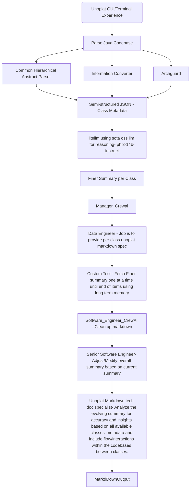

# Unoplat-CodeConfluence - Where Code Meets Clarity

## Overall Flow Diagram

## Tech Stack 

1. [Chapi](https://chapi.phodal.com/)
2. [PyTermGui](https://ptg.bczsalba.com/)
3. [Litellm](https://docs.litellm.ai/docs/)
4. [ArchGuard](https://github.com/archguard/archguard)
5. [CrewAi](https://www.crewai.com/)
6. [loguru](https://loguru.readthedocs.io/en/stable/api/logger.html)
7. [PyTest](https://pytest.org/)

## Techniques Used
1. Markdown Spec based Filler prompt for extreme precision
2. Chain of Thought
3. Self Reflection for Autocorrection
4. Collaboration among crewi agents with long/short term memory with precise roles

## Credits/heroes

These are the people because of which this work has been possible. Unoplat code confluence would not exist without them.
1. [Phodal from Chapi and ArcGuard](https://github.com/phodal)
2. [Ishaan & Krrish from Litellm](ishaan@berri.ai / krrish@berri.ai)
3. [Joao Moura from crewai](https://github.com/joaomdmoura)
4. [Vipin Shreyas Kumar](https://github.com/vipinshreyaskumar)
5. [Apeksha](https://github.com/apekshamehta)

