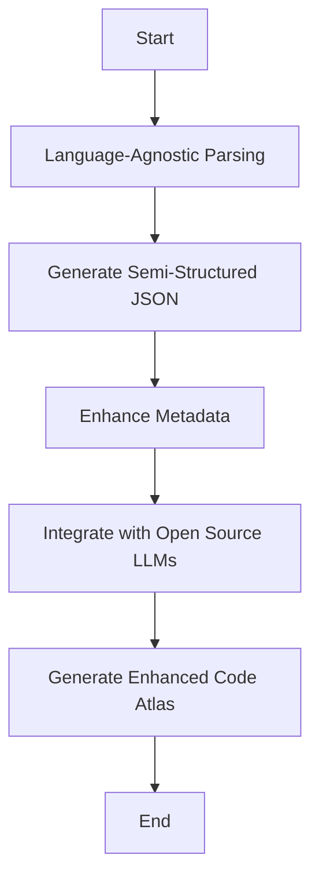
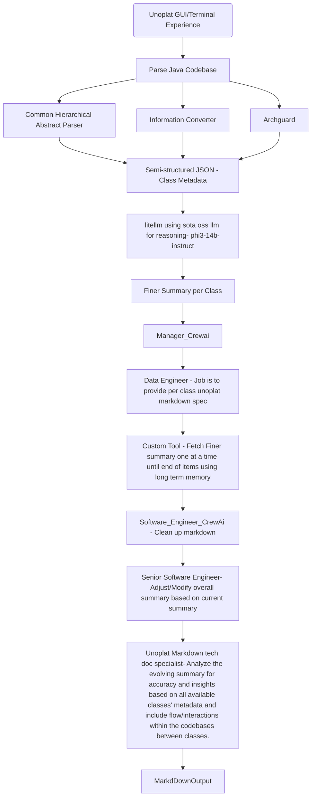

# Unoplat-CodeConfluence - Where Code Meets Clarity


## Current Problem with doing Repository level Documentation using AI Tooling 

### Process Overview:

1. Indexing Code Files: All code files are indexed into a vector database using embeddings that capture the semantic meaning of the code.
2. Query Processing: The system uses fine-tuned language models to interpret the user's query about the codebase.
3. Retrieval-Augmented Generation: The language model performs RAG to fetch relevant code snippets or documentation based on the query.
4. Reranking: Retrieved results are reranked to present the most relevant information first based on the context and specifics of the query.

###  Challenges:

1. Limited Context Windows: Most AI tools suffer from limited context windows of large language models, which can hinder their ability to process large blocks of code or extended documentation effectively.
2. Lack of Long-term Memory: These tools generally do not incorporate long-term memory, which affects their ability to remember past interactions or understand extensive codebases deeply.

3. Inefficiency: This process can be computationally expensive and slow, particularly for large codebases, due to the extensive indexing and complex querying mechanisms.
4. Cost: The operational costs can be significant because of the resources required for maintaining up-to-date embeddings and processing queries with advanced AI models.
5. Compliance and Security Issues: Storing and processing entire codebases can lead to compliance issues, especially with code that contains sensitive or proprietary information.
6. First Principles Concern: The approach may not align with first principles of software engineering, which emphasize simplicity and minimizing complexity across programming languages constructs and frameworks.

### Mermaid Diagram of the Process:
Here's a visual representation of the process using a Mermaid diagram:


This diagram helps visualize the workflow from the start of the query to the presentation of results, illustrating the steps where inefficiencies and complexities arise.

### Unoplat Solution to all of these problems

#### Unoplat Solution: Deterministic Information Ingestion for Enhanced Code Understanding
The Unoplat approach offers a significant shift from the conventional AI-powered tools by opting for a deterministic method to manage and understand codebases. Here’s an overview of how Unoplat proposes to resolve the inefficiencies of current AI-powered code assistance tools:

#### Process Overview:

1. Language-Agnostic Parsing: Unoplat uses a language-agnostic parser, similar to generic compilers, to analyze and interpret any programming language or framework. This step involves no AI, focusing solely on deterministic parsing methods.
2. Generating Semi-Structured JSON: From the parsing step, Unoplat generates semi-structured JSON data. This JSON captures essential constructs and elements of the programming languages being analyzed, providing a clear, structured view of the codebase without reliance on AI for code understanding.
3. Enhancing Metadata: The semi-structured JSON is then used to enhance the metadata in a single attribute with help of oss instruct model.
4. Integration with Open Source LLMs: Leveraging open-source large language models (LLMs), Unoplat combines the enriched metadata with multi-agentic  workflows. This integration aims to produce a more sophisticated and useful "Code Atlas," which developers can use to navigate and understand large and complex codebases more effectively.
5. Output: The output is a highly detailed, easily navigable representation of the codebase, allowing developers to understand and modify code with much higher accuracy and speed than traditional AI-based tools.

#### Benefits:
1. Deterministic and Transparent: The deterministic nature of the process ensures transparency and reliability in how code is analyzed and understood.
2. Cost-Effective: Reduces the dependency on expensive AI models and the associated computational and maintenance costs.
3. Compliance and Security: By not relying on AI models trained on external data, Unoplat minimizes potential compliance and security issues.
4. Scalability: The approach is highly scalable, as it can handle any programming language or framework without needing specific model training.
##### Mermaid Diagram of the Process:
Here’s a visual representation using a Mermaid diagram to illustrate the Unoplat process:


This diagram outlines the Unoplat process from the initial parsing of the codebase to the generation of an enhanced Code Atlas, highlighting the deterministic and structured approach to managing and understanding codebases.

## Unoplat Solution to the Current Problem



## Example:

### Input:
```
Local workspace from https://github.com/DataStax-Examples/spring-data-starter.git
```

### Output:
```
# Order Class

- **Package**: `com.datastax.examples.order`
- **File Path**: `src/main/java/com/datastax/examples/order/Order.java`
- **Responsibility**: This class represents an order in the system, encapsulating all necessary details such as product quantity, name, price, and added-to-order timestamp.

## Fields

Each field corresponds to a column of our Cassandra database table. The annotations indicate how each Java data type is mapped to its respective datatype in Cassandra.

- **OrderPrimaryKey**: `None`
  - **Type**: This field represents the unique identifier for an order within the system, serving as the primary key. No dependencies are injected here.

- **Integer**
  - **type_key**: `productQuantity`
  - **Type**: Represents the quantity of a product in this particular order. Annotated with `@Column("product_quantity")` and `@CassandraType(type = CassandraType.Name.INT)` to map it properly within our database structure. No dependencies are injected here.

- **String**
  - **type_key**: `productName`
  - **Type**: Stores the name of a product in this order. Annotated with `@Column("product_name")` and `@CassandraType(type = CassandraType.Name.TEXT)` to ensure accurate representation in our database schema. No dependencies are injected here.

- **Float**
  - **type_key**: `productPrice`
  - **Type**: Contains the price of a product within this order. Annotated with `@CassandraType(type = CassandraType.Name.DECIMAL)` to map it correctly in our database system. No dependencies are injected here.

- **Instant**
  - **type_key**: `addedToOrderTimestamp`
  - **Type**: Stores the timestamp of when this order was added to the system. Annotated with `@CassandraType(type = CassandraType.Name.TIMESTAMP)` for accurate mapping in our database schema. No dependencies are injected here.

# OrderController Class Summary

## Package
com.datastax.examples.order

## File Path
src/main/java/com.datastax.examples/order/OrderController.java

## Fields
- **OrderRepository** (private OrderRepository orderRepository)
   - **Type**: The field is an instance of the OrderRepository class, which contains methods for accessing and manipulating data from a database using JPA or similar technologies. It serves as a dependency injection to enable interaction with the repository layer inside the controller's methods.

## Methods
- **root()**: `ModelAndView`
  - **Summary**: Returns a ModelAndView object representing the root page of the order management system, which typically includes links or navigation elements for other pages/actions within the application.
  
- **createOrder(Request req, Response res)**: `Order`
  - **Summary**: Processes an HTTP POST request to create a new Order object with data from the client's input and saves it in the database using the repository layer. It then returns the created order as the response payload.
  
- **updateOrder(UUID id, Request req, Response res)**: `Order`
  - **Summary**: Processes an HTTP PUT or PATCH request to update a specific Order object identified by its UUID with new data from the client's input and saves it in the database using the repository layer. It then returns the updated order as the response payload.
  
- **deleteOrder(UUID id)**: `void`
  - **Summary**: Processes an HTTP DELETE request to remove a specific Order object identified by its UUID from the database and handles any related cleanup or cascading deletions using the repository layer. It does not return any response payload.

# OrderPrimaryKey Class Summary

## Package
`com.datastax.examples.order`

## File Path
`src/main/java/com/datastax/examples/order/OrderPrimaryKey.java`

## Responsibility
This class represents the primary key for an Order entity, containing UUID fields to uniquely identify each order and its associated product within a Cassandra database.

## Fields

- **UUID**: `orderId`
  - **Type**: Represents the unique identifier of the order itself. It is marked with `@PrimaryKeyColumn(name = "order_id", ordinal = 0, type = PrimaryKeyType.PARTITIONED)` to denote its role as a partition key in Cassandra's primary key structure.
  
- **UUID**: `productId`
  - **Type**: Represents the unique identifier of the product associated with the order. This is also marked with `@PrimaryKeyColumn(name = "product_id", ordinal = 1, type = PrimaryKeyType.CLUSTERED)` indicating that it serves as a clustering key in Cassandra's primary key scheme, which further refines the data retrieval within each partition identified by `orderId`.

(No methods are defined for this class.)
```
## Current Stage

### Status: Alpha
### Blockers before user adoption:
1. Performance issue with per class summary [Dspy based pipelines in progress with finetuned data]
2. Multi agent workflow not exiting due to potential enhancements needed in our crewai implementation.
3. Moving to cli from tui. [DONE]

## Tech Stack 

1. [Chapi](https://chapi.phodal.com/)
2. [PyTermGui](https://ptg.bczsalba.com/)
3. [Litellm](https://docs.litellm.ai/docs/)
4. [ArchGuard](https://github.com/archguard/archguard)
5. [CrewAi](https://www.crewai.com/)
6. [loguru](https://loguru.readthedocs.io/en/stable/api/logger.html)
7. [PyTest](https://pytest.org/)
8. [Pydantic](https://www.pydantic.dev)
9. DSPY


## Credits/heroes/supporters

These are the people because of which this work has been possible. Unoplat code confluence would not exist without them.
1. [Phodal from Chapi and ArcGuard](https://github.com/phodal)
2. [Ishaan & Krrish from Litellm](ishaan@berri.ai / krrish@berri.ai)
3. [Joao Moura from crewai](https://github.com/joaomdmoura)
4. [Vipin Shreyas Kumar](https://github.com/vipinshreyaskumar)
5. [Apeksha](https://github.com/apekshamehta)