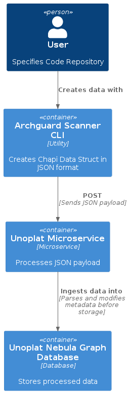

# unoplat-codebase-understanding
The goal is to understand the codebase/s to form a knowledge Graph.


## Example output

```
{"FullName":"NetworkClient.java","PackageName":"","Imports":[],"Members":[],"DataStructures":[{"NodeName":"NetworkClient","Module":"","Type":"CLASS","Package":"","FilePath":"NetworkClient.java","Fields":[{"TypeType":"NetworkService","TypeValue":"","TypeKey":"networkService","Annotations":[],"Modifiers":[],"Calls":[]}],"MultipleExtend":[],"Implements":[],"Extend":"","Functions":[{"Name":"NetworkClient","FilePath":"","Package":"","ReturnType":"","MultipleReturns":[],"Parameters":[{"Modifiers":[],"DefaultValue":"","TypeValue":"networkService","TypeType":"NetworkService","Annotations":[],"ObjectValue":[],"ReturnTypes":[],"Parameters":[]}],"FunctionCalls":[],"Annotations":[],"Override":false,"Modifiers":[],"InnerStructures":[],"InnerFunctions":[],"Position":{"StartLine":5,"StartLinePosition":11,"StopLine":7,"StopLinePosition":4},"Extension":{},"LocalVariables":[],"IsConstructor":true,"IsReturnHtml":false,"BodyHash":0,"Type":"Function","Content":"","extensionMap":{}},{"Name":"fetchDataAndPrint","FilePath":"","Package":"","ReturnType":"void","MultipleReturns":[],"Parameters":[{"Modifiers":[],"DefaultValue":"","TypeValue":"url","TypeType":"String","Annotations":[],"ObjectValue":[],"ReturnTypes":[],"Parameters":[]}],"FunctionCalls":[{"Package":"","Type":"FUNCTION","NodeName":"System.out","FunctionName":"println","Parameters":[{"Modifiers":[],"DefaultValue":"","TypeValue":"\"Fetching data from: \"+url","TypeType":"","Annotations":[],"ObjectValue":[],"ReturnTypes":[],"Parameters":[]}],"Position":{"StartLine":10,"StartLinePosition":19,"StopLine":10,"StopLinePosition":55},"OriginNodeName":""},{"Package":"","Type":"FUNCTION","NodeName":"NetworkService","FunctionName":"fetchData","Parameters":[{"Modifiers":[],"DefaultValue":"","TypeValue":"url","TypeType":"","Annotations":[],"ObjectValue":[],"ReturnTypes":[],"Parameters":[]}],"Position":{"StartLine":11,"StartLinePosition":39,"StopLine":11,"StopLinePosition":52},"OriginNodeName":""},{"Package":"","Type":"FUNCTION","NodeName":"System.out","FunctionName":"println","Parameters":[{"Modifiers":[],"DefaultValue":"","TypeValue":"\"Received: \"+result","TypeType":"","Annotations":[],"ObjectValue":[],"ReturnTypes":[],"Parameters":[]}],"Position":{"StartLine":12,"StartLinePosition":19,"StopLine":12,"StopLinePosition":48},"OriginNodeName":""}],"Annotations":[],"Override":false,"Modifiers":[],"InnerStructures":[],"InnerFunctions":[],"Position":{"StartLine":9,"StartLinePosition":11,"StopLine":13,"StopLinePosition":4},"Extension":{},"LocalVariables":[{"Modifiers":[],"DefaultValue":"","TypeValue":"networkService","TypeType":"NetworkService","Annotations":[],"ObjectValue":[],"ReturnTypes":[],"Parameters":[]},{"Modifiers":[],"DefaultValue":"","TypeValue":"url","TypeType":"String","Annotations":[],"ObjectValue":[],"ReturnTypes":[],"Parameters":[]},{"Modifiers":[],"DefaultValue":"","TypeValue":"result","TypeType":"String","Annotations":[],"ObjectValue":[],"ReturnTypes":[],"Parameters":[]}],"IsConstructor":false,"IsReturnHtml":false,"BodyHash":1894490292,"Type":"Function","Content":"","extensionMap":{}},{"Name":"main","FilePath":"","Package":"","ReturnType":"void","MultipleReturns":[],"Parameters":[{"Modifiers":[],"DefaultValue":"","TypeValue":"args","TypeType":"String[]","Annotations":[],"ObjectValue":[],"ReturnTypes":[],"Parameters":[]}],"FunctionCalls":[{"Package":"","Type":"SELF","NodeName":"NetworkClient","FunctionName":"fetchDataAndPrint","Parameters":[{"Modifiers":[],"DefaultValue":"","TypeValue":"\"http://example.com/api/data\"","TypeType":"","Annotations":[],"ObjectValue":[],"ReturnTypes":[],"Parameters":[]}],"Position":{"StartLine":18,"StartLinePosition":15,"StopLine":18,"StopLinePosition":62},"OriginNodeName":""}],"Annotations":[],"Override":false,"Modifiers":[],"InnerStructures":[],"InnerFunctions":[],"Position":{"StartLine":15,"StartLinePosition":18,"StopLine":19,"StopLinePosition":4},"Extension":{},"LocalVariables":[{"Modifiers":[],"DefaultValue":"","TypeValue":"networkService","TypeType":"NetworkService","Annotations":[],"ObjectValue":[],"ReturnTypes":[],"Parameters":[]},{"Modifiers":[],"DefaultValue":"","TypeValue":"url","TypeType":"String","Annotations":[],"ObjectValue":[],"ReturnTypes":[],"Parameters":[]},{"Modifiers":[],"DefaultValue":"","TypeValue":"result","TypeType":"String","Annotations":[],"ObjectValue":[],"ReturnTypes":[],"Parameters":[]},{"Modifiers":[],"DefaultValue":"","TypeValue":"args","TypeType":"String[]","Annotations":[],"ObjectValue":[],"ReturnTypes":[],"Parameters":[]},{"Modifiers":[],"DefaultValue":"","TypeValue":"service","TypeType":"NetworkService","Annotations":[],"ObjectValue":[],"ReturnTypes":[],"Parameters":[]},{"Modifiers":[],"DefaultValue":"","TypeValue":"newSimpleNetworkService()","TypeType":"SimpleNetworkService","Annotations":[],"ObjectValue":[],"ReturnTypes":[],"Parameters":[]},{"Modifiers":[],"DefaultValue":"","TypeValue":"client","TypeType":"NetworkClient","Annotations":[],"ObjectValue":[],"ReturnTypes":[],"Parameters":[]},{"Modifiers":[],"DefaultValue":"","TypeValue":"newNetworkClient(service)","TypeType":"NetworkClient","Annotations":[],"ObjectValue":[],"ReturnTypes":[],"Parameters":[]}],"IsConstructor":false,"IsReturnHtml":false,"BodyHash":-1597084065,"Type":"Function","Content":"","extensionMap":{}}],"InnerStructures":[],"Annotations":[],"FunctionCalls":[],"Parameters":[],"Imports":[],"Exports":[],"Extension":{},"Position":{"StartLine":1,"StartLinePosition":7,"StopLine":20,"StopLinePosition":0},"Content":""}],"Fields":[],"Containers":[]}
```

Use https://jsonformatter.org/json-pretty-print for the message


## Nebula Graph Database Schema for CHAPI Data Struct

### MVP Schema
```

CREATE SPACE software_analysis (partition_num=10, replica_factor=1, vid_type=fixed_string(64));
USE software_analysis;


# Creating tags
CREATE TAG Node(NodeName string, Module string, Type string, Package string, FilePath string, Content string);
CREATE TAG Function(Name string, ReturnType string, Content string);
CREATE TAG FunctionCall(FunctionName string, Package string, PositionStartLine int, PositionEndLine int);

# Creating edges
CREATE EDGE ContainsFunction();
CREATE EDGE CallsFunction();

```

### MVP Schema insertion example
```
# Insert nodes and functions
INSERT VERTEX Node(NodeName, Module, Type, Package, FilePath, Content) VALUES
    "node1":("ReactiveServiceForMathOperation", "root", "CLASS", "org.acme.impl", "path/to/file", "<node_content>");
INSERT VERTEX Function(Name, ReturnType, Content) VALUES
    "func1":("processMessage", "void", "<function_content>");

# Insert function calls
INSERT VERTEX FunctionCall(FunctionName, Package, PositionStartLine, PositionEndLine) VALUES
    "call1":("sin", "org.acme.impl", 19, 19);

# Create edges between them
INSERT EDGE ContainsFunction() VALUES "node1" -> "func1";
INSERT EDGE CallsFunction() VALUES "func1" -> "call1";
```


### MVP Schema query example


# Find all functions in a node
GO FROM "node1" OVER ContainsFunction YIELD ContainsFunction._dst AS functionId, $$.Function.Name AS functionName;

# Find all calls from a function
GO FROM "functionId" OVER CallsFunction YIELD CallsFunction._dst AS callId, $$.FunctionCall.FunctionName AS calledFunctionName;


## C2 Container Diagram
```plantuml
@startuml
!define C4Puml https://raw.githubusercontent.com/plantuml-stdlib/C4-PlantUML/master/C4_Component.puml
!includeurl C4Puml

' Define the system and its components
Person(user, "User", "Specifies Code Repository")
Container(cli, "Archguard Scanner CLI", "Utility", "Creates Chapi Data Struct in JSON format")
Container(unoplat, "Unoplat Microservice", "Microservice", "Processes JSON payload")
Container(db, "Unoplat Nebula Graph Database", "Database", "Stores processed data")

' Define relationships
Rel(user, cli, "Creates data with")
Rel(cli, unoplat, "POST", "Sends JSON payload")
Rel(unoplat, db, "Ingests data into", "Parses and modifies metadata before storage")
@enduml
```

