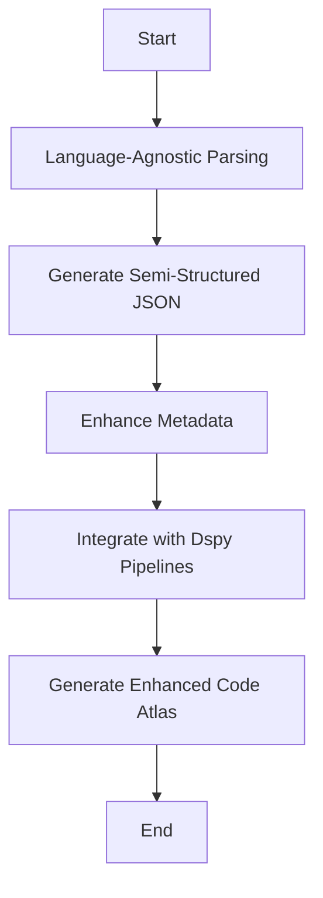

# Unoplat-CodeConfluence - Where Code Meets Clarity


## The Ultimate Goal

Goal of the project is to be the most deterministic and precise code context provider for any code repository and across multiple such code repositories tied through domain and then eventually become the unified code context provider which then can be integrated with projects like OpenDevin, Devon, Danswer,
Continue Dev and other oss , thereby complimenting the precision of these frameworks with minimal opex.


## Unoplat OSS Atlas

The objective of the repo below is to curate comprehensive understanding of oss repos. We are starting with oss repos that inspired us to do this work and giving them back first. Please go through readme of the below repo to get started. 

[UnoplatOssAtlas](https://github.com/unoplat/unoplat-oss-atlas/tree/main)


### Short term goals 

| Task                                                      | Status     |
|-----------------------------------------------------------|------------|
| Launch autodoc for Java                                    | Ready: Stable       |
| Launch autodoc for Kotlin                                  | Planned    |
| Launch autodoc for Python                                  | Ready: Stable|
| Launch autodoc for all programming languages               | Planned    |
| Launch Graph based ingestion and query through Dspy                    | Planned    |
| Launch Tree sitters for respective programming languages to induce changes in Codebases to adjust knowledgeGraph based on commit and git diff| Planned |
| Solve cross cutting concerns and make it possible to self host | Planned    |
| Plug it in to oss partners/heros mentioned below.                                                | Planned    |

Note: Full codebase parsing is based on https://chapi.phodal.com/ and contributions are required on chapi upstream to improve parsing metadata. . for detailed issues please refer roadmap mentioned below.

## Current Problem with doing Repository level Understanding using AI Tooling 

### Process Overview:

1. Indexing Code Files: All code files are indexed into a vector database using embeddings that capture the semantic meaning of the code.
2. Query Processing: The system uses fine-tuned language models to interpret the user's query about the codebase.
3. Retrieval-Augmented Generation: The language model performs RAG to fetch relevant code snippets or documentation based on the query.
4. Reranking: Retrieved results are reranked to present the most relevant information first based on the context and specifics of the query.

###  Challenges:

1. Limited Context Windows: Most AI tools suffer from limited context windows of large language models, which can hinder their ability to process large blocks of code or extended documentation effectively.
2. Lack of Long-term Memory: These tools generally do not incorporate long-term memory, which affects their ability to remember past interactions or understand extensive codebases deeply.
3. Inefficiency: This process can be computationally expensive and slow, particularly for large codebases, due to the extensive indexing and complex querying mechanisms.
4. Cost: The operational costs can be significant because of the resources required for maintaining up-to-date embeddings and processing queries with advanced AI models.
5. Compliance and Security Issues: Storing and processing entire codebases through cloud based commercial vendors can lead to lot of time lost in compliance issues/processes, especially with code that contains sensitive or proprietary information. 
6. First Principles Concern: The approach may not align with first principles of software engineering, which emphasize simplicity and minimizing complexity across programming languages constructs and frameworks.

### Mermaid Diagram of the Process:
Here's a visual representation of the process using a Mermaid diagram:


This diagram helps visualize the workflow from the start of the query to the presentation of results, illustrating the steps where inefficiencies and complexities arise.

### Unoplat Solution to all of these problems

#### Unoplat Solution: Deterministic Information Ingestion for Enhanced Code Understanding
The Unoplat approach offers a significant shift from the conventional AI-powered tools by opting for a deterministic method to manage and understand codebases. Here’s an overview of how Unoplat proposes to resolve the inefficiencies of current AI-powered code assistance tools:

#### Process Overview:

1. Language-Agnostic Parsing: Unoplat uses a language-agnostic parser, similar to generic compilers, to analyze and interpret any programming language or framework. This step involves no AI, focusing solely on deterministic parsing methods.
2. Generating Semi-Structured JSON: From the parsing step, Unoplat generates semi-structured JSON data. This JSON captures essential constructs and elements of the programming languages being analyzed, providing a clear, structured view of the codebase without reliance on AI for code understanding.
3. Enhancing Metadata: The semi-structured JSON is transformed to optimised data model to represent codebase in most optimal fashion.
4. LLM Pipelines: There are tailored dspy pipelines (uncompiled as of now) for function, class, package and codebase summary capture. The goal is to externalise the config of preferred llms(oss/commercial) across dspy pipelines.
5. Output: The output is a highly detailed, easily navigable representation of the codebase, allowing developers to understand and modify code with much higher accuracy and speed than traditional AI-based tools.


##### Mermaid Diagram of the Process:
Here’s a visual representation using a Mermaid diagram to illustrate the Unoplat process:


This diagram outlines the Unoplat process from the initial parsing of the codebase to the generation of an enhanced Code Atlas, highlighting the deterministic and structured approach to managing and understanding codebases.


## Java Examples:

1. Spring Java Cassandra Starter
### Input:
Local workspace on your computer from:
```
 https://github.com/DataStax-Examples/spring-data-starter.git
```

### Output:

[JavaResult](https://github.com/unoplat/unoplat-code-confluence/blob/main/unoplat-code-confluence/examples/java/springstarterjava1_20240708115959.md)


## Python Example 

~~Note: Python support is alpha right now - check issue- [Python-Improvements](https://github.com/unoplat/unoplat-code-confluence/issues/77)~~ 

Python is stable and we tested on the most latest groundbreaking optimiser for prompts - textgrad through a model that has not seen beyond 2021. We have got amazing results. please check output below.

1. TextGrad
### Input:
Local workspace on your computer from:
```
https://github.com/zou-group/textgrad
```

### Output:

[TextGradPythonResult](https://github.com/unoplat/unoplat-code-confluence/blob/main/unoplat-code-confluence/examples/python/textgrad)

~~Refer - class and function level summaries for python as it is in alpha right now. Package and code are not up to the mark.~~

2. DSPY
### Input: 
Local workspace on your computer from:
```
https://github.com/stanfordnlp/dspy/tree/main/dspy
```
### Output:
[DspyPythonresult](https://github.com/unoplat/unoplat-code-confluence/tree/main/unoplat-code-confluence/examples/python/dspy)

#### Note: ~~Gpt3.5 turbo 16k is currently used for all examples.~~ You can use gpt-4o-mini as it is better and cheaper and the the utlity has been optimised for it.

## Current Stage

### Usage Instructions

1. Install [Pipx](https://pipx.pypa.io/stable/)
2. Install unoplat-code-confluence through :
```
   pipx install 'git+https://github.com/unoplat/unoplat-code-confluence.git@v0.10.0#subdirectory=unoplat-code-confluence'
```
3. Before you can run the unoplat code confluence tool on your local machine, you need to set up the necessary configuration file. This file tells tool where your codebase is located, where to output the analysis results, and other essential information. Below is a step-by-step guide to setting up your configuration.


```
{
    "local_workspace_path": "your path to codebase",
    "output_path": "directory path for markdown output",
    "output_file_name": "name of markdown output (example - xyz.md)",
    "codebase_name": "name of your codebase",
    "programming_language": "programming language type(example- java or python)",
    "repo": {
      "download_url": "archguard/archguard",
      "download_directory": "download directory for arcguard tool"
    },
    "api_tokens": {
      "github_token": "your github pat for downloading arcguard"
    },
    "llm_provider_config": {
      "openai": {
        "api_key": "YourApiKey",
        "model": "gpt-3.5-turbo-16k",
        "model_type" : "chat",
        "max_tokens": 1024,
        "temperature": 0.0
    }
},
    "logging_handlers": [
      {
          "sink": "~/Documents/unoplat/app.log",
          "format": "<green>{time:YYYY-MM-DD at HH:mm:ss}</green> | <level>{level}</level> | <cyan>{name}</cyan>:<cyan>{function}</cyan>:<cyan>{line}</cyan> - <level>{message}</level>",
          "rotation": "10 MB",
          "retention": "10 days",
          "level": "INFO"
      }
    ]
}
```
Configuration Note: Do not change the download_url and keep the programming_language to java or python (as right now only java & python are supported)

llm Provider Config: 
- Model Providers Supported: ["openai","together","anyscale","awsanthropic","cohere","ollama"] (cohere does not work right now. there is a issue already created. 
we will be addressing it soon)
 
- For config inside llm_provider_config refer - [Dspy Model Provider Doc](https://dspy-docs.vercel.app/docs/category/remote-language-model-clients)


If you are looking for some credits sign up on Together AI and get 25$ to run code confluence on repository of your choice. You can even use Ollama

Together Example:
```
"llm_provider_config": {
      "together": {
        "api_key": "YourApiKey",
        "model": "zero-one-ai/Yi-34B-Chat"
    }

```

Ollama Example:
```
"llm_provider_config": {
      "ollama": {
        "model": "llama3"
    }

```

4. Run code confluence and check your output path. you will have a file name based on output file name. That file will carry precise summary of codebase at all levels - codebase,packages,classes and functions.
```
unoplat-code-confluence --config example_config.json
```

### Limitations

1. Slow Performance - https://github.com/unoplat/unoplat-code-confluence/issues/69 .
2. Observability/Tracing - https://github.com/unoplat/unoplat-code-confluence/issues/54
3. ~~Externalise logs - https://github.com/unoplat/unoplat-code-confluence/issues/61~~ 
4. Progress Bar for AutoDoc - https://github.com/unoplat/unoplat-code-confluence/issues/50

Please let us know if there are issues other than limitations that are hindering your adoption. we will prioritise accordingly. Also please go through issues first before raising any issue.

### Status: Alpha

### Roadmap:
1. Generate training data for optimisation of summary generated at function ,class , package and codebase (use argilla for that)
2. Enable oss llms and induce llm routing for cost and effective optimisation for oss and commercial llms
3. ~~Enable Python Language Support (extend current pydantic data models based on chapi for python)~~
4. Enable Graph based ingestion as well as retrieval - baleen/tree-summary
5. Encapsulate the ingestion in a python native pipeline framework to make deployment easier.
6. Integrate with Unoplat core to make it possible to self host with all cross cutting concerns for both unoplat code confluence and any embeddable graph db. (https://github.com/unoplat/unoplat)
7. Now the most important Get all heroes/inspirations on board.

[GithubProjectBoard](https://github.com/orgs/unoplat/projects/6/views/2)

## Tech Stack 

1. [Chapi](https://chapi.phodal.com/)
2. [ArchGuard](https://github.com/archguard/archguard)
3. [DSPY](https://dspy-docs.vercel.app/)
4. [loguru](https://loguru.readthedocs.io/en/stable/api/logger.html)
5. [PyTest](https://pytest.org/)
6. [Pydantic](https://www.pydantic.dev)


## Credits/heroes/supporters/Inspirations

These are the people because of which this work has been possible. Unoplat code confluence would not exist without them.
1. [Phodal from Chapi and ArcGuard](https://github.com/phodal)
2. [Ishaan & Krrish from Litellm](ishaan@berri.ai / krrish@berri.ai)
3. [Omar Khattab](https://omarkhattab.com/)
3. [Joao Moura from crewai](https://github.com/joaomdmoura)
4. [Vipin Shreyas Kumar](https://github.com/vipinshreyaskumar)
5. [Danswer](https://www.danswer.ai/)
6. [Continue](https://www.continue.dev/)
7. [OpenDevin](https://github.com/OpenDevin/OpenDevin)
8. [Devon](https://github.com/entropy-research/Devon)
7. [Apeksha](https://github.com/apekshamehta)
8. [Argilla](https://argilla.io/)
9. [Jeremy Howard](https://www.linkedin.com/in/howardjeremy)

## Maintainers

1. [Jay Ghiya](https://github.com/JayGhiya)
    - Contact: jayghiya@unoplat.co.in
2. [Vipin Shreyas Kumar](https://github.com/vipinshreyaskumar)
    - Contact: vipinshreyaskumar@unoplat.co.in
  
Book a call with us - [Cal Link](https://cal.com/jay-ghiya/15min)

  
## Community Channel
[UnoplatCodeConfluence Discord Channel](https://discord.com/channels/1131597983058755675/1169968780953260106) 
  
## X handle
[x](https://x.com/unoplatio)
