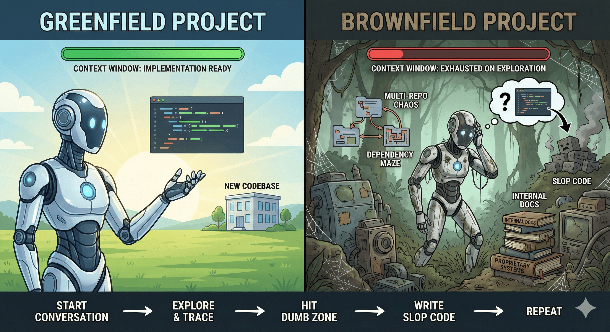

<a name="top"></a>

<!-- PROJECT LOGO -->
<br />
<div align="center">
  <!-- If you have a logo, uncomment and use this
  <a href="https://github.com/unoplat/unoplat-code-confluence">
    
  </a>
  -->

  <h1 align="center"><a href="https://www.unoplat.io">Unoplat-CodeConfluence</a></h1>
  <h3 align="center">The Universal Code Context Engine</h3>

  <p align="center">
    Always keep your agents ready with all the context required per repository.
    <br />
    <a href="https://docs.unoplat.io"><strong>Explore the docs »</strong></a>
    <br />
    <br />
    <a href="https://docs.unoplat.io/docs/quickstart/how-to-run">Quick Start</a>
    ·
    <a href="https://github.com/unoplat/unoplat-code-confluence/issues">Report Bug</a>
    ·
    <a href="https://github.com/unoplat/unoplat-code-confluence/issues">Request Feature</a>
  </p>
  
  <!-- PROJECT SHIELDS -->
  <p align="center">
    
    
    <a href="https://github.com/unoplat/unoplat-code-confluence/stargazers">
      
    </a>
    <a href="https://www.youtube.com/watch?v=l6gFjoj4QJE">
      
    </a>
  </p>

  <!-- SOCIAL SHIELDS -->
  <p align="center">
    <a href="https://discord.gg/qe2nbQMnWB">
      
    </a>
    <a href="https://x.com/unoplatio">
      
    </a>
    <a href="https://www.linkedin.com/company/unoplat/">
      
    </a>
  </p>
</div>

<!-- TABLE OF CONTENTS -->
<details>
  <summary>Table of Contents</summary>
  <ol>
    <li><a href="#demo-agentsmd-first-context">Demo</a></li>
    <li><a href="#%EF%B8%8F-the-problem">The Problem</a></li>
    <li><a href="#-the-solution">The Solution</a></li>
    <li><a href="#-core-principles">Core Principles</a></li>
    <li><a href="#-getting-started">Getting Started</a></li>
    <li><a href="#-project-status">Project Status</a></li>
    <li><a href="#maintainers">Maintainers</a></li>
    <li><a href="#-product-feedback--alpha-disclaimer">Product Feedback</a></li>
    <li><a href="#license">License</a></li>
  </ol>
</details>

<!-- DEMO SECTION -->
<a id="demo-agentsmd-first-context"></a>
## 🎥 Demo: Agents.md-first Context

<p align="center">
  <a href="https://www.youtube.com/watch?v=l6gFjoj4QJE" target="_blank">
    
  </a>
  <br />
  <a href="https://github.com/unoplat/unoplat-code-confluence/stargazers"><b>Like this? Star the repo</b> ⭐</a>
  ·
  <a href="https://www.youtube.com/watch?v=l6gFjoj4QJE">Watch on YouTube</a>
  ·
  <a href="https://github.com/JayGhiya/full-stack-fastapi-template/pull/1">Sample PR</a>
</p>

**What's in the demo:** automatic `AGENTS.md` generation per repo and an org index that gives any coding agent a precise source of truth. See a [sample PR](https://github.com/JayGhiya/onyx/pull/1) created by the tool.

<!-- THE PROBLEM SECTION -->
## ⚠️ The Problem

<p align="center">
  
</p>

AI coding agents excel at **greenfield projects** (new codebases built from scratch) but struggle with **brownfield codebases** (mature, production systems with existing code).

**Why?** They burn most of their context window on exploration—searching files, tracing flows, connecting dots—leaving little capacity for actual implementation. By the time they're ready to code, they've hit the "dumb zone" where performance degrades sharply. And since they lack long-term memory, this cycle repeats with every conversation.

**Multi-repo complexity** makes it worse. When code is split across connected repositories, the agent exhausts its context just mapping dependencies between codebases—often before writing a single line.

**Internal dependencies** present another failure mode. The agent has no onboarding to proprietary systems, so it hallucinates usage patterns. Worse, when internal documentation has drifted from actual implementation, the agent trusts those "lies" and produces code that doesn't work.

The end result: **slop code** requiring heavy rework.

<p align="right">(<a href="#top">back to top</a>)</p>

<!-- SOLUTION SECTION -->
## 🎯 The Solution

Unoplat Code Confluence is the **context engine** for application development, organizing precise, up-to-date knowledge of your data models, entry points, endpoints, and more—so coding agents can deliver and maintain features **2–3x faster** with higher quality.

### AGENTS.md-first Context

Auto-generates machine-readable `AGENTS.md` files per repo to give coding agents a **precise source of truth**:

- **Engineering Workflow** — Canonical install/build/dev/test/lint/type_check commands plus key config files and their responsibilities
- **Business Logic** — Core application logic, domain entities, and database entities
- **Entry Points & Interfaces** — Main entry points, API endpoints, and external interfaces
- **External Dependencies** — Roles and responsibilities of external libraries

<p align="right">(<a href="#top">back to top</a>)</p>

<!-- CORE PRINCIPLES SECTION -->
## 🌟 Core Principles

### 1. **Precision First**
- **[Extensible Language Support](https://github.com/unoplat/unoplat-code-confluence/tree/main/unoplat-code-confluence-ingestion/code-confluence-flow-bridge/src/code_confluence_flow_bridge/parser/queries)**: Modular Tree-sitter based grammar extraction delivers consistent, accurate code context across all programming languages
- **[Extensible Framework-Aware Parsing](https://docs.unoplat.io/docs/contribution/custom-framework-schema)**: Specialized grammar engines recognize framework and library-specific patterns based on project dependencies

### 2. **Context Engineering**
- All important metadata about application—dependencies, inbound/outbound interfaces, domain models, and data store models—are identified and their relationships preserved

### 3. **Enterprise-Grade Scalability, Reliability and Auditability**
- Scalable, auditable and reliable processing powered by workflow orchestrator

<p align="right">(<a href="#top">back to top</a>)</p>

<!-- GETTING STARTED SECTION -->
## 🚀 Getting Started

Ready to enhance your development workflow?

Check out our [Quick Start Guide](https://docs.unoplat.io/docs/quickstart/how-to-run).

<p align="right">(<a href="#top">back to top</a>)</p>

## 📊 Project Status

<div align="center">

  
  
```
  ALPHA ████████████████░░░░ BETA
```

  <h3>🚀 Sprinting Toward Beta</h3>
  <p>
    Unoplat Code Confluence currently supports <b>Python</b> and <b>TypeScript</b> codebases.<br/>
    We're heads-down closing the remaining blockers to reach <b>Beta</b>.
  </p>

  <p>
    👉 <a href="https://github.com/unoplat/unoplat-code-confluence/issues?q=is%3Aissue%20state%3Aopen%20label%3Aurgent"><b>Track our Beta blockers →</b></a><br/>
    <sub>Every open <code>urgent</code> issue is actively being worked on. We're shipping fixes daily.</sub>
  </p>

</div>

For detailed roadmap, language support status, and planned features, see our **[Product Roadmap](https://docs.unoplat.io/docs/introduction/roadmap)**.

<p align="right">(<a href="#top">back to top</a>)</p>
<p align="right">(<a href="#top">back to top</a>)</p>

<!-- MAINTAINERS SECTION -->
## Maintainers

<table>
  <tr>
    <td>
      <a href="https://github.com/JayGhiya">
        <strong>Jay Ghiya</strong>
        <br>
        Contact: jayghiya@unoplat.io
      </a>
    </td>
  </tr>
</table>
<p>Book a call with me - <a href="https://cal.com/jay-ghiya/15min">Cal Link</a></p>

<p align="right">(<a href="#top">back to top</a>)</p>

<!-- PRODUCT FEEDBACK SECTION -->
## 💬 Product Feedback & Alpha Disclaimer

Unoplat Code Confluence is in alpha. We’re building for our own daily use first, prioritizing stability and bug fixes. We’re collecting feedback now and will act on it once the core is solid. Early adopters welcome. Expect rapid changes and rough edges.

- **Discord**: Join our [community channel](https://discord.gg/qe2nbQMnWB)
- **GitHub Issues**: [Create an issue](https://github.com/unoplat/unoplat-code-confluence/issues) for bug reports or feature requests
- **GitHub Discussions**: [Start a discussion](https://github.com/unoplat/unoplat-code-confluence/discussions) for broader conversations

Your feedback is invaluable as we work toward production readiness and helps us prioritize our roadmap to better serve the developer community.

<p align="right">(<a href="#top">back to top</a>)</p>

<!-- LICENSE SECTION -->
## License

Unoplat-CodeConfluence is licensed under the [GNU Affero General Public License v3.0 (AGPL-3.0) + COMMONS CLAUSE](LICENSE).

<p align="right">(<a href="#top">back to top</a>)</p>
