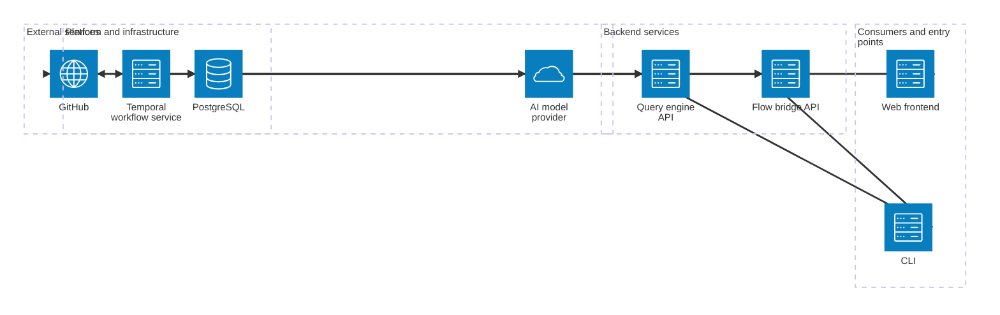

# Current architecture

The web frontend and CLI call the flow bridge and query engine APIs. The flow bridge receives GitHub App webhooks, calls GitHub and the query engine, and runs ingestion workflows through Temporal. The query engine runs Temporal agent workflows, persists application data, and calls GitHub and an AI model provider. Both backend services use PostgreSQL; Temporal is configured to use PostgreSQL.

