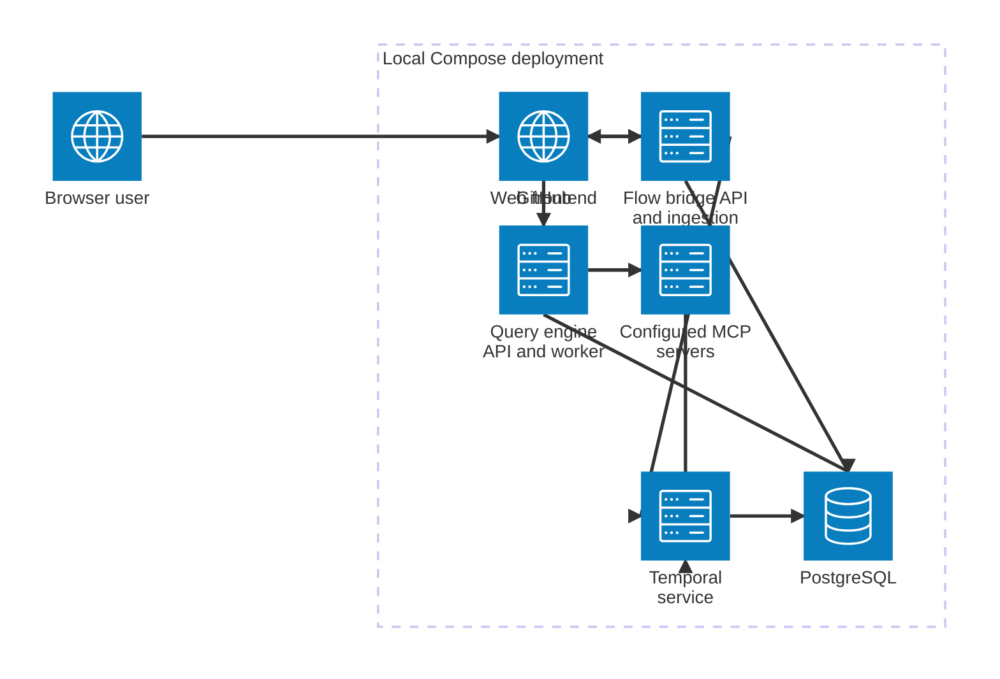

# Current architecture

The local Compose deployment runs the frontend, flow bridge, query engine, Temporal, and PostgreSQL. The frontend has separate HTTP clients for the flow bridge and query engine; both backend applications expose FastAPI endpoints. The flow bridge processes GitHub repositories and runs ingestion workflows, while the query engine can use configured MCP servers.

