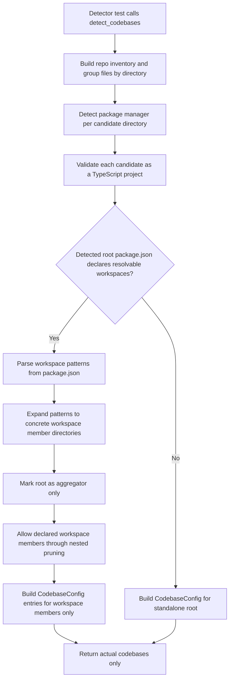

## Description

<!-- SECTION:DESCRIPTION:BEGIN -->
Improve TypeScript workspace detection so the new alpha codebase-config UI receives accurate aggregator and leaf package entries with manifest-derived identity data.
<!-- SECTION:DESCRIPTION:END -->

## Acceptance Criteria
<!-- AC:BEGIN -->
- [ ] #1 Workspace aggregator detection no longer suppresses nested leaf package detection in TypeScript monorepos.
- [ ] #2 Detected TypeScript codebases populate `project_name`, `manifest_path`, `package_manager`, and role metadata needed by TASK-16 screens.
- [ ] #3 The alpha flow does not rely on `root_packages` as a primary TypeScript identity control.
- [ ] #4 Detector tests cover representative workspace repositories and protect against regressions in nested package discovery.
<!-- AC:END -->

## Implementation Plan

<!-- SECTION:PLAN:BEGIN -->
1. Update the regression test in `unoplat-code-confluence-ingestion/code-confluence-flow-bridge/tests/parser/package_manager/detectors/test_typescript_ripgrep_detector.py` so the Turbo fixture asserts only actual workspace codebases are returned. The expected set should exclude `.` and include only `apps/desktop`, `apps/marketing`, `apps/server`, `apps/web`, `packages/contracts`, `packages/shared`, and `scripts`.
2. Add an explicit assertion that `.` is not emitted for the Turbo fixture, since the root `package.json` acts as a workspace aggregator and not a reviewable codebase.
3. Add a standalone non-workspace TypeScript detector regression test using a minimal fixture with `package.json` and `tsconfig.json` but no `workspaces` field. This locks in current single-package behavior so `.` remains a valid codebase for non-monorepo TypeScript repositories.
4. Refactor `unoplat-code-confluence-ingestion/code-confluence-flow-bridge/src/code_confluence_flow_bridge/parser/package_manager/detectors/typescript_ripgrep_detector.py` so `_fast_detect()` separates candidate discovery from final emission. The detector should first collect TypeScript-capable directories, then classify whether a detected root is a standalone codebase or a workspace aggregator.
5. Parse detected root `package.json` files to extract workspace declarations from both supported npm-compatible shapes:
   - array form: `"workspaces": ["apps/*", "packages/*"]`
   - object form: `"workspaces": { "packages": ["apps/*", "packages/*", "scripts"] }`
6. Expand workspace patterns against repository-relative directories already present in the inventory so the detector resolves only concrete workspace folders that actually exist in the repository snapshot.
7. Treat a directory as a workspace aggregator only when both conditions are true:
   - it declares a valid `workspaces` field, and
   - at least one concrete workspace member resolves from that declaration.
8. Exclude confirmed workspace aggregators from final `CodebaseConfig` output so the alpha flow receives only actual codebases, while preserving root detection for non-workspace repositories.
9. Adjust nested-directory suppression so declared workspace members can still be evaluated even when nested under a previously processed workspace root. Keep pruning behavior for unrelated nested directories to avoid broad over-detection.
10. Keep the change narrowly scoped to workspace detection and emission. Do not broaden package-manager inheritance or unrelated metadata behavior unless a failing test requires it.
11. If helpful for clarity, extend `unoplat-code-confluence-ingestion/code-confluence-flow-bridge/src/code_confluence_flow_bridge/parser/package_manager/detectors/rules.yaml` to explicitly declare `workspace_field: workspaces` for TypeScript managers so workspace-aware logic stays aligned with rule metadata already supported by `ManagerRule`.
12. Validate the finished change by running the targeted detector tests first, then `uv run --group dev basedpyright src/`, and finally `uv run ruff check src/` for touched Python code.

<!-- SECTION:PLAN:END -->

## Implementation Notes

<!-- SECTION:NOTES:BEGIN -->
Added a detector regression test against the real Turbo fixture at `tests/test_data/turbo_monorepo/t3code`. The first run fails as expected: the detector returns only `.` with `package_manager=PackageManagerType.BUN` and `manifest_path=package.json`, while nested workspaces under `apps/*`, `packages/*`, and `scripts` are suppressed.

Decision recorded during planning: for TypeScript workspace repositories, the root `.` is an aggregator only and must not be emitted as a codebase. Standalone non-workspace TypeScript repositories should continue to emit `.` as the codebase root.
<!-- SECTION:NOTES:END -->
