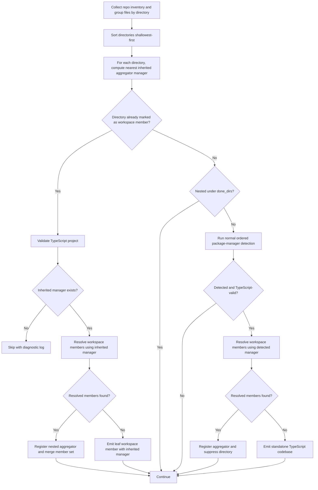
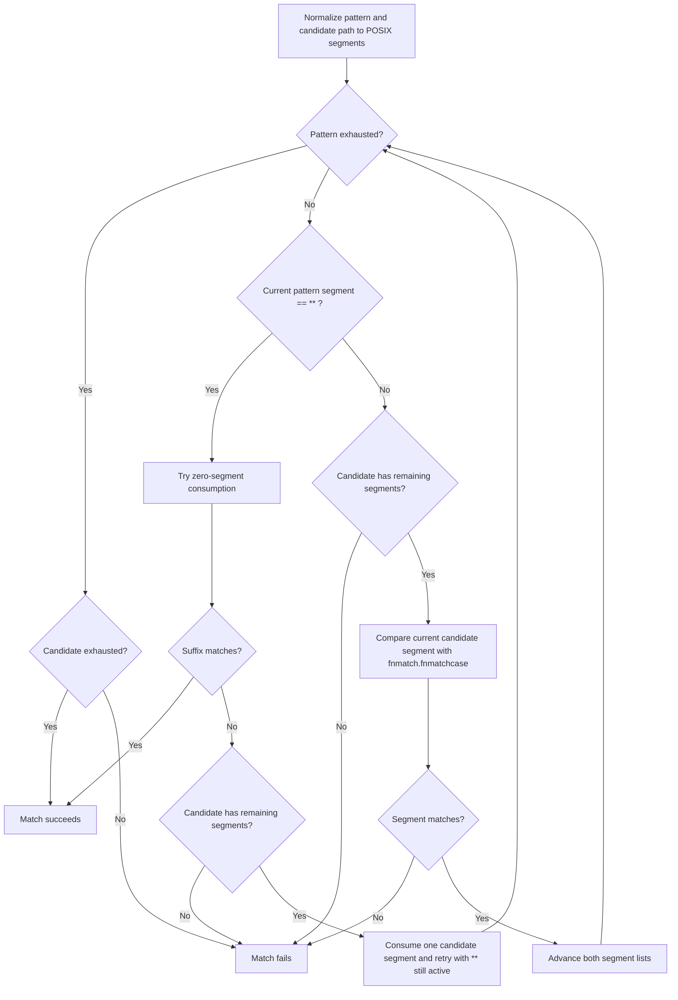
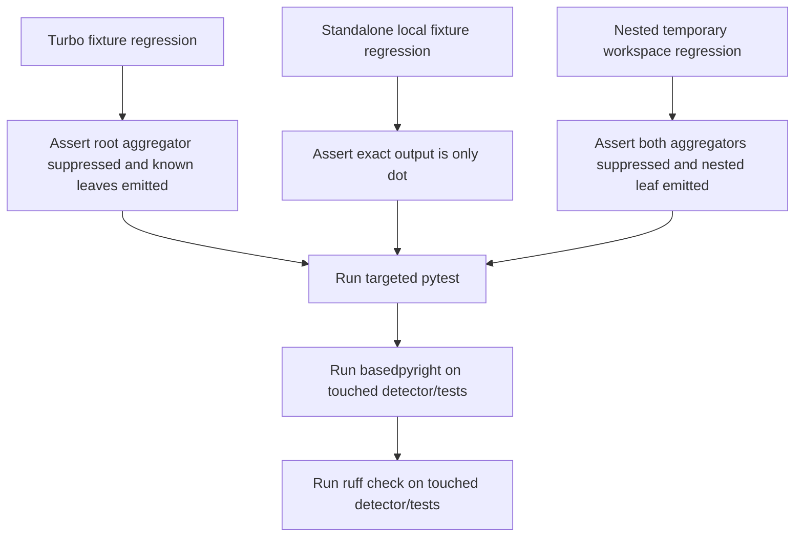

## Description

<!-- SECTION:DESCRIPTION:BEGIN -->
Address review-discovered edge cases in TypeScript workspace detection so the alpha codebase-config preview remains correct for nested monorepos and portable regression environments. This follow-up closes correctness and coverage gaps left after TASK-16.7 without broadening scope beyond workspace detection, emitted metadata, and detector regression tests.
<!-- SECTION:DESCRIPTION:END -->

## Acceptance Criteria
<!-- AC:BEGIN -->
- [ ] #1 Nested TypeScript workspace aggregators are excluded from final codebase output while their declared leaf workspace members are still discovered and emitted.
- [ ] #2 Workspace glob resolution supports segment patterns such as `apps/*-web` and recursive `**` patterns without overmatching unrelated deeper directories.
- [ ] #3 Emitted TypeScript codebases populate `manifest_path`, inherited `package_manager`, and `project_name` from `package.json`; workspace aggregators remain suppressed and `root_packages` remains unused for alpha identity.
- [ ] #4 Detector regression coverage uses repository-local fixtures or ephemeral test repositories only and fails if a standalone TypeScript repository emits any extra codebase beyond `.`.
- [ ] #5 Touched detector code and tests pass targeted pytest, basedpyright, and ruff verification.
<!-- AC:END -->

## Implementation Plan

<!-- SECTION:PLAN:BEGIN -->
## Context
TASK-16.7 fixed the primary Turbo-monorepo failure mode by suppressing the root workspace aggregator and emitting leaf workspaces, but review uncovered several follow-up gaps that still affect correctness and durability:

1. A directory that is already known as a workspace member is short-circuited before it can be reclassified as a nested workspace aggregator.
2. The custom workspace matcher is narrower than real npm-compatible workspace syntax and does not correctly support partial-segment globs such as `apps/*-web` or recursive patterns using `**`.
3. The standalone regression test currently depends on an external sibling repository instead of a local fixture.
4. The standalone test only asserts that `.` is present, not that it is the only emitted codebase.
5. Emitted TypeScript codebases still leave `project_name=None`, which weakens alpha identity metadata.
6. The detector still contains f-string Loguru calls and strict-type issues that should be cleaned up while touching the code.

## Scope Guardrails
- Keep the work limited to TypeScript workspace detection, emitted TypeScript metadata, and detector regression coverage.
- Do not reintroduce `root_packages` as a primary TypeScript identity source.
- Do not broaden package-manager semantics beyond what is required for nested workspace inheritance and workspace-pattern expansion.

## Files In Scope
- `unoplat-code-confluence-ingestion/code-confluence-flow-bridge/src/code_confluence_flow_bridge/parser/package_manager/detectors/typescript_ripgrep_detector.py`
- `unoplat-code-confluence-ingestion/code-confluence-flow-bridge/src/code_confluence_flow_bridge/parser/package_manager/detectors/rules.yaml`
- `unoplat-code-confluence-ingestion/code-confluence-flow-bridge/tests/parser/package_manager/detectors/test_typescript_ripgrep_detector.py`
- `unoplat-code-confluence-ingestion/code-confluence-flow-bridge/tests/test_data/standalone_ts_project/package.json`
- `unoplat-code-confluence-ingestion/code-confluence-flow-bridge/tests/test_data/standalone_ts_project/tsconfig.json`
- `unoplat-code-confluence-ingestion/code-confluence-flow-bridge/tests/test_data/standalone_ts_project/bun.lock`

## Implementation Strategy
### 1. Refactor workspace-member handling so nested aggregators are discoverable
The detector should not immediately emit a directory just because it already appears in `workspace_member_dirs`. Instead, workspace members must be re-evaluated to determine whether they are:
- a nested workspace aggregator that should be suppressed, or
- a true leaf workspace member that should be emitted.

Recommended helper extraction:
- `_resolve_workspace_members(directory_path, repo_path, manager_name, known_dirs) -> set[str]`
  - read the manager's configured `workspace_field`
  - parse `package.json`
  - expand declared workspace patterns against known repository directories
  - return the concrete member directories

Recommended `_fast_detect()` control flow:
1. Build `dirs_to_files`, `detections`, `done_dirs`, `workspace_member_dirs`, and `aggregator_manager_map`.
2. Sort directories shallowest-first.
3. For each `directory_path`, compute `inherited_manager = _find_aggregator_manager(directory_path, aggregator_manager_map)` before any branch-specific emission logic.
4. If `directory_path in workspace_member_dirs`:
   - validate the directory as TypeScript
   - require `inherited_manager` to exist; if missing, skip emission and log a diagnostic
   - call `_resolve_workspace_members(directory_path, repo_path, inherited_manager, known_dirs)`
   - if concrete members are returned:
     - treat `directory_path` as a nested aggregator
     - add `directory_path -> inherited_manager` to `aggregator_manager_map`
     - merge the resolved members into `workspace_member_dirs`
     - do **not** add `directory_path` to `detections` or `done_dirs`
   - otherwise:
     - emit `directory_path` using `inherited_manager`
     - add `directory_path` to `detections` and `done_dirs`
   - continue to next directory
5. If the directory is not an explicit workspace member, apply nested suppression using `done_dirs`.
6. Run normal manager detection only for non-member directories.
7. For a normally detected TypeScript directory, call `_resolve_workspace_members(directory_path, repo_path, detected_manager, known_dirs)`:
   - if members exist, classify the directory as an aggregator and suppress it
   - otherwise emit it as a standalone codebase

Key rule: nested workspace members should inherit the nearest aggregator manager instead of falling back to npm merely because they only contain `package.json`.

### 2. Replace the current workspace glob matcher with a segment-aware algorithm that supports `fnmatch` semantics and recursive `**`
The follow-up should not use whole-path `fnmatch.fnmatch()` directly because patterns such as `apps/*` can incorrectly match `apps/web/deep`. Instead, use a segment-aware matcher that applies `fnmatch.fnmatchcase()` per segment and treats `**` as a recursive segment wildcard.

Recommended algorithm for `_match_workspace_pattern(pattern_parts, dir_parts)`:
1. Normalize both the workspace pattern and directory path to POSIX segments.
2. Match recursively (or with equivalent memoized iteration):
   - if no pattern segments remain, return `True` only when no directory segments remain
   - if the current pattern segment is `**`:
     - either consume zero directory segments and advance the pattern, or
     - consume one directory segment and keep the `**` active
   - otherwise require at least one directory segment and evaluate `fnmatch.fnmatchcase(current_dir_segment, current_pattern_segment)`
   - recurse on the remaining segments
3. Return `True` only for exact segment alignment unless `**` explicitly allows additional depth.

Expected matching behavior:
- `apps/*` matches `apps/web` but not `apps/web/deep`
- `apps/*-web` matches `apps/admin-web`
- `packages/**` matches `packages/core` and `packages/core/utils`
- `**/examples/*` matches `packages/core/examples/demo`

### 3. Populate emitted `project_name` from the emitted codebase's own `package.json`
Add a helper such as `_read_project_name(directory_path, repo_path) -> str | None` that:
- reads the emitted directory's `package.json`
- returns the `name` field when it exists and is a string
- returns `None` on missing file, invalid JSON, or non-string name

Update `_build_codebase_config()` so every emitted TypeScript codebase attempts to populate:
- `manifest_path`
- `package_manager`
- `project_name`

Keep `root_packages=None` to preserve the TASK-16 decision that alpha TypeScript identity must not depend on `root_packages`.

### 4. Make the regression suite self-contained and exact
#### Standalone fixture
Create a minimal local fixture at `tests/test_data/standalone_ts_project/` containing:
- `package.json` with a string `name`, no `workspaces`, and a `typescript` dependency or devDependency
- `tsconfig.json` with minimal valid JSON
- `bun.lock` (empty file is sufficient for detection)

#### Existing Turbo test
- move `assert T3CODE_FIXTURE_DIR.exists()` before `detect_codebases(...)`
- keep the explicit assertion that `.` is not emitted
- keep the expected leaf-workspace set
- assert each emitted codebase inherits Bun
- add assertions for `manifest_path` and `project_name` so metadata is exercised, not just folder detection

#### Standalone test
- replace the external sibling-repository fixture path with the local fixture path
- assert `detected_folders == {"."}`
- assert the only emitted codebase has Bun, `manifest_path == "package.json"`, and the expected `project_name`

#### Nested workspace regression
Add a self-contained test using `tmp_path` (or equivalent temporary repository setup) with this shape:
- root `package.json` with `workspaces: ["packages/*"]`, Bun lockfile, and TypeScript signal
- `packages/platform/package.json` with `workspaces: ["plugins/*"]` and TypeScript signal
- `packages/platform/plugins/foo/package.json` with TypeScript signal and package name
- matching `tsconfig.json` files where needed

Expected output:
- root `.` is suppressed as aggregator
- `packages/platform` is suppressed as nested aggregator
- only `packages/platform/plugins/foo` is emitted
- emitted codebase inherits Bun and has the nested leaf package name

### 5. Clean up logging and type-checking while touching the detector
- Convert f-string Loguru debug calls to brace-style formatting.
- Replace broad or partially-typed YAML handling with explicit casts or validated structures rather than introducing new broad `# pyright: ignore` comments where practical.
- Resolve the `clone_repo_if_missing` / `asyncio.to_thread` typing gap so `_fast_detect()` receives a `str` consistently.

## Detection Flow

## Workspace Pattern Matching Flow

## Regression Coverage Flow

## Verification Commands
1. `uv run --group test pytest tests/parser/package_manager/detectors/test_typescript_ripgrep_detector.py -v`
2. `uv run --group dev basedpyright src/code_confluence_flow_bridge/parser/package_manager/detectors/typescript_ripgrep_detector.py tests/parser/package_manager/detectors/test_typescript_ripgrep_detector.py`
3. `uv run ruff check src/code_confluence_flow_bridge/parser/package_manager/detectors/typescript_ripgrep_detector.py tests/parser/package_manager/detectors/test_typescript_ripgrep_detector.py`
<!-- SECTION:PLAN:END -->

## Implementation Notes

<!-- SECTION:NOTES:BEGIN -->
Created as a TASK-16 follow-up from review findings on TASK-16.7 so nested workspace aggregators, richer workspace glob syntax, and portable detector regressions are tracked explicitly instead of being folded silently into the current subtask.
<!-- SECTION:NOTES:END -->
