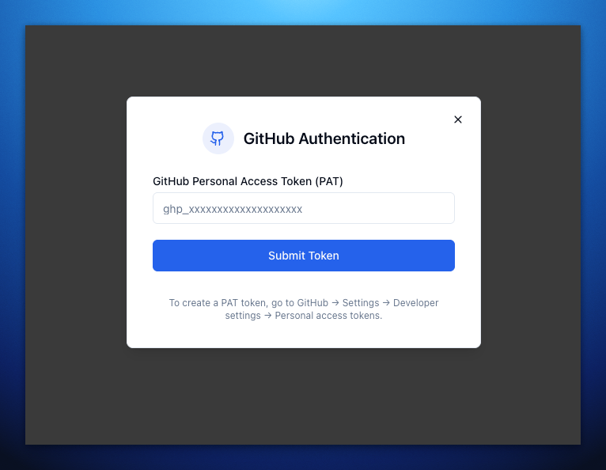
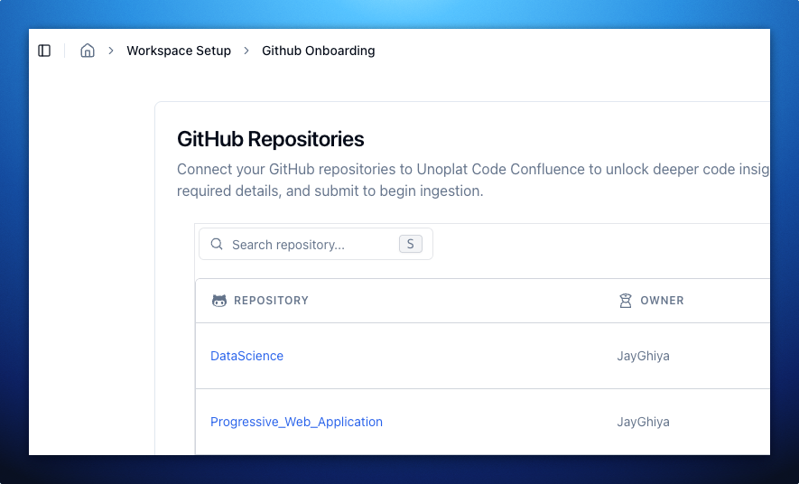
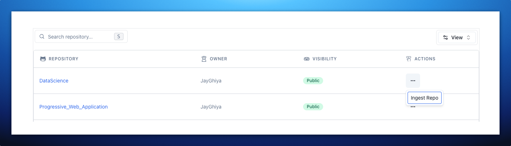
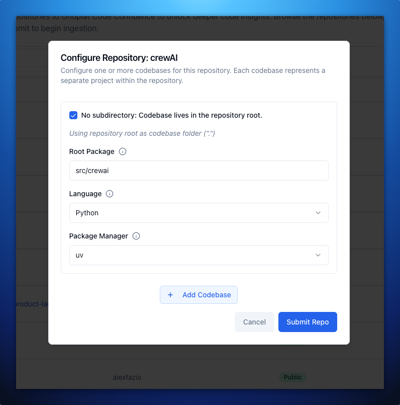
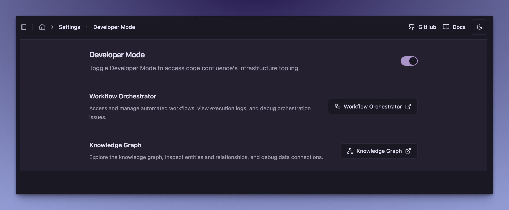

# Quick Start Guide

Welcome to **Unoplat Code Confluence** - Your Gateway to Code Understanding!

:::info Current Status
🔄 Unoplat Code Confluence currently supports Python codebases and is in alpha stage. We're actively working on expanding language support and features.
While in alpha stage, it's best suited for developers and tech enthusiasts who enjoy exploring new tools, don't mind a few rough edges, and are willing to provide feedback as we work towards establishing a complete end-to-end workflow!
:::

## Introduction

The current version supports parsing codebases and exporting a JSON representation of code graph. For more details, check out:
- 📘 [**Vision »**](/docs/deep-dive/vision)

## Prerequisites

Before you begin, ensure you have the following tool installed:

| Tool | Purpose |
|------|---------|
| [**🐳 Docker & Docker Compose »**](https://www.portainer.io/) | For running services |

## Setting Up Code Confluence

Follow these steps to set up Code Confluence:

1. **Create Project Directory and Download Configuration:**
   ```bash
   mkdir -p code-confluence && cd code-confluence
   
   # Download Docker Compose file
   curl -O https://raw.githubusercontent.com/unoplat/unoplat-code-confluence/refs/heads/main/prod-docker-compose.yml
   ```

2. **Launch Services:**
   ```bash
   docker compose -f prod-docker-compose.yml up -d
   ```

3. **Verify Deployment:**
   ```bash
   docker compose -f prod-docker-compose.yml ps
   ```

## Running the Application

### 1. Access the Web Interface
- Open your browser and go to [http://localhost:3000](http://localhost:3000)

### 2. Enter Your GitHub Personal Access Token (PAT)
- When prompted, enter a GitHub PAT with read access to the repositories you want to ingest.
- This is required for Code Confluence to clone and analyze your repositories.



:::tip Getting a GitHub PAT
If you don't have a GitHub PAT:
1. Go to GitHub Settings → Developer Settings → Personal Access Tokens → Tokens (classic)
2. Click "Generate new token (classic)"
3. Give it a name like "CodeConfluence"
4. Select only the `repo` scope (this gives read access to repositories)
5. Click "Generate token" and copy it

You only need read access since we'll just be cloning repositories!
:::

### 3. Search for a Repository
- Press **`s`** or **`S`** (Shift + s) to open the search dialog.
- You can search through your personal, public, and open source repositories.



### 4. Ingest a Repository
- In the **Actions** column, click on **Ingest Repo** for the repository you want to analyze.



### 5. Configure Repository & Codebase
- A Repository Dialog Configuration will open up where you can add one or more codebases for that repo.
- For each codebase, fill in the following:
  - **Root Package**: Path to root package/module where the main file for the codebase is situated
  - **Codebase Folder**: Folder for codebase within the mono repo (check "No subdirectory" if codebase lives in the repository root)
  - **Package Manager**: Select the package manager
  - **Programming Language**: Currently only Python is supported

#### Example: Configuring CrewAI
For example, to ingest the popular agent framework CrewAI:



- Once done, click **Submit** to start the ingestion process.

### 6. Enable Developer Mode
- Navigate to **Settings > Developer Mode**, and toggle the switch on to unlock infrastructure tooling.
- Once enabled, you will see two new tools:



#### Workflow Orchestrator
- Access and manage automated workflows
- View execution logs and debug orchestration issues
- Monitor real-time workflow performance
- **Click the "Workflow Orchestrator" button** to open the temporal workflow orchestrator dashboard.

#### Knowledge Graph
- Explore the knowledge graph, inspect entities and relationships, and debug data connections
- **Click the "Knowledge Graph" button** to open the Neo4j Browser directly
- When Neo4j Browser opens, you'll be prompted to log in with:
  ```
  Username: neo4j
  Password: password
  ```
- Once logged in, try this query to explore your code graph:
  ```cypher
  MATCH (n) 
  RETURN n 
  LIMIT 25
  ```

:::tip
The above query displays the first 25 nodes in your code graph, perfect for a quick overview!
:::

## Troubleshooting

Need assistance? We're here to help! 

### Support Options

1. **GitHub Issues**
   - 📝 Visit [**GitHub Issues »**](https://github.com/unoplat/unoplat-code-confluence/issues) to:
     - Report bugs or request features
     - Browse existing solutions
     - Get developer support

2. **Community Support**
   - 💬 Join our [**Discord Community »**](https://discord.com/channels/1131597983058755675/1169968780953260106) to:
     - Connect with other users
     - Get real-time assistance

:::note
Remember to check existing issues before creating a new one!
:::

---

<div className="docusaurus-powered">
  <p>This documentation is powered by <a href="https://docusaurus.io" target="_blank">Docusaurus</a>, making it easy to maintain and extend.</p>
</div>

