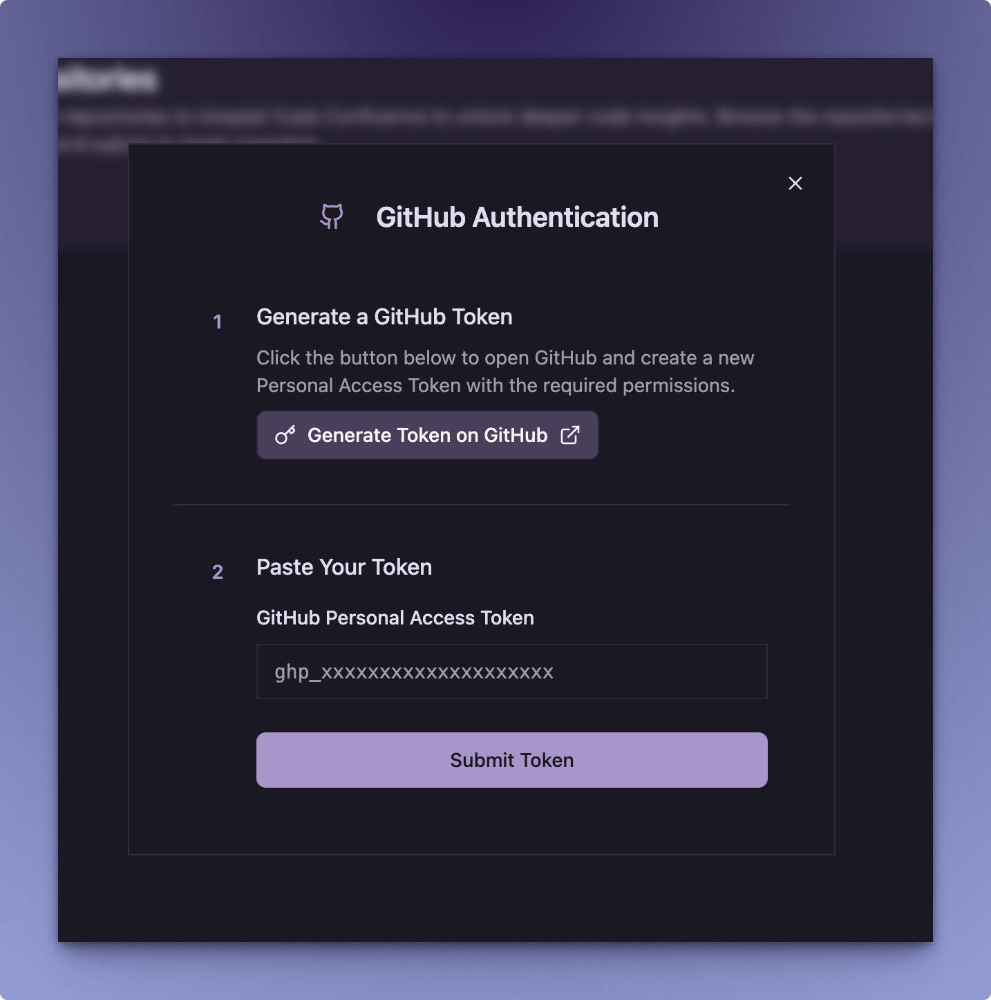
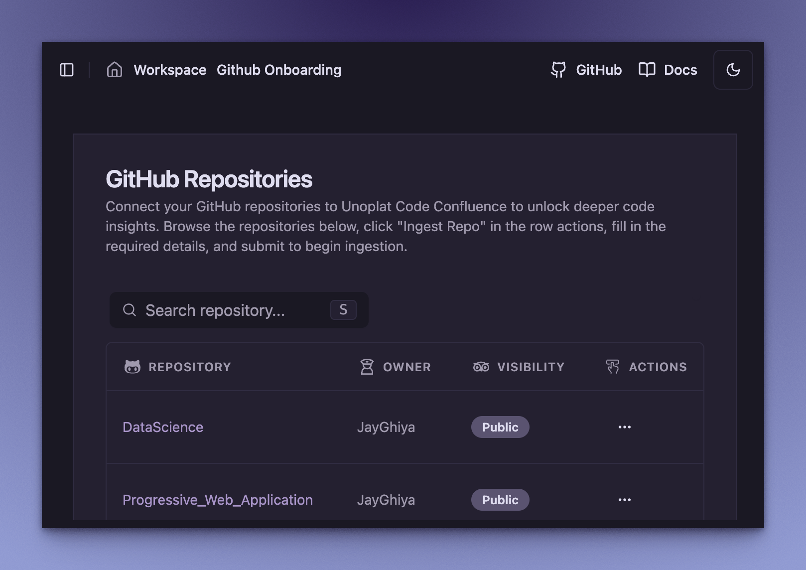
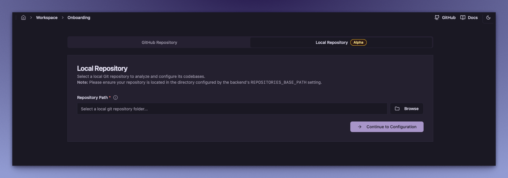
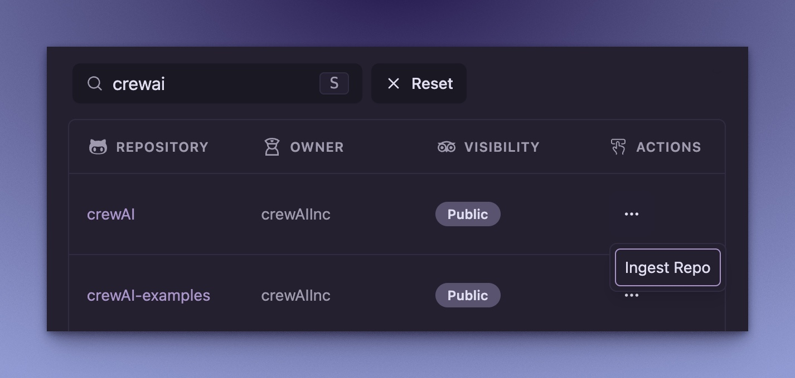
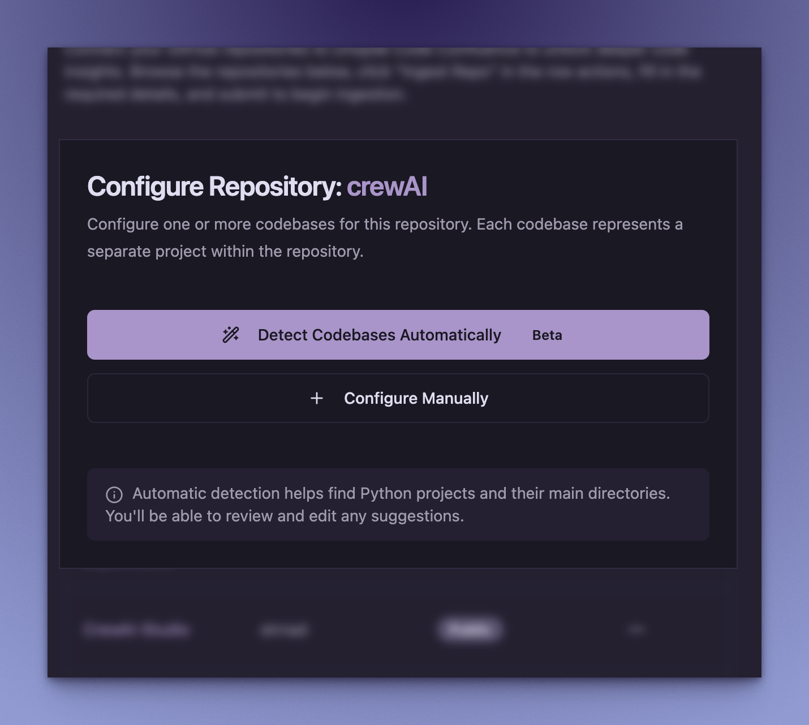
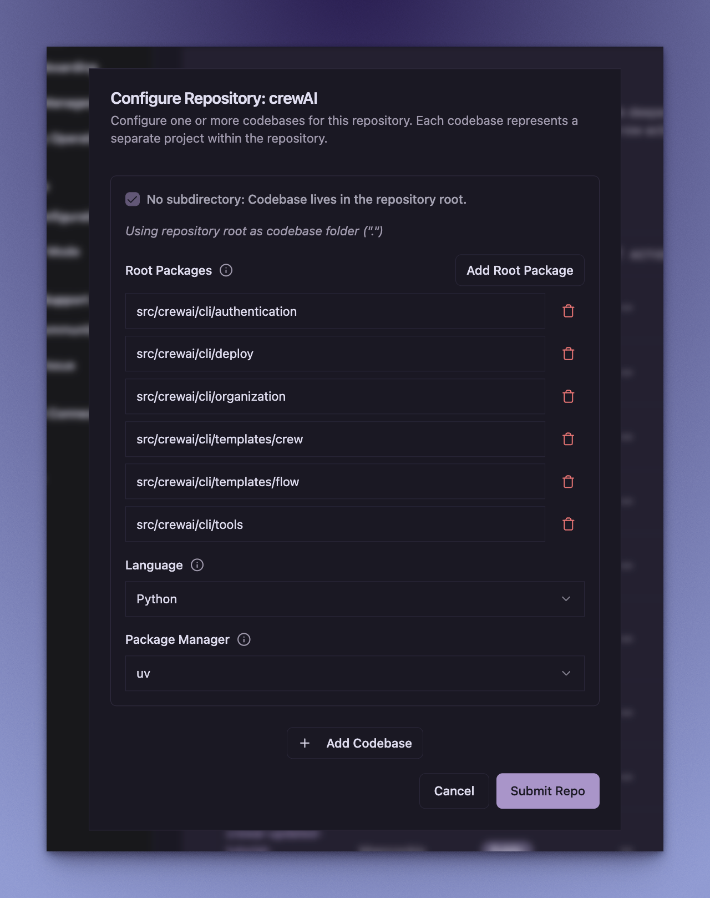

# Quick Start Guide

Welcome to **Unoplat Code Confluence** - Your Gateway to Code Understanding!

:::info Current Status
🔄 Unoplat Code Confluence currently supports Python codebases and is in alpha stage. We're actively working on expanding language support and features.
While in alpha stage, it's best suited for developers and tech enthusiasts who enjoy exploring new tools, don't mind a few rough edges, and are willing to provide feedback as we work towards establishing a complete end-to-end workflow!
:::

## Introduction

The current version supports parsing codebases and exporting a JSON representation of code graph. For more details, check out:
- 📘 [**Vision »**](/deep-dive/vision)

## Prerequisites

Before you begin, ensure you have the following tool installed:

| Tool | Purpose |
|------|---------|
| [**🐳 Docker & Docker Compose »**](https://www.portainer.io/) | For running services |

## Setting Up Code Confluence

Follow these steps to set up Code Confluence:

1. **Create Project Directory and Download Configuration:**
   ```bash
   mkdir -p code-confluence && cd code-confluence
   
   # Download Docker Compose file
   curl -O https://raw.githubusercontent.com/unoplat/unoplat-code-confluence/refs/heads/main/prod-docker-compose.yml
   ```

2. **Launch Services:**
   ```bash
   docker compose -f prod-docker-compose.yml up -d
   ```

3. **Verify Deployment:**
   ```bash
   docker compose -f prod-docker-compose.yml ps
   ```

## Running the Application

### 1. Access the Web Interface
- Open your browser and go to [http://localhost:3000](http://localhost:3000)

### 2. Enter Your GitHub Personal Access Token (PAT)
- When prompted, enter a GitHub PAT with read access to the repositories you want to ingest.
- This is required for Code Confluence to clone and analyze your repositories.



:::tip Getting a GitHub PAT
If you don't have a GitHub PAT:
1. Click "Generate new token on github (classic)"
2. Click "Generate token" and copy it in the dialog box.

:::

### 3. Ingest Repository

You can ingest repositories from two sources:

#### A. Search for GitHub Repositories
- Press **`s`** or **`S`** (Shift + s) to open the search dialog.
- You can search through your personal, public, and open source repositories.



#### B. Browse Local Git Repositories
- Click on the **Local Repository** tab to switch to local repository onboarding.
- Click the **Browse** button to select a local Git repository from your machine.
- Note: Your repository must be located within the directory configured by the backend's REPOSITORIES_BASE_PATH setting.



:::note Docker Configuration for Local Repositories
The Docker Compose is pre-configured with volume mounting (`${HOME}/unoplat/repositories:/root/.unoplat/repositories`) and sets the environment variable `REPOSITORIES_BASE_PATH=/root/.unoplat/repositories` in the flow-bridge service to enable local repository ingestion. 

Before using local repositories, create the required directory on your host machine:
```bash
mkdir -p ~/unoplat/repositories
```

You can modify these paths in the Docker Compose file to match your preferred directory structure if needed, but ensure the volume mount path remains consistent with the `REPOSITORIES_BASE_PATH` environment variable in the `code-confluence-flow-bridge` service configuration.
:::

### 4. Continue with Repository Configuration
- For GitHub repositories: In the **Actions** column, click on **Ingest Repo** for the repository you want to analyze.
- For local repositories: After selecting your local repository, click **Continue to Configuration** to proceed.



### 5. Configure Repository & Codebase
- A Repository Dialog Configuration will open up with automatic codebase detection capabilities.
- Code Confluence will automatically detect Python projects and their main directories within the repository.



- You can choose to **Detect Codebases Automatically** (recommended) or configure manually if needed.
- The automatic detection will analyze the repository structure and suggest appropriate configurations for:
  - **Root Packages**: Automatically identified main modules/packages
  - **Codebase Folders**: Detected project directories
  - **Package Manager**: Automatically detected (e.g., uv, pip, poetry)
  - **Programming Language**: Currently supports Python

#### Example: Automatic Detection Results
When automatic detection completes, you'll see the detected codebases:



- Review the automatically detected configurations and make any necessary adjustments.
- Once satisfied with the detection results, click **Submit Repo** to start the ingestion process.

### 6. Enable Developer Mode
- Navigate to **Settings > Developer Mode**, and toggle the switch on to unlock infrastructure tooling.
- Once enabled, you will see two new tools:


#### Workflow Orchestrator
- Access and manage automated workflows
- View execution logs and debug orchestration issues
- Monitor real-time workflow performance
- **Click the "Workflow Orchestrator" button** to open the temporal workflow orchestrator dashboard.

#### Knowledge Graph
- Explore the knowledge graph, inspect entities and relationships, and debug data connections
- **Click the "Knowledge Graph" button** to open the Neo4j Browser directly
- When Neo4j Browser opens, you'll be prompted to log in with:
  ```
  Username: neo4j
  Password: password
  ```
- Once logged in, try this query to explore your code graph:
  ```cypher
  MATCH (n) 
  RETURN n 
  LIMIT 25
  ```

:::tip
The above query displays the first 25 nodes in your code graph, perfect for a quick overview!
:::

## Troubleshooting

Need assistance? We're here to help! 

### Support Options

1. **GitHub Issues**
   - 📝 Visit [**GitHub Issues »**](https://github.com/unoplat/unoplat-code-confluence/issues) to:
     - Report bugs or request features
     - Browse existing solutions
     - Get developer support

2. **Community Support**
   - 💬 Join our [**Discord Community »**](https://discord.com/channels/1131597983058755675/1169968780953260106) to:
     - Connect with other users
     - Get real-time assistance

:::note
Remember to check existing issues before creating a new one!
:::

---

<div className="docusaurus-powered">
  <p>This documentation is powered by <a href="https://docusaurus.io" target="_blank">Docusaurus</a>, making it easy to maintain and extend.</p>
</div>

