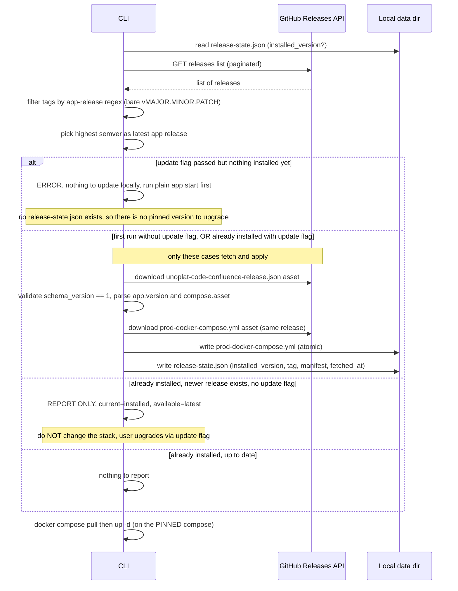

# How the CLI Fetches & Pins the App Version

> Audience: whoever maintains `unoplat-code-confluence-cli`.
> Status: the **CI side is live**; the **CLI side described in “Target design” is not implemented yet**.
> This document explains the deployment change that just shipped and how the CLI is meant to
> consume it, so the two halves stay in sync.

---

## TL;DR

- An **app release** (`unoplat-code-confluence-vX.Y.Z`, published from `main` by
  `.github/workflows/promote_app_release.yaml`) is now the **single source of truth** for what an
  end user runs.
- Every app release carries **two immutable assets**:
  1. `prod-docker-compose.yml` — the exact compose snapshot for that version.
  2. `unoplat-code-confluence-release.json` — a manifest naming the app version and the pinned
     component image tags.
- The CLI should stop downloading compose from the **moving `main` branch** and instead resolve the
  **latest app release**, download these two assets, and **record the version it installed locally**
  so it can tell when an update is available.
- **Update policy (important — no silent upgrades):**
  - **First run** (nothing installed yet) → fetch the latest release and start. No prompt: there is
    nothing to preserve, so this is the one case that fetches automatically.
  - **Every later run** → run the **already-installed (pinned) version** and **never upgrade on its
    own**. If a newer release exists, only **report** it — return the current version and the
    available version — and keep running the pinned one.
  - **Upgrading is opt-in** via an explicit `--update` flag (user consent). Only then does the CLI
    fetch the newer release's assets and restart on it.
  - **`--update` on a fresh machine is rejected, not silently fetched.** There is no local release
    manifest to upgrade *from* yet, so `--update` with nothing installed prints guidance to run the
    plain start command (no `--update`) first, which performs the initial fetch.

---

## 1. What changed on the deployment side (already shipped)

Previously there was no per-version record of "which images make up app version X". Compose lived
only on `main`, and any push to `main` could silently change what users pulled.

Now, when an app release is **published** (the moment the `release-please--*` PR is merged into
`main`), the workflow runs three extra steps, gated on
`steps.release_app_publish.outputs.release_created == 'true'`:

1. **Install `js-yaml`.**
2. **Generate `unoplat-code-confluence-release.json`** — parse `prod-docker-compose.yml`, extract the
   three component image tags, validate them (every component present; every tag an explicit semver,
   never `latest`), and fail the job if anything is off (so a bad manifest never ships).
3. **Upload both assets** to the just-published release via `gh release upload --clobber` (attaches
   assets only; never touches the CHANGELOG body or title).

Because the manifest is *derived from* the compose file in the same step, the two **cannot disagree**.

> Component releases (flow-bridge / query-engine / frontend) are cut separately on `dev` by
> `publish_release_management.yaml`. Those do **not** produce app releases and do **not** publish
> these assets. Only the app release does.

### Manifest schema (`unoplat-code-confluence-release.json`, `schema_version: 1`)

```json
{
  "schema_version": 1,
  "app": {
    "name": "unoplat-code-confluence",
    "version": "0.38.0",
    "tag": "unoplat-code-confluence-v0.38.0"
  },
  "compose": { "asset": "prod-docker-compose.yml" },
  "components": {
    "flow_bridge":  { "image": "ghcr.io/unoplat/code-confluence-flow-bridge",         "tag": "0.80.0" },
    "query_engine": { "image": "ghcr.io/unoplat/unoplat-code-confluence-query-engine", "tag": "0.44.0" },
    "frontend":     { "image": "ghcr.io/unoplat/unoplat-code-confluence-frontend",     "tag": "1.55.1" }
  }
}
```

- `app.version` — the app semver the CLI compares against its stored local version.
- `app.tag` — the GitHub release tag the assets are attached to.
- `compose.asset` — the filename of the companion compose asset on the **same** release.
- `components.*.image` / `.tag` — the pinned image each service runs (informational for the CLI today;
  useful for diagnostics and future "show me what I'm running" output).

> The live example above is real: it was backfilled onto the existing `v0.38.0` release. You can fetch
> it right now:
> `https://github.com/unoplat/unoplat-code-confluence/releases/download/unoplat-code-confluence-v0.38.0/unoplat-code-confluence-release.json`

---

## 2. What the CLI does today (the gap)

Current behavior pins nothing and tracks no version:

- `config.py:22-27` — `compose_source_url` defaults to the **`main` branch raw URL**:
  `https://raw.githubusercontent.com/unoplat/unoplat-code-confluence/main/prod-docker-compose.yml`.
- `app_runtime.py:100-118` — `ensure_compose_file()` downloads that URL once and caches it at
  `resolved_data_dir / "prod-docker-compose.yml"` (`config.py:42-45`). It **only re-downloads if the
  file is missing or `--refresh-compose` is passed** — it never checks whether a newer release exists.

So today: first run pins you to whatever `main` looked like at that instant; later runs keep using the
cached file forever unless you manually `--refresh-compose`, and even then you get "latest `main`",
not a coherent released version. There is **no record of which app version is installed.**

---

## 3. Target design (to implement)

Replace "download compose from `main`" with "resolve the latest app **release**, download its two
assets, and remember the version."

### 3.1 Resolve the latest app release — mind the tag shape

Every release in this repo is prefixed `unoplat-code-confluence-`, *including the component ones*:

| Tag | Is it the app release? |
| --- | --- |
| `unoplat-code-confluence-v0.38.0`               | ✅ yes (bare `…-v<semver>`) |
| `unoplat-code-confluence-frontend-v1.55.1`      | ❌ no (frontend component) |
| `unoplat-code-confluence-query-engine-v0.44.0`  | ❌ no (query-engine component) |
| `code-confluence-flow-bridge-v0.80.0`           | ❌ no (flow-bridge component) |

So you **must** anchor a full-string regex, not a prefix match:

```python
import re

APP_TAG_RE = re.compile(r"^unoplat-code-confluence-v(\d+)\.(\d+)\.(\d+)$")
```

A bare prefix check on `unoplat-code-confluence-` would happily pick a frontend release and break
everything. This is the #1 trap.

> **Do not rely on GitHub's `/releases/latest`.** It returns whichever non-prerelease was published
> most recently across *all* components — that can be a frontend or query-engine release, not the app.
> List releases, filter by `APP_TAG_RE`, and pick the highest semver yourself.

### 3.2 Fetch flow



### 3.3 Asset download URLs

Two equivalent options:

- **Stable URL pattern** (no extra API call once you know the tag):
  `https://github.com/unoplat/unoplat-code-confluence/releases/download/<tag>/<asset-name>`
  e.g. `…/download/unoplat-code-confluence-v0.38.0/unoplat-code-confluence-release.json`
- **API-driven**: each release object from the releases API exposes `assets[].browser_download_url`
  and `assets[].name` — match `name == "unoplat-code-confluence-release.json"` /
  `"prod-docker-compose.yml"` and follow `browser_download_url`.

For a **public** repo, unauthenticated `httpx2.get` works and is the simplest path. If you later add a
token (e.g. to avoid rate limits), send `Authorization: Bearer <token>` and
`Accept: application/vnd.github+json` on API calls.

### 3.4 Local version state — `release-state.json`

Store it next to the cached compose, in `resolved_data_dir` (`config.py:35-45`,
`platformdirs.user_data_dir("unoplat-code-confluence", "unoplat")`):

```
<resolved_data_dir>/
├── prod-docker-compose.yml          # existing cached compose (now a release snapshot)
└── release-state.json               # NEW: what version is installed locally
```

Suggested shape:

```json
{
  "schema_version": 1,
  "installed_version": "0.38.0",
  "installed_tag": "unoplat-code-confluence-v0.38.0",
  "fetched_at": "2026-06-04T10:00:00Z",
  "manifest": { "...": "verbatim copy of unoplat-code-confluence-release.json" }
}
```

- `installed_version` is the value compared against the latest release to decide "update available?".
- Keeping the full `manifest` verbatim lets the CLI answer "what images am I running?" offline and
  makes debugging trivial.
- Write it **atomically** (write to a temp file in the same dir, then `os.replace`) so an interrupted
  run never leaves a half-written state file. Do the same for the compose file.

### 3.5 Update decision — two separate questions

Do **not** collapse "should I fetch?" and "is a newer version out?" into one boolean. They drive
different behaviour: the first may mutate the user's stack, the second is read-only reporting.

Before either of those, guard the one nonsensical combination — `--update` with nothing installed.
`--update` means "move my existing pinned install to latest", but on a fresh machine there is no
`release-state.json` / compose to upgrade *from*. Reject it with guidance instead of treating it as a
first fetch:

```python
def reject_update_without_install(installed: str | None, *, update_requested: bool) -> str | None:
    """Return an error message when --update is meaningless, else None.

    On a fresh machine there is no local release manifest to upgrade from, so the initial fetch
    must go through the plain start command (no --update). The CLI should print this and exit
    non-zero *before* touching the network for assets.
    """
    if installed is None and update_requested:
        return (
            "Nothing is installed yet, so there is no pinned version to update. "
            "Run `unoplat-code-confluence app start` (without --update) to fetch and start "
            "the latest release."
        )
    return None
```

Only once that guard passes do the two questions below apply.

```python
def should_fetch_and_apply(
    installed: str | None,
    *,
    update_requested: bool,   # the --update flag
    compose_cached: bool,
) -> bool:
    """True only when we are allowed to download + (re)write the pinned version.

    - first run (nothing installed) -> fetch & start
    - missing/corrupt local cache   -> re-fetch the installed (or latest) version
    - explicit user consent         -> upgrade to latest
    Never triggered merely because a newer release exists.
    """
    return installed is None or not compose_cached or update_requested


def update_available(installed: str | None, latest: str) -> bool:
    """Pure, read-only: is there a strictly newer app release than what's installed?"""
    if installed is None:
        return False  # first run is a fetch, not an 'update'
    return _semver_tuple(latest) > _semver_tuple(installed)
```

Behaviour matrix:

| State | `should_fetch_and_apply` | What the user sees |
| --- | --- | --- |
| First run (`installed is None`), no `--update` | **True** → fetch latest, pin it, start | "Installed unoplat-code-confluence v0.38.0" |
| First run (`installed is None`) **+ `--update`** | rejected by guard (never reaches this fn) | "Nothing is installed yet … run `app start` (without --update) to fetch and start the latest release" (exit non-zero) |
| Installed, `latest == installed` | False | starts pinned version; nothing to report |
| Installed, `latest > installed`, no `--update` | False | starts pinned version **+ reports** "Update available: v0.38.0 → v0.39.0 (run `… app start --update` to upgrade)" |
| Installed, `--update` passed | **True** → fetch latest, re-pin, restart | "Updated v0.38.0 → v0.39.0" |

- Compare as integer `(major, minor, patch)` tuples (parsed by `APP_TAG_RE`), **not** string compare —
  `"0.9.0" < "0.10.0"` is false as strings.
- **Never downgrade**, even with `--update`: only act when `latest > installed`.
- The reporting path must return both versions to the caller (e.g. on the `AppStartResult`) so
  `cli.py` can print them and `--json` callers can read them — see §4.

---

## 4. Concrete change points in the current code

| File / lines | Today | Change to |
| --- | --- | --- |
| `config.py:22-27` (`compose_source_url`) | Raw `main` compose URL | A `repo` identifier (`unoplat/unoplat-code-confluence`) + release API base; the moving-`main` URL goes away |
| `config.py` (new) | — | `release_state_path` computed field → `resolved_data_dir / "release-state.json"` |
| `app_runtime.py:100-118` (`ensure_compose_file`) | GET compose from `main`, cache if missing | Resolve latest app release → if `should_fetch_and_apply` → download manifest + compose assets, write both + `release-state.json` atomically; otherwise leave the pinned compose untouched |
| `app_runtime.py` (new) | — | `resolve_latest_app_release()` (list + regex-filter + max-semver), `read_release_state()` / `write_release_state()`, `should_fetch_and_apply()`, `update_available()` |
| `app_runtime.py` (`AppStartResult`) | no version fields | add `installed_version: str`, `available_version: str \| None`, `update_available: bool` so the report survives back to the CLI |
| `cli.py:27-39` (`app_start` options) | `--refresh-compose`, `--json` | add **`--update`** (opt-in upgrade = user consent). `--refresh-compose` can stay as "re-fetch the *installed* version" (repair), distinct from `--update` (move to latest). Call `reject_update_without_install()` right after reading `release-state.json`: if it returns a message, print it and exit non-zero **before** any asset download |
| `cli.py:47-69` (output) | prints compose path | also print `installed_version`; when `update_available`, print `Update available: vX → vY (run … --update to upgrade)`; include both in the `--json` payload |

> Keep the existing "is Flow Bridge already reachable?" short-circuit (`app_runtime.py:60-72`). Even on
> that fast path, still do the cheap **read-only** release lookup so an "update available" line can be
> shown — but it must remain report-only; the stack is never changed without `--update`.

---

## 5. Failure modes to handle

- **GitHub unreachable / rate-limited** but a cached compose + `release-state.json` exist → warn and
  run the cached version rather than hard-failing. Only hard-fail on first run (nothing cached).
- **No tag matches `APP_TAG_RE`** (e.g. only component releases exist) → explicit error; do **not**
  fall back to a component release.
- **Manifest `schema_version` unknown / > 1** → refuse and tell the user to upgrade the CLI, rather
  than guessing at a newer shape.
- **Asset missing on a matched release** (older releases predate this mechanism — e.g. anything before
  `v0.38.0`) → treat as "no consumable release"; surface a clear message. `v0.38.0` was backfilled, so
  it is the earliest release that has assets.

---

## 6. Verifying against a real release

```bash
# Latest app release tag (filter out component releases):
gh release list --limit 50 \
  | awk '$0 ~ /unoplat-code-confluence-v[0-9]+\.[0-9]+\.[0-9]+\t/ {print $0}'

# Assets attached to it:
gh release view unoplat-code-confluence-v0.38.0 --json assets --jq '.assets[].name'
# -> prod-docker-compose.yml
# -> unoplat-code-confluence-release.json

# Pull the manifest the way the CLI will:
curl -sL https://github.com/unoplat/unoplat-code-confluence/releases/download/unoplat-code-confluence-v0.38.0/unoplat-code-confluence-release.json
```

---

## 7. Out of scope (explicitly not done yet)

The entire CLI rewrite in §3–§4 is a planned follow-up. The shipped change is **CI only**: app
releases now publish the two assets, and `v0.38.0` was backfilled by hand. Implementing the
release-aware fetch, `release-state.json`, version comparison, and tests in the CLI is the next step.
