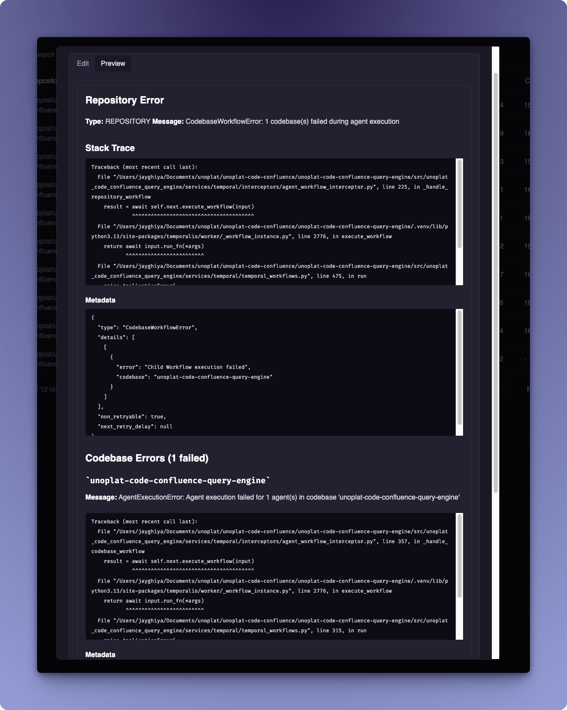
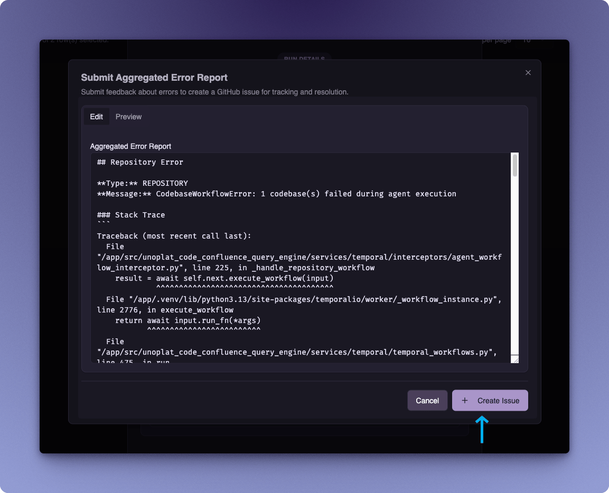
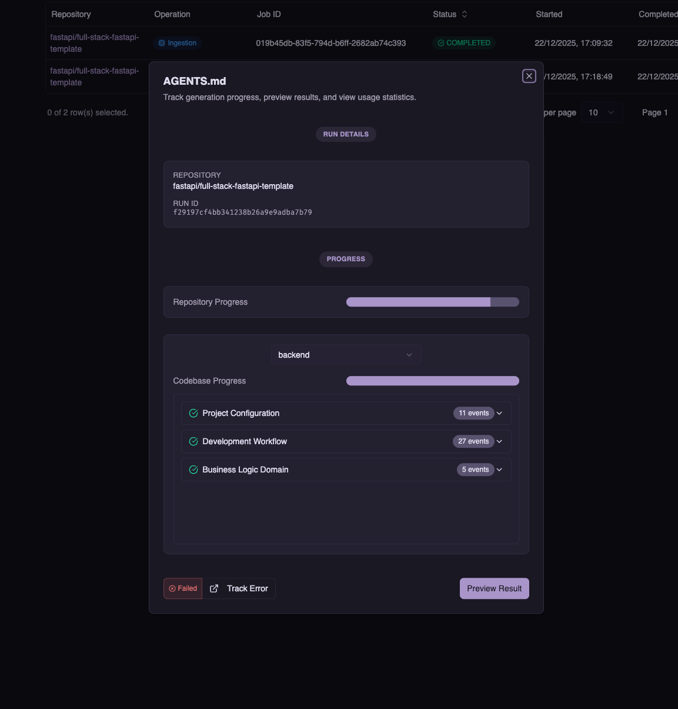

import { Callout } from 'fumadocs-ui/components/callout';

# Submitting an Error

Code Confluence includes a built-in error reporting system that automatically creates GitHub issues when operations fail. This helps us track and resolve issues quickly while providing you with a way to monitor the progress of your reported errors.

## Error Reporting Workflow

### Step 1: Navigate to Operations Panel

Go to **Workspace > Operations Management** in the sidebar to view all your operations.

The Operations Panel displays a table with all your operations including:
- **Repository** — The repository being processed
- **Operation** — Type of operation (Ingestion, Agents Generation)
- **Job ID** — Unique identifier for the operation
- **Status** — Current status (Running, Completed, Failed)
- **Started/Completed** — Timestamps for the operation

### Step 2: Identify the Failed Operation

Look for operations with a **Failed** status in the table. Click the **Actions** menu (`...`) for the failed operation and select **View Details**.

### Step 3: Review Error Details

The error details dialog provides comprehensive information about what went wrong:

The dialog includes:
- **Error Type and Message** — High-level description of the error
- **Stack Trace** — Technical details showing where the error occurred
- **Metadata** — JSON object with additional error context
- **Codebase Errors** — Specific errors for each affected codebase

### Step 4: Submit Error Report

Click the **Submit Error** button to open the error submission dialog.

The **Submit Aggregated Error Report** dialog allows you to:
1. **Review** the pre-populated error report in the **Edit** tab
2. **Preview** the formatted report in the **Preview** tab
3. **Edit** any details before submission if needed
4. Click **Create Issue** to automatically create a GitHub issue

<Callout type="info" title="What Gets Shared">
When you submit an error report, the following information is included:
- **Stack trace** — Technical details of where the error occurred
- **Codebase name** — The name of the affected codebase
- **Workflow run ID** — Identifier for the specific operation run

If there are any details in the error report that you prefer not to share, you can edit them directly in the dialog before clicking **Create Issue**.
</Callout>

### Step 5: Track Your Issue

After submitting the error, you can track your GitHub issue directly from the application.

Click the **Track Error** button (with the external link icon) to open the GitHub issue in your browser. This allows you to:
- Monitor the status of your reported issue
- Add additional context or comments
- Receive updates when the issue is addressed

## Supported Operations

Error reporting is available for all Code Confluence operations:

| Operation | Description |
|-----------|-------------|
| **Ingestion** | Repository cloning and codebase detection |
| **Agents Generation** | AGENTS.md file generation |

<Callout type="info" title="Need More Help?">
If you need immediate assistance or want to discuss an issue with the community, join our [Discord Community](https://discord.com/channels/1131597983058755675/1169968780953260106).
</Callout>
