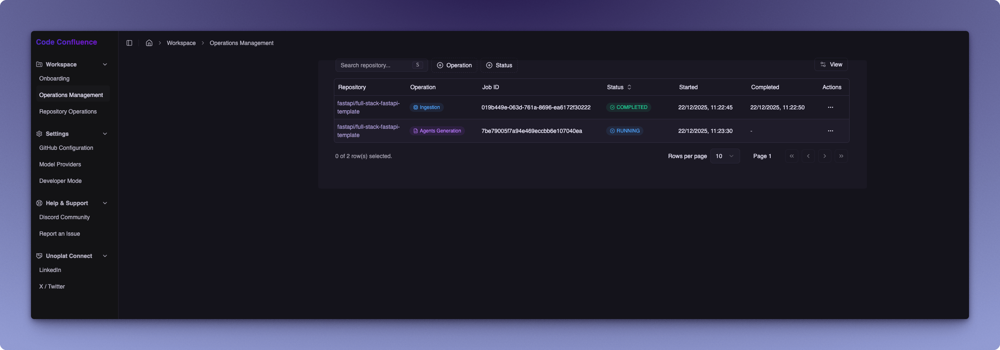
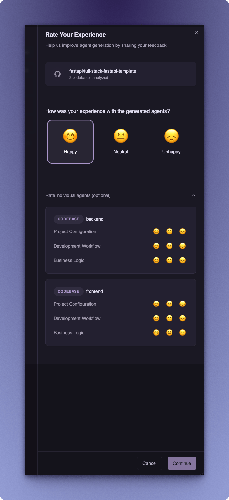
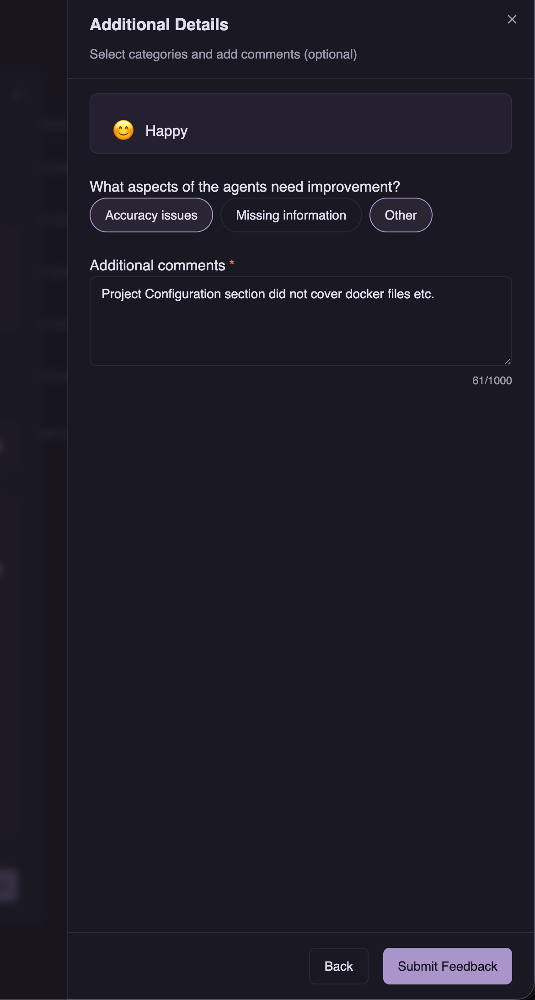
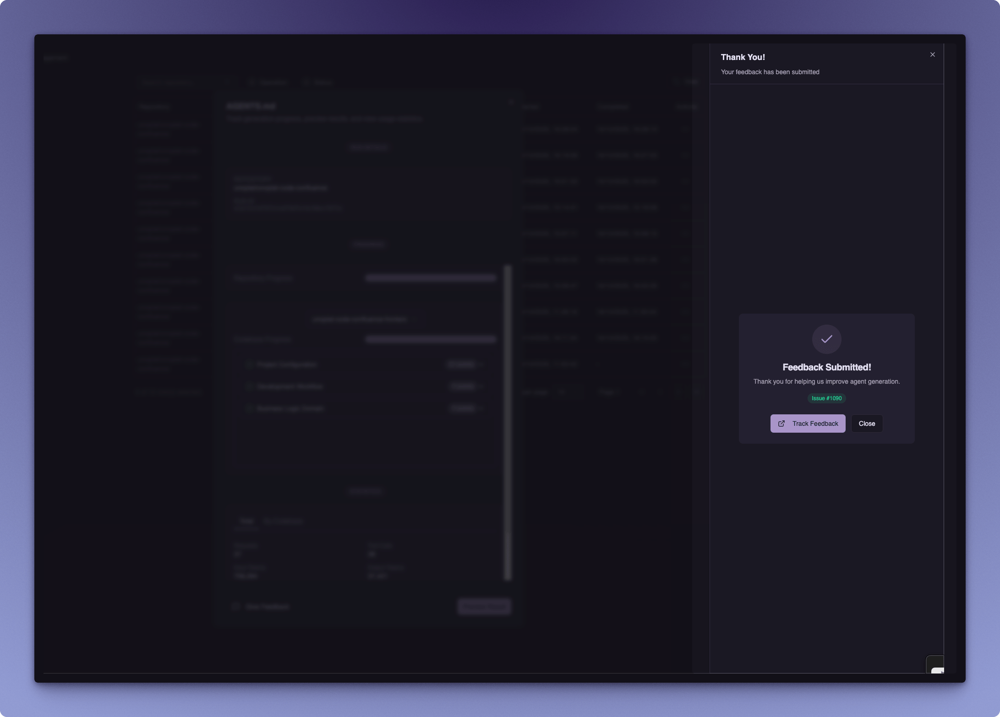

import { Callout } from 'fumadocs-ui/components/callout';

# Submitting Feedback

Code Confluence includes a feedback system that allows you to share your experience with AI agent generation results. Your feedback helps improve the quality of generated documentation and is submitted as a GitHub issue for tracking and follow-up.

## When to Submit Feedback

Feedback submission is available for **completed AI Agent Generation operations**. Use this feature when you want to:
- Report accuracy issues in the generated AGENTS.md content
- Highlight missing information that should be included
- Provide general suggestions for improvement

## Feedback Submission Workflow

### Step 1: Navigate to Operations Panel

Go to **Workspace > Operations Management** in the sidebar to view all your operations.

The Operations Panel displays a table with all your operations including:
- **Repository** — The repository being processed
- **Operation** — Type of operation (Ingestion, Agents Generation)
- **Job ID** — Unique identifier for the operation
- **Status** — Current status (Running, Completed, Failed)
- **Started/Completed** — Timestamps for the operation

### Step 2: Access Completed Operation

Locate a **Completed** AI Agent Generation operation in the table. Click the **Actions** menu (`...`) for the operation and select **View Details** to open the operation details dialog.

### Step 3: Click Submit Feedback

In the operation details view, click the **Submit Feedback** button to begin the feedback submission process.

### Step 4: Rate Your Experience

The first screen allows you to rate your overall experience with the generated agents:

This form includes:

| Section | Description |
|---------|-------------|
| **Repository Info** | Shows the repository name and number of codebases analyzed |
| **Overall Experience** | Select your overall mood: Happy, Neutral, or Unhappy |
| **Rate Individual Agents** | (Optional) Expand to rate specific sections for each codebase |

The individual agent ratings allow you to provide granular feedback on:
- **Project Configuration** — How well the configuration documentation was generated
- **Development Workflow** — Quality of workflow and process documentation
- **Business Logic** — Accuracy of business logic documentation

Click **Continue** to proceed to the next step.

### Step 5: Provide Additional Details

The second screen allows you to provide more specific feedback:

The form includes:

| Field | Description |
|-------|-------------|
| **Selected Mood** | Displays your previously selected mood |
| **Improvement Categories** | Select applicable categories: Accuracy issues, Missing information, Other |
| **Additional Comments** | Provide specific details about what could be improved (required, max 1000 characters) |

<Callout type="info" title="Tip">
Be specific in your additional comments. For example, instead of "Missing information", describe what specific section or topic was not covered in the generated documentation.
</Callout>

Click **Submit Feedback** to create a GitHub issue with your feedback.

### Step 6: Track Your Feedback

After submitting your feedback, a confirmation dialog appears with a link to the created GitHub issue.

Click the **Track Feedback** button (with the external link icon) to open the GitHub issue in your browser. This allows you to:
- Monitor the status of your feedback
- Add additional context or follow-up comments
- Receive updates when your feedback is addressed

## Supported Operations

Feedback submission is currently available for:

| Operation | Feedback Available |
|-----------|-------------------|
| **Ingestion** | Not available |
| **Agents Generation** | Available |

<Callout type="info" title="Need More Help?">
If you need immediate assistance or want to discuss feedback with the community, join our [Discord Community](https://discord.com/channels/1131597983058755675/1169968780953260106).
</Callout>
