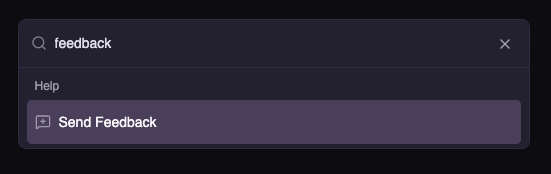
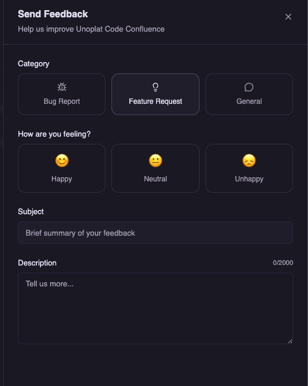
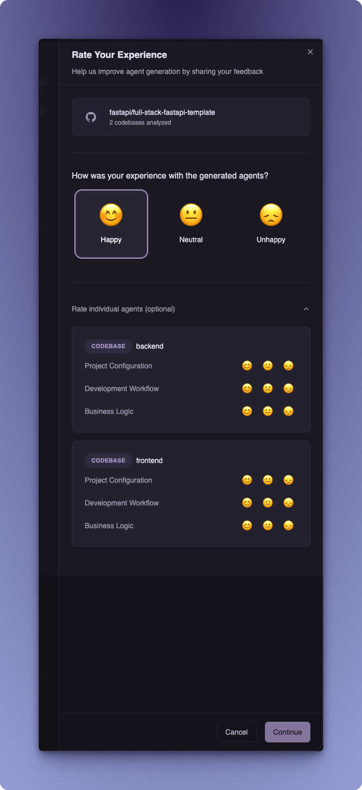
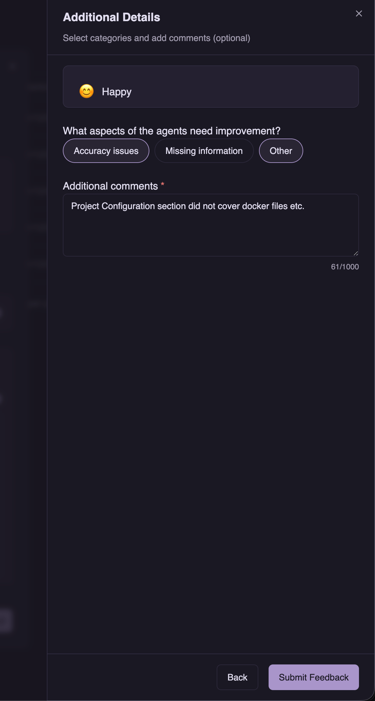
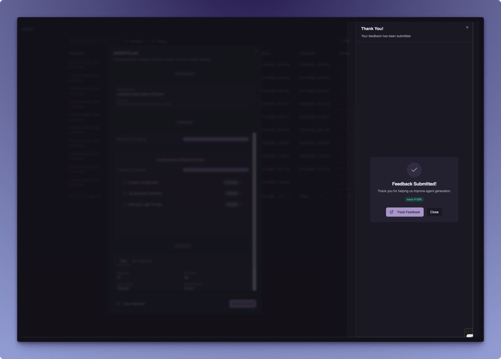

import { Callout } from 'fumadocs-ui/components/callout';

# Submitting Feedback

**Unoplat Code Confluence** provides two ways to share feedback:

1. **In-App Feedback** — Send general feedback (bug reports, feature requests, or comments) directly to the Unoplat team from within the application.
2. **Agent Generation Feedback** — Rate and review the results of a completed AI Agent Generation operation, submitted as a GitHub issue.

## In-App Feedback

You can send general feedback at any time using the built-in **Send Feedback** command.

### Opening the Feedback Dialog

Open the **Command Palette** and search for **"feedback"**, then click **Send Feedback**.

### Filling Out the Form

The Send Feedback dialog lets you describe your experience:

| Field | Description |
|-------|-------------|
| **Category** | Select one: Bug Report, Feature Request, or General |
| **How are you feeling?** | Choose a sentiment: Happy, Neutral, or Unhappy |
| **Subject** | A brief summary of your feedback |
| **Description** | Detailed feedback (up to 2000 characters) |

<Callout type="info" title="Where does this go?">
In-app feedback is sent directly to the Unoplat team for review.
</Callout>

## Agent Generation Feedback

After a completed **AI Agent Generation** operation, you can rate the generated results and submit detailed feedback as a GitHub issue. This helps improve the quality of generated AGENTS.md documentation.

### Step 1: Navigate to Operations Panel

Go to **Workspace > Operations Management** in the sidebar to view all your operations.

The Operations Panel displays a table with all your operations including:
- **Repository** — The repository being processed
- **Operation** — Type of operation (Ingestion, Agents Generation)
- **Job ID** — Unique identifier for the operation
- **Status** — Current status (Running, Completed, Failed)
- **Started/Completed** — Timestamps for the operation

### Step 2: Access Completed Operation

Locate a **Completed** AI Agent Generation operation in the table. Click the **Actions** menu (`...`) for the operation and select **View Details** to open the operation details dialog.

### Step 3: Click Give Feedback

In the operation details view, click the **Give Feedback** button to begin the feedback submission process.

### Step 4: Rate Your Experience

The first screen allows you to rate your overall experience with the generated agents:

This form includes:

| Section | Description |
|---------|-------------|
| **Repository Info** | Shows the repository name and number of codebases analyzed |
| **Overall Experience** | Select your overall mood: Happy, Neutral, or Unhappy |
| **Rate Individual Agents** | (Optional) Expand to rate specific sections for each codebase |

The individual agent ratings use a simple **thumbs up / thumbs down** system for each agent:

| Agent | What It Covers |
|-------|---------------|
| **Development Workflow Guide** | Development practices, build processes, and workflow documentation |
| **Dependency Guide** | Dependency analysis and package configuration documentation |
| **Business Domain Guide** | Core business logic and domain model documentation |
| **App Interfaces Guide** | API endpoints, interface contracts, and integration documentation |

Click **Continue** to proceed to the next step.

### Step 5: Provide Additional Details

The second screen allows you to provide more specific feedback:

The form includes:

| Field | Description |
|-------|-------------|
| **Selected Mood** | Displays your previously selected mood |
| **Improvement Categories** | Select applicable categories: Accuracy issues, Missing information, Other |
| **Additional Comments** | Provide specific details about what could be improved (required, max 1000 characters) |

<Callout type="info" title="Tip">
Be specific in your additional comments. For example, instead of "Missing information", describe what specific section or topic was not covered in the generated documentation.
</Callout>

Click **Submit Feedback** to create a GitHub issue with your feedback.

### Step 6: Track Your Feedback

After submitting your feedback, a confirmation dialog appears with a link to the created GitHub issue.

Click the **Track Feedback** button (with the external link icon) to open the GitHub issue in your browser. This allows you to:
- Monitor the status of your feedback
- Add additional context or follow-up comments
- Receive updates when your feedback is addressed

## Supported Operations

Feedback submission is currently available for:

| Operation | Feedback Available |
|-----------|-------------------|
| **Ingestion** | Not available |
| **Agents Generation** | Available |

<Callout type="info" title="Need More Help?">
If you need immediate assistance or want to discuss feedback with the community, join our [Discord Community](https://discord.gg/qe2nbQMnWB).
</Callout>
