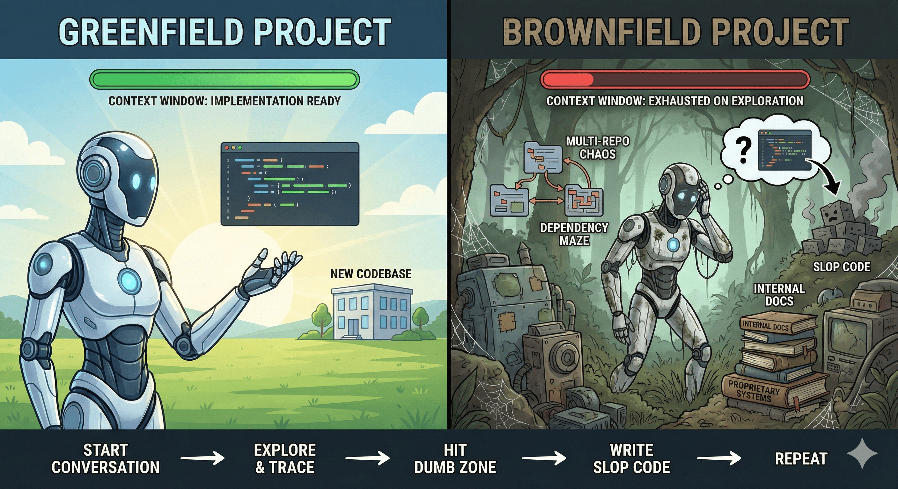

import { Callout } from 'fumadocs-ui/components/callout';

## Why Unoplat Code Confluence?

<Callout type="error" title="The Problem">
  AI agents perform well on [greenfield projects](https://en.wikipedia.org/wiki/Greenfield_project) *(new codebases built from scratch)* but struggle with existing [brownfield codebases](https://en.wikipedia.org/wiki/Brownfield_(software_development)) *(mature, production systems with existing code)*. 
  
  The core problem: they burn most of their **context window** on exploration—searching files, tracing flows, connecting dots—leaving little capacity for actual implementation. By the time they're ready to code, they've hit the **"dumb zone"** where performance degrades sharply. And since they lack *long-term memory*, this cycle repeats with every conversation.

  **Multi-repo Complexity**: The problem compounds with *multi-repo architectures*. When code is split across connected repositories, the agent exhausts its context just mapping dependencies between codebases—often before writing a single line.

  **Internal Dependencies**: Internal dependencies and *niche packages* present another failure mode. The agent has no onboarding to proprietary systems, so it **hallucinates usage patterns**. Worse, when internal documentation has drifted from the actual implementation, the agent trusts those "lies" and produces code that doesn't work.This problem compounds dramatically when working outside the *most popular ecosystems (Python and TypeScript/JavaScript)*.
  

  The end result is the same across all scenarios: **slop code** requiring heavy rework.
</Callout>
