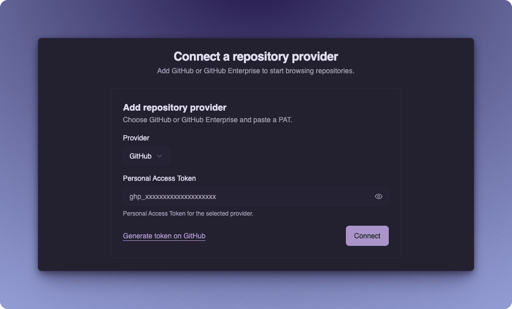
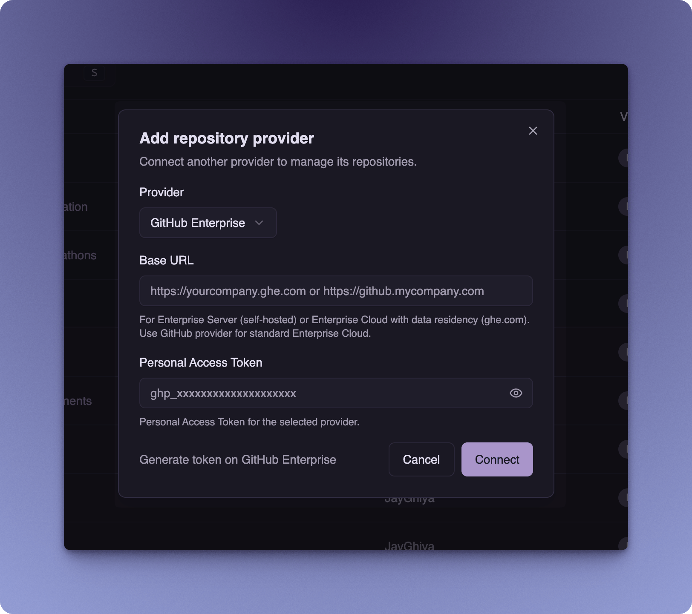
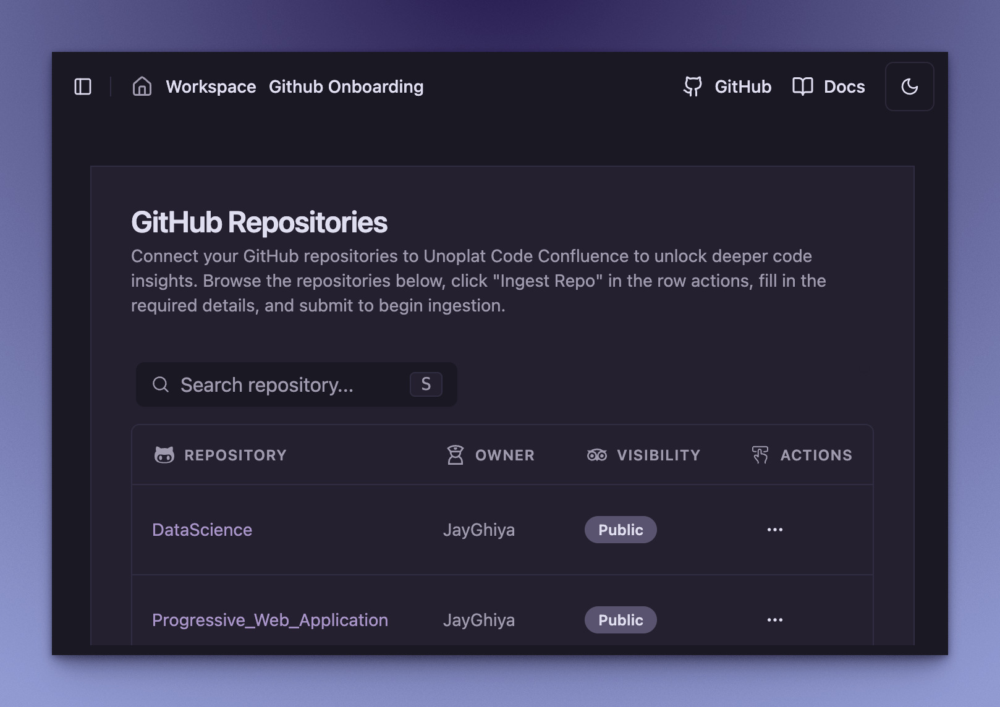
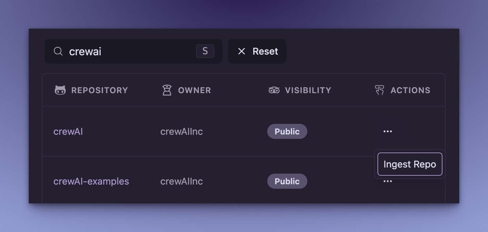
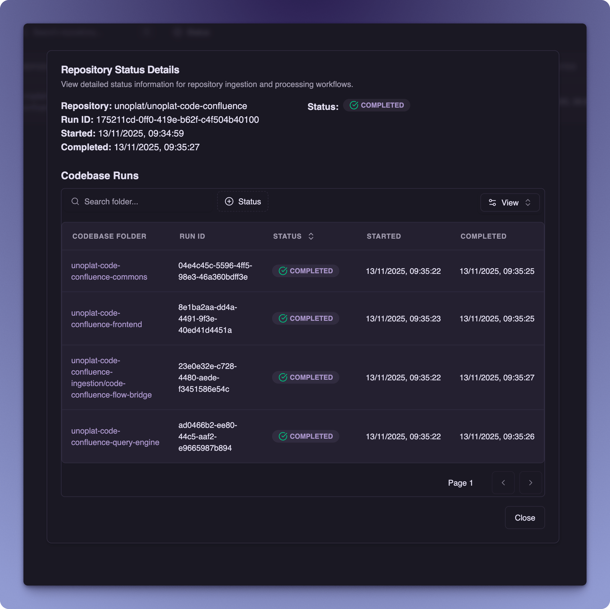
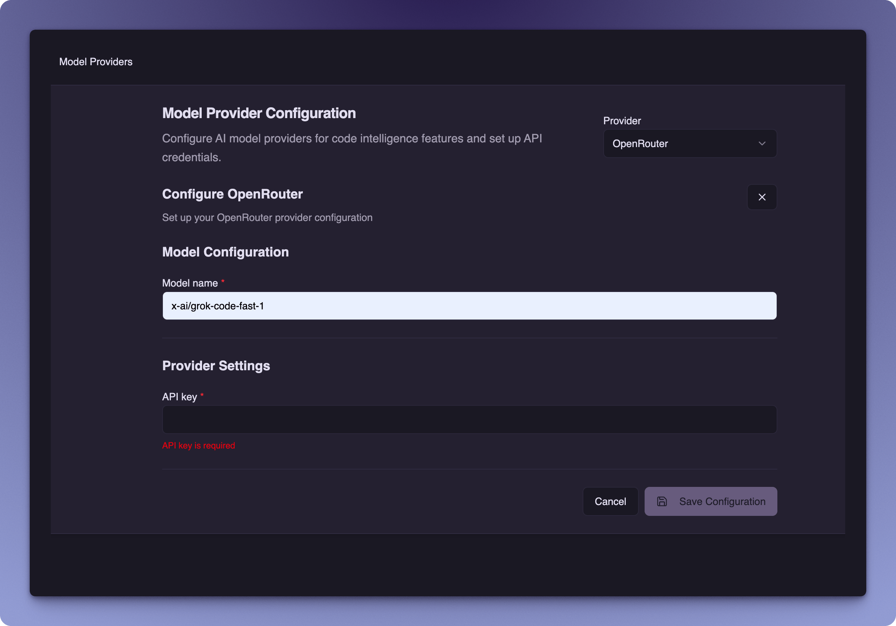
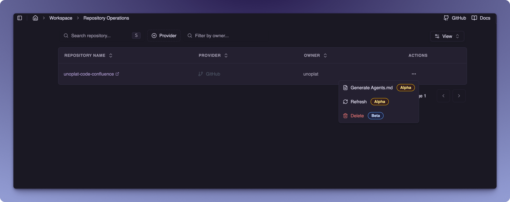
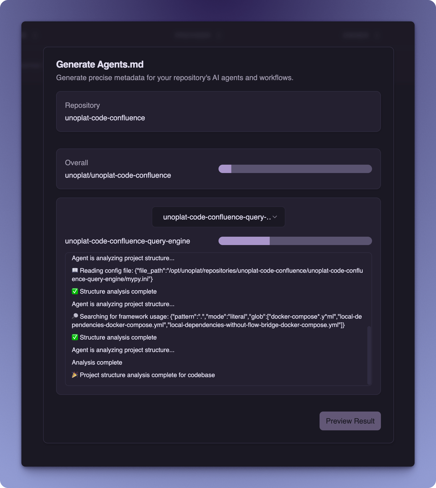
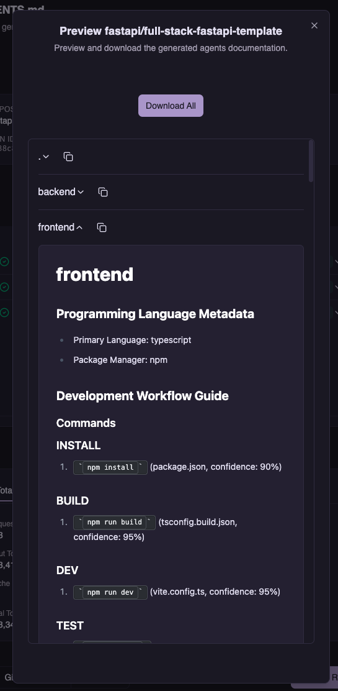

import { Callout } from 'fumadocs-ui/components/callout';

# Quick Start Guide

Welcome to **Unoplat Code Confluence** - Your Gateway to Code Understanding!

<Callout type="info" title="Current Status">
Unoplat Code Confluence currently supports **Python** and **TypeScript** codebases and is in **alpha** stage. We're actively working on expanding language support and features.

Best suited for *developers* and *tech enthusiasts* who enjoy exploring new tools, don't mind a few rough edges, and are willing to provide feedback as we work towards establishing a complete end-to-end workflow!
</Callout>

## Prerequisites

Before you begin, ensure you have the following tool installed:

| Tool | Purpose |
|------|---------|
| [**Docker & Docker Compose**](https://www.portainer.io/) | For running services |

## Setting Up Code Confluence

Follow these steps to set up Code Confluence:

1. **Create Project Directory and Download Configuration:**
   ```bash
   mkdir -p code-confluence && cd code-confluence

   # Download Docker Compose file
   curl -O https://raw.githubusercontent.com/unoplat/unoplat-code-confluence/refs/heads/main/prod-docker-compose.yml
   ```

2. **Launch Services:**
   ```bash
   docker compose -f prod-docker-compose.yml up -d
   ```

3. **Verify Deployment:**
   ```bash
   docker compose -f prod-docker-compose.yml ps
   ```

## Running the Application

### 1. Access the Web Interface
- Open your browser and go to [http://localhost:3000](http://localhost:3000)

### 2. Connect a Repository Provider
- When prompted, select your repository provider and enter a Personal Access Token (PAT) with read access to the repositories you want to ingest.
- This is required for Code Confluence to clone and analyze your repositories.

Code Confluence supports **two provider options**:

#### GitHub
For **GitHub.com** and **standard GitHub Enterprise Cloud** users:
1. Select **GitHub** from the Provider dropdown
2. Enter your Personal Access Token
3. Click **Connect**



#### GitHub Enterprise
For **Enterprise Server (self-hosted)** or **Enterprise Cloud with data residency**:
1. Select **GitHub Enterprise** from the Provider dropdown
2. Enter your **Base URL** (e.g., `https://yourcompany.ghe.com` or `https://github.mycompany.com`)
3. Enter your Personal Access Token
4. Click **Connect**



<Callout type="info" title="Getting a GitHub PAT">
If you don't have a GitHub PAT:
1. Click "Generate token on GitHub" (or "Generate token on GitHub Enterprise") to create a new token
2. Copy the generated token and paste it in the Personal Access Token field
3. Click **Connect** to add the provider
</Callout>

<Callout type="warn" title="GitHub Enterprise Testing Status">
- **GitHub Enterprise Cloud** (standard): Tested and working
- **GitHub Enterprise Server** (self-hosted): Not yet fully tested
- **Enterprise Cloud with data residency**: Not yet fully tested

If you're using self-hosted Enterprise Server or Enterprise Cloud with data residency and encounter any issues, please [report them on our GitHub Issues](https://github.com/unoplat/unoplat-code-confluence/issues) to help us improve support.
</Callout>

### 3. Search for GitHub Repositories
- Press **`s`** or **`S`** (Shift + s) to open the *search dialog*.
- You can search through your *personal*, *public*, and *open source* repositories.



### 4. Ingest Repository
- In the **Actions** column, click on **Ingest Repo** for the repository you want to analyze.
- Code Confluence will *automatically detect* Python and TypeScript codebases as part of repository along with corresponding *package manager metadata*.



<Callout type="warn" title="Codebase Detection - Beta Feature">
Automatic codebase detection is currently in beta and may have bugs. After ingestion completes:

1. Navigate to **Ingestion Management** to review your repository ingestion results
2. Verify that all expected codebases were detected correctly
3. Check for any errors or missing codebases



If you encounter any issues, such as codebases not being detected or errors during ingestion, please [**report them on our GitHub Issues**](https://github.com/unoplat/unoplat-code-confluence/issues).
</Callout>

### 5. Configure Model Provider

After ingestion completes, configure your *AI model provider* to enable **code intelligence** features.

- Navigate to **Settings > Model Providers** in the application
- Code Confluence supports *multiple AI model providers* for code analysis and understanding

#### Recommended Configuration: OpenRouter with Grok

We recommend using **OpenRouter** with the `x-ai/grok-code-fast-1` model, which we've tested extensively for *optimal performance* and *efficiency*.

**Setup Steps**:
1. Select **OpenRouter** from the *Provider* dropdown
2. Enter your OpenRouter API key in the **API key** field
3. Set the **Model name** to `x-ai/grok-code-fast-1`
4. Click **Save Configuration**



<Callout type="info" title="Getting an OpenRouter API Key">
If you don't have an OpenRouter API key:
1. Visit [OpenRouter](https://openrouter.ai/) and create an account
2. Navigate to your API Keys section
3. Generate a new API key and copy it

OpenRouter provides access to multiple AI models including Grok with competitive pricing.
</Callout>

<Callout type="info" title="Other Model Providers">
While we recommend **OpenRouter with Grok** for the best experience, Code Confluence supports *other model providers* as well. You can experiment with different providers and models based on your preferences and requirements.
</Callout>

<Callout type="warn" title="Known Limitations">
**Provider Support**: Most *standard AI model providers* are supported. We have tested **OpenRouter** with the following models:
- `moonshotai/kimi-k2` (Kimi K2 Thinking)
- `x-ai/grok-code-fast-1` (Grok Code Fast 1)
- `minimax/minimax-m1` (MiniMax M1)

If you encounter issues with a specific provider, please report them on our [GitHub Issues](https://github.com/unoplat/unoplat-code-confluence/issues) page.
</Callout>

### 6. Repository Operations

After successfully ingesting your repository, you can perform various operations to manage your codebase. Navigate to **Ingestion Management** to access these operations.



Code Confluence provides **three key repository operations**:

- **Generate Agents.md** — *Automatically generates* required metadata for AI agents to understand your codebase and operate on it effectively.
- **Refresh Repository** — *Updates* your ingested codebase to reflect the latest changes from the source repository
- **Delete Repository** — *Removes* the ingested repository and all associated data from Code Confluence

#### `AGENTS.md`

When you trigger the **Generate Agents.md** operation:

1. Navigate to **Workspace > Operations Management** in the sidebar
2. Find your **Agents Generation** job in the operations table
3. Click the **Actions** menu (`...`) for your job and select **View Details**


You can monitor the progress *in real-time*. The workflow shows progress for each codebase individually, as well as *overall progress* when your repository contains multiple codebases. You can view **agent events** in real-time as actions are performed.



You can continue ingesting and generating `AGENTS.md` for **multiple repositories in parallel** until you reach the *maximum tokens per second* limit of your model provider.

The generated `AGENTS.md` provides **structured documentation** covering:
- **Project Structure** — Overview of your *codebase organization*
- **Development Workflow** — *Development practices* and patterns
- **Business Logic** — Core functionality and *domain logic*



<Callout type="info" title="Coming Soon">
We're continuously expanding the `AGENTS.md` sections to provide even more *comprehensive codebase documentation* for AI agents.
</Callout>

## Troubleshooting

Need assistance? We're here to help!

### Support Options

1. **GitHub Issues**
   - Visit [**GitHub Issues**](https://github.com/unoplat/unoplat-code-confluence/issues) to:
     - Report bugs or request features
     - Browse existing solutions
     - Get developer support

2. **Community Support**
   - Join our [**Discord Community**](https://discord.com/channels/1131597983058755675/1169968780953260106) to:
     - Connect with other users
     - Get real-time assistance

<Callout type="info" title="Note">
Remember to check existing issues before creating a new one!
</Callout>
