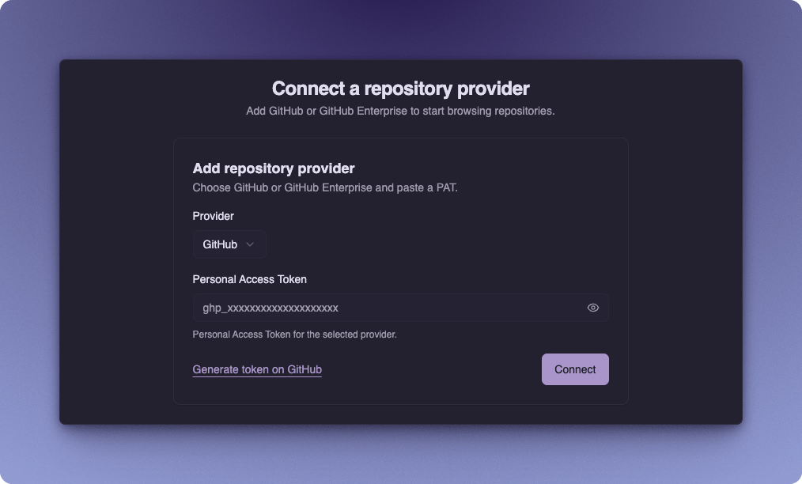
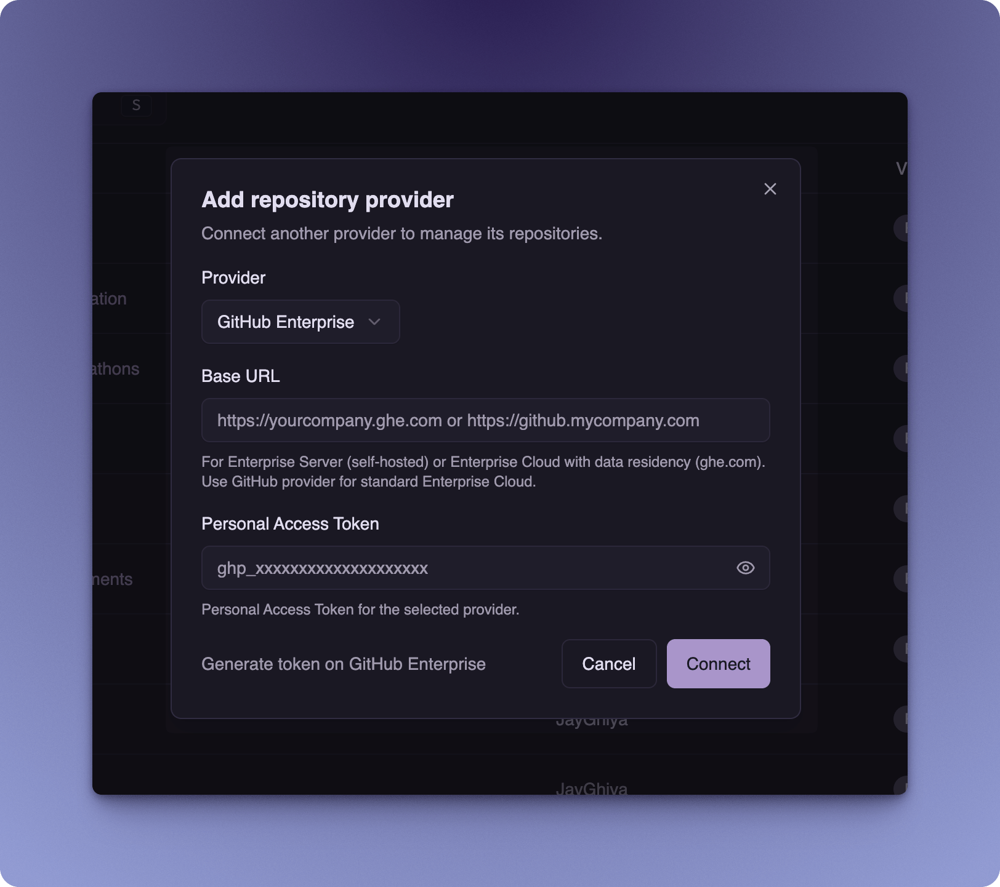
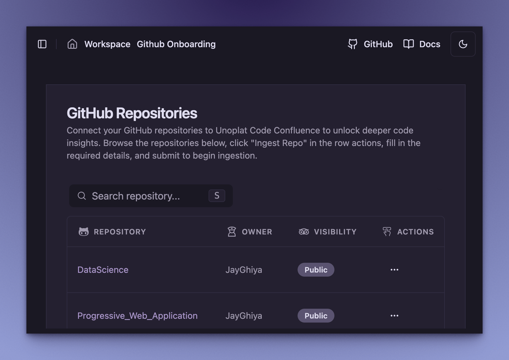
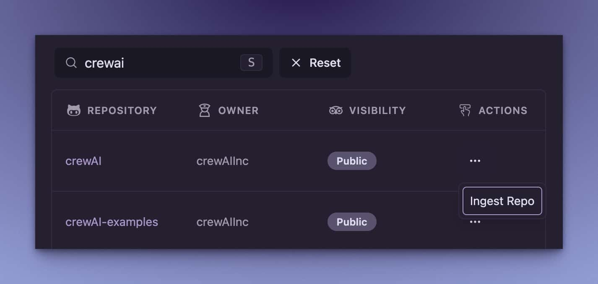
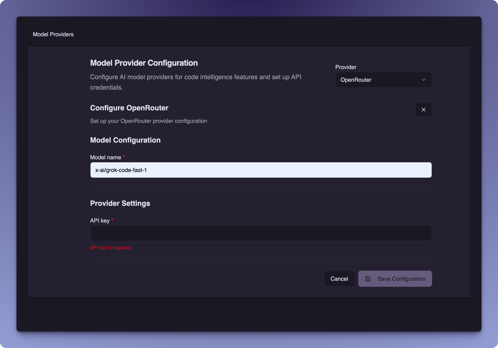
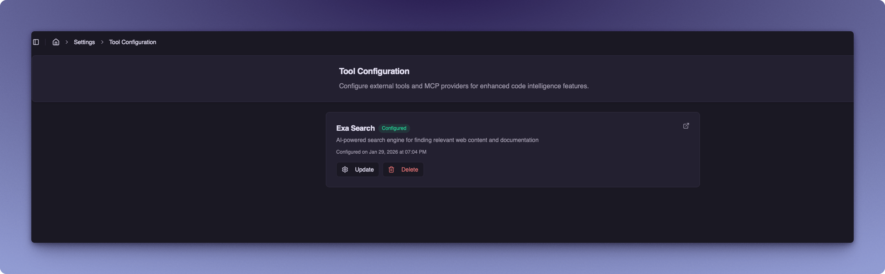
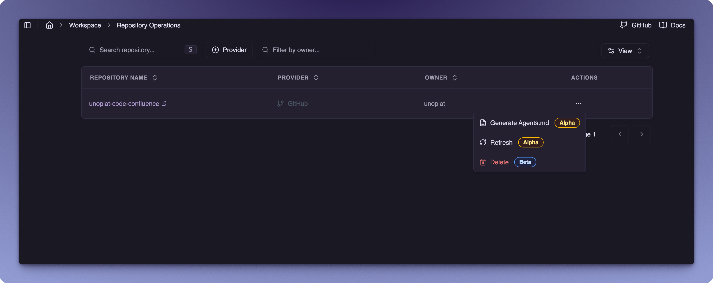
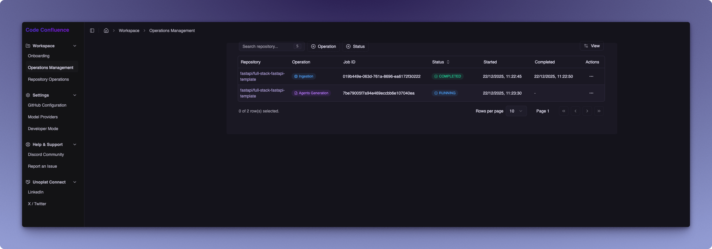
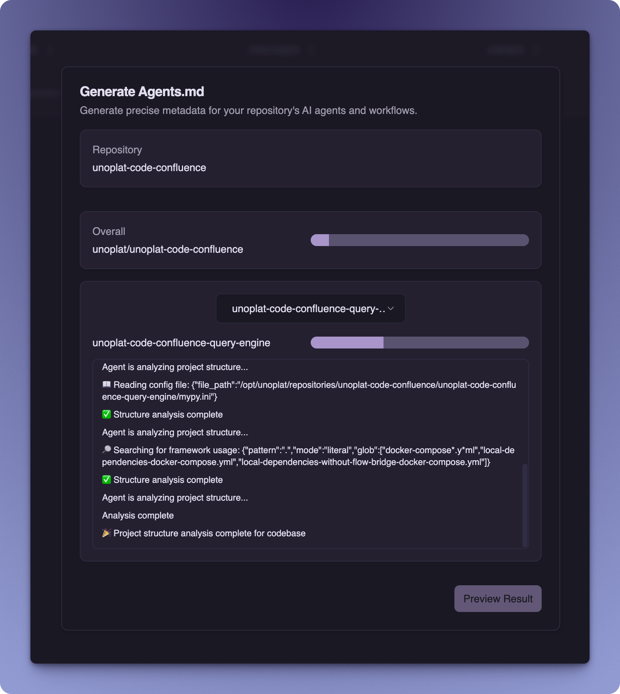

import { Callout } from 'fumadocs-ui/components/callout';

# Quick Start Guide

Welcome to **Unoplat Code Confluence** - Your Gateway to Code Understanding!

<Callout type="info" title="Current Status">
Unoplat Code Confluence currently supports **Python** and **TypeScript** codebases and is in **alpha** stage. We're actively working on expanding language support and features.

Best suited for *developers* and *tech enthusiasts* who enjoy exploring new tools, don't mind a few rough edges, and are willing to provide feedback as we work towards establishing a complete end-to-end workflow!
</Callout>

## Prerequisites

Before you begin, ensure you have the following tool installed:

| Tool | Purpose |
|------|---------|
| [**Docker & Docker Compose**](https://www.portainer.io/) | For running services |

## Setting Up Unoplat Code Confluence

Follow these steps to set up **Unoplat Code Confluence**:

1. **Create Project Directory and Download Configuration:**
   ```bash
   mkdir -p code-confluence && cd code-confluence

   # Download Docker Compose file
   curl -O https://raw.githubusercontent.com/unoplat/unoplat-code-confluence/refs/heads/main/prod-docker-compose.yml
   ```

2. **Launch Services:**
   ```bash
   docker compose -f prod-docker-compose.yml up -d
   ```

3. **Verify Deployment:**
   ```bash
   docker compose -f prod-docker-compose.yml ps
   ```

## Running the Application

### 1. Access the Web Interface
- Open your browser and go to [http://localhost:3000](http://localhost:3000)

### 2. Connect a Repository Provider
- When prompted, select your repository provider and enter a Personal Access Token (PAT) with read access to the repositories you want to ingest.
- This is required for **Unoplat Code Confluence** to clone and analyze your repositories.

**Unoplat Code Confluence** supports **two provider options**:

#### GitHub
For **GitHub.com** and **standard GitHub Enterprise Cloud** users:
1. Select **GitHub** from the Provider dropdown
2. Enter your Personal Access Token
3. Click **Connect**



#### GitHub Enterprise
For **Enterprise Server (self-hosted)** or **Enterprise Cloud with data residency**:
1. Select **GitHub Enterprise** from the Provider dropdown
2. Enter your **Base URL** (e.g., `https://yourcompany.ghe.com` or `https://github.mycompany.com`)
3. Enter your Personal Access Token
4. Click **Connect**



<Callout type="info" title="Getting a GitHub PAT">
Unoplat Code Confluence requires a **classic** Personal Access Token with these scopes:

| Scope | Purpose |
|-------|---------|
| `repo` | Full read/write access to repositories — **required for PR creation**, branch creation, and file operations |
| `security_events` | Read/write access to Code Scanning and Dependabot alerts |
| `user` | Read and update your GitHub profile and email addresses |
| `user:follow` | Ability to follow and unfollow users |

**To create a token with the correct scopes:**
1. Click **"Generate token on GitHub"** (or **"Generate token on GitHub Enterprise"**) — the link pre-fills all required scopes automatically
2. Copy the generated token and paste it in the Personal Access Token field
3. Click **Connect** to add the provider

If you already have a PAT, ensure it includes at least the `repo` scope to use PR features.
</Callout>

<Callout type="warn" title="GitHub Enterprise Testing Status">
- **GitHub Enterprise Cloud** (standard): Tested and working
- **GitHub Enterprise Server** (self-hosted): Not yet fully tested
- **Enterprise Cloud with data residency**: Not yet fully tested

If you're using self-hosted Enterprise Server or Enterprise Cloud with data residency and encounter any issues, please [report them on our GitHub Issues](https://github.com/unoplat/unoplat-code-confluence/issues) to help us improve support.
</Callout>

### 3. Search for GitHub Repositories
- Press **`s`** or **`S`** (Shift + s) to open the *search dialog*.
- You can search through your *personal*, *public*, and *open source* repositories.



### 4. Ingest Repository
- In the **Actions** column, click on **Ingest Repo** for the repository you want to analyze.
- **Unoplat Code Confluence** will *automatically detect* Python and TypeScript codebases as part of repository along with corresponding *package manager metadata*.



### 5. Configure Model Provider

After ingestion completes, configure your *AI model provider* to enable **code intelligence** features.

- Navigate to **Settings > Model Providers** in the application
- **Unoplat Code Confluence** supports *multiple AI model providers* for code analysis and understanding

#### Recommended Models

We recommend the following models for *optimal performance* and *code understanding*:

| Model | Provider |
|-------|----------|
| **Kimi 2.5** | OpenRouter |
| **Claude Opus** | Anthropic |
| **Codex** | OpenAI |
| **MiniMax 2.1** | OpenRouter |

**Setup Steps**:
1. Select your preferred *Provider* from the dropdown
2. Enter your API key in the **API key** field
3. Set the **Model name** to your chosen model
4. Click **Save Configuration**



<Callout type="info" title="Supported Providers">
**Unoplat Code Confluence** uses [Pydantic AI](https://ai.pydantic.dev/models/overview/) and supports the following providers:

**Built-in Support**: OpenAI, Anthropic, Gemini, xAI, Bedrock, Cerebras, Cohere, Groq, Hugging Face, Mistral, OpenRouter

**OpenAI-Compatible**: Azure AI Foundry, DeepSeek, Fireworks AI, Ollama, Together AI, and more

OpenRouter is recommended for accessing models like Kimi and MiniMax through a single API.
</Callout>

<Callout type="warn" title="Tested Configurations">
We have tested the following model configurations:
- **Kimi 2.5** (via OpenRouter)
- **Claude Opus** (Anthropic)
- **Codex** (OpenAI)
- **MiniMax 2.1** (via OpenRouter)

Other models may work but have not been fully validated. If you encounter issues with a specific provider or model, please report them on our [GitHub Issues](https://github.com/unoplat/unoplat-code-confluence/issues) page.
</Callout>

### 6. Web Search for Documentation Lookup

**Unoplat Code Confluence** AI agents use *web search* to find official documentation, library references, and best practices during code analysis. The search provider is resolved automatically in the following **priority order**:

1. **Exa** — Used when an Exa API key is configured *(recommended for best results)*
2. **Built-in Web Search** — Used when the configured model provider supports native web search (Anthropic, OpenAI Codex, Grok, Groq)
3. **DuckDuckGo** — Automatic fallback when neither Exa nor built-in web search is available

<Callout type="info" title="No Configuration Required for Basic Search">
If you skip Exa setup, **Unoplat Code Confluence** will automatically fall back to your model provider's built-in web search or DuckDuckGo. You always get documentation search capabilities regardless of configuration.
</Callout>

#### Optional: Configure Exa for Enhanced Search

For the *best documentation search results*, configure **Exa Search**:

1. Navigate to **Settings > Tool Configuration** in the application
2. Click **Configure** next to **Exa Search**
3. Enter your Exa API key
4. Click **Save**



<Callout type="info" title="Getting an Exa API Key">
If you don't have an Exa API key:
1. Visit [Exa](https://exa.ai/) and create an account
2. Navigate to your API Keys section
3. Generate a new API key and copy it
</Callout>

### 7. Repository Operations

After successfully ingesting your repository, you can perform various operations to manage your codebase. Navigate to **Ingestion Management** to access these operations.



**Unoplat Code Confluence** provides **three key repository operations**:

- **Generate Agents.md** — *Automatically generates* required metadata for AI agents to understand your codebase and operate on it effectively.
- **Refresh Repository** — *Updates* your ingested codebase to reflect the latest changes from the source repository
- **Delete Repository** — *Removes* the ingested repository and all associated data from **Unoplat Code Confluence**

#### `AGENTS.md`

When you trigger the **Generate Agents.md** operation:

1. Navigate to **Workspace > Operations Management** in the sidebar
2. Find your **Agents Generation** job in the operations table
3. Click the **Actions** menu (`...`) for your job and select **View Details**



You can monitor the progress *in real-time*. The workflow shows progress for each codebase individually, as well as *overall progress* when your repository contains multiple codebases. You can view **agent events** in real-time as actions are performed.



You can continue ingesting and generating `AGENTS.md` for **multiple repositories in parallel** until you reach the *maximum tokens per second* limit of your model provider.

The generated `AGENTS.md` provides **structured documentation** covering:
- **Project Structure** — Overview of your *codebase organization*
- **Development Workflow** — *Development practices* and patterns
- **Business Logic** — Core functionality and *domain logic*
