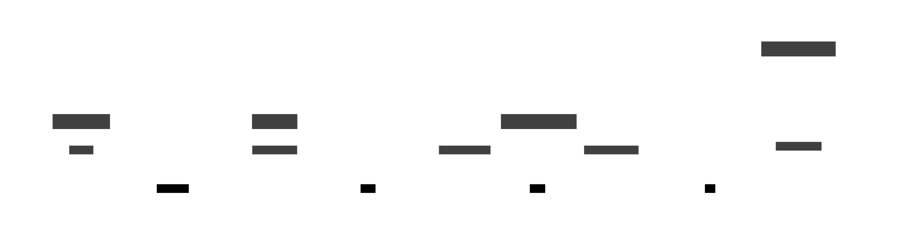

# Architecture

# Component Description

## CLI Utility
The command-line interface serves as the primary entry point for users to interact with CodeConfluence:
- Built using Click framework for intuitive command-line interactions
- Captures configuration through:
  - JSON configuration files for complex settings
  - Interactive prompts for sensitive inputs
  - Command-line arguments for quick configurations
- Validates and structures user inputs into a standardized JSON payload
- Securely communicates with Flow Bridge via HTTP POST requests

## Flow Bridge
A FastAPI-based microservice that acts as the bridge between the CLI and Temporal workflows:
- Exposes RESTful endpoints to receive configuration payloads
- Performs validation and preprocessing of incoming requests
- Initiates and manages Temporal workflows via gRPC

## Temporal Cluster
Orchestrates and executes the core code analysis workflows:
- Manages long-running code analysis workflows
- Provides:
  - Reliable workflow execution
  - Automatic retry mechanisms
  - State management
  - Workflow history
  - Scalable worker architecture
- Executes complex code analysis tasks through worker processes
- Maintains workflow state and handles failures gracefully

## Graph Database

### Neo4j with DozerDb 

## Data Flow
1. User initiates analysis through CLI with configuration
2. CLI constructs JSON payload and sends to Flow Bridge
3. Flow Bridge validates request and initiates Temporal workflow
4. Temporal executes analysis through distributed workers

