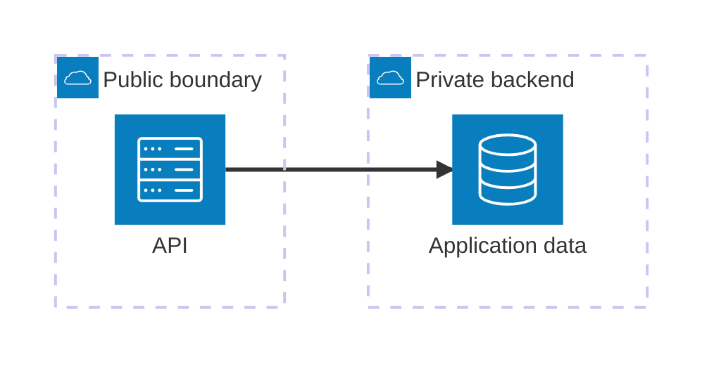
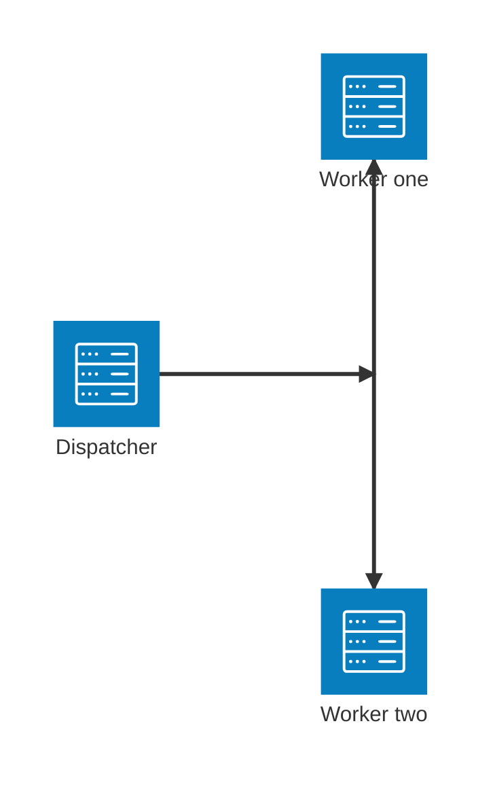

# Mermaid Architecture Diagrams

Architecture diagrams visualize the relationships among deployable services,
external systems, data stores, and supporting resources. Mermaid introduced
`architecture-beta` in v11.1.0. This project renders with Mermaid v11.16.0.

Use this project-owned guide when creating or reviewing the repository-root
`architecture.md`. Model only current repository evidence and
`app_interfaces.md`; do not invent infrastructure, protocols, ownership
boundaries, or dependencies.

This skill is guidance only: it ships no skill scripts and no skill resources.

## Artifact contract

- Keep the document focused on the current architecture that the repository can
  support with evidence.
- `architecture.md` contains **exactly one** Mermaid fence. Its first non-empty
  diagram line is exactly `architecture-beta`.
- Use stable, lower-case identifiers, and declare every group, service, and
  junction before an edge references it. Labels go in square brackets and are
  concise, reader-facing names.
- **Every `service` declaration must attach exactly one built-in icon.** A bare
  `service <id>[<label>]` renders as an empty dashed placeholder rather than a
  useful component glyph. Select the closest of the five built-ins; the icon is
  a visual category, not an unsupported claim about the implementation.
- Declare only components and connections justified by source, configuration,
  deployment, or the current `app_interfaces.md` artifact.
- The one-diagram contract means that a complex codebase must be represented by
  a single, focused, high-level view. Do not add multiple detailed views to
  `architecture.md`; omit unsupported implementation detail and rely on
  `app_interfaces.md` for its line-level inventory.

## Role-oriented modeling

Plan the diagram by architectural responsibility before choosing Mermaid ports or
alignment. The primary organization is a small set of logical roles, not a
container runtime, codebase directory, or deployment manifest:

| Canonical role | Classify here when the component's primary responsibility is | Examples |
| --- | --- | --- |
| Consumers and entry points | Initiating product use or exposing a user-facing invocation surface | Browser or automation actor, web frontend, CLI, SDK client, public entry point |
| Backend services | Implementing repository-owned application behavior | API, domain service, ingestion process, query service, worker |
| Platform and infrastructure | Supporting execution, orchestration, communication, or persistence | Database, workflow orchestrator, queue, cache, object/file storage |
| External services | Providing a capability or data source operated outside the system | GitHub API, LLM provider, MCP server, identity provider, third-party API |

Use the first role whose primary-responsibility definition fits: an initiating
actor or user-facing surface is a consumer/entry point; otherwise a
repository-owned application process is a backend service; otherwise a runtime
support or persistence dependency is platform/infrastructure; otherwise an
outside capability provider is an external service. This keeps, for example, a
managed database in infrastructure because persistence is its architectural
role, while GitHub or an LLM provider remains external. When no role is
supported by evidence, omit the component.

Create only role groups that contain at least one supported node. Never emit an
empty group or a group for a codebase whose current evidence contains no
relevant executable, interface, external system, data store, or supporting
resource. Role groups are the primary structure. A deployment, network, or
trust boundary may appear only as evidence-backed secondary/nested structure
when it does not replace or obscure the logical roles; otherwise explain that
boundary in prose outside the Mermaid fence. In particular, one broad
`Compose` group is not a useful primary architecture.

Model independently meaningful runtime nodes rather than repository packaging:

- Omit libraries, packages, shared source modules, and codebases with no
  relevant constructs; they are not deployable architecture nodes.
- Split independently executable APIs, workers, schedulers, and ingestion
  processes when their inbound/outbound relationships differ materially.
- Combine executables only when evidence establishes one architectural
  responsibility and the combined node does not hide different callers,
  dependencies, or data flows. Avoid ambiguous labels such as "API and worker"
  when the two have distinct relationships.

Make the diagram's main story readable as **consumers and entry points → backend
services → platform/infrastructure and external services**. This is a planning
and layout objective, not permission to invent or reverse a relationship:

- Add an edge only when current interface, source, configuration, or deployment
  evidence establishes an interaction.
- Co-location in Docker Compose, Kubernetes, or another deployment definition
  establishes membership/deployment only; it does not by itself establish an
  edge between the co-located components.
- Preserve evidence-backed arrow direction. Do not reverse an arrow to force a
  preferred layout; use an undirected edge when direction is not established,
  as described below.
- Keep secondary infrastructure-to-infrastructure or external-to-external
  edges only when they are material to the system-level story and directly
  supported by evidence.

## Syntax and building blocks

An architecture diagram begins with `architecture-beta` and consists of groups,
services, edges, and junctions. Icons use `()` and labels use `[]`.



### Groups

Use groups first for the non-empty canonical roles defined above. Deployment,
trust, or network boundaries are optional evidence-backed secondary structure,
not substitutes for the logical organization. Groups may be nested; do not
create a group merely to visually decorate the diagram.

```text
group <id>(<icon>)[<label>] in <parent-id>
```

The icon and parent clauses are optional when no built-in icon is appropriate
or the group is top-level:

```text
group <id>[<label>]
```

### Services

Services model executable components, external systems, data stores, and
relevant resources. Put a service in a previously declared group only when that
membership is supported by evidence. **Always attach one built-in icon to every
service.** Without one, Mermaid produces an empty dashed service box, which is
both visually ambiguous and unlike the intended architecture node.

```text
service <id>(<icon>)[<label>] in <parent-id>
```

When a component does not map perfectly to an icon, choose the closest visual
category instead of omitting it. For example, use `server` for an MCP server,
queue, scheduler, workflow engine, webhook receiver, cache, vector store, or
other application-side endpoint; use `cloud` for a managed/hosted external
service; and use `database` or `disk` for persisted data as applicable. The
reader-facing label supplies the precise meaning.

### Junctions

A junction is an unlabeled four-way connection point:

```text
junction <id> in <parent-id>
```

Use one only for a real fan-out or fan-in that would otherwise obscure the
relationships. For example, a proven dispatcher that distributes work to two
separate workers can be modeled as:



Do not use a junction as a substitute for a labeled service, or for fan-out
that is not established by repository evidence.

## Icons

Mermaid architecture diagrams support these built-in icons:

`cloud`, `database`, `disk`, `internet`, `server`

Use them consistently as lightweight visual cues:

| Component meaning | Built-in icon when appropriate |
| --- | --- |
| Executable application process or service | `server` |
| Persisted, queryable data store | `database` |
| Object, file, or filesystem-backed storage | `disk` |
| Hosted or managed external service | `cloud` |
| External client or API beyond the deployment boundary | `internet` |

The icon is not the type system. A queue, workflow engine, webhook receiver,
MCP server, cache, vector store, scheduler, CI/CD component, or conceptual
boundary still needs an icon when modeled as a service: normally `server` for
an application-side endpoint, or `cloud` when it is managed/hosted externally.
Use the label to state its precise role. (Groups and junctions follow their own
syntax and do not require an icon.)

Mermaid itself can use registered Iconify/custom icon packs (for example,
`logos:docker` after installing an icon pack). **This project must not use that
capability.** Do not register, install, reference, or render external icon
packs; never use `logos:*`, Font Awesome, Iconify, or a custom icon. The
packaged renderer does not register them, and the artifact contract allows only
the five built-ins above.

## Edges, ports, direction, and protocols

An edge connects two declared services or junctions. Specify ports explicitly:

```text
<source>{group}?:<T|B|L|R> <arrow> <T|B|L|R>:<target>{group}?
```

`T`, `B`, `L`, and `R` select the top, bottom, left, and right side of an
endpoint. Choose ports that communicate the intended layout and avoid needless
crossings.

| Form | Meaning |
| --- | --- |
| `a:R -- L:b` | Undirected horizontal relationship |
| `a:T -- B:b` | Undirected vertical relationship |
| `a:R --> L:b` | Relationship directed from `a` to `b` |
| `a:R <--> L:b` | Evidence-backed bidirectional relationship |
| `a{group}:R --> L:b{group}` | Edge exiting/entering group boundaries |

Use `--` when direction is not established. Add `>` at the receiving end, or
`<` at the sending end, only where source/configuration/`app_interfaces.md`
establishes it. Group IDs cannot be edge endpoints. The `{group}` modifier is
valid only on a service that belongs to that group.

`architecture-beta` has no edge-label grammar. Do **not** invent flowchart
syntax such as `-->|HTTPS|`. When a protocol (HTTPS, TCP, gRPC, a queue
transport, and so on) is established and materially clarifies the diagram,
communicate it with an evidence-backed endpoint label such as `[GitHub HTTPS
API]`, or concise prose outside the Mermaid fence. Do not claim a protocol that
the available evidence does not establish.

## Alignment and layout

Declaration order affects Mermaid's layout. Use explicit ports first. Add
alignment only to fix a concrete sibling-layout issue, not as decoration.

```text
align row <id-a> <id-b> ...
align column <id-a> <id-b> ...
```

- Members must already be declared services or junctions; each directive needs
  at least two members and occupies its own line.
- Use `align column` for siblings that connect to a common downstream node via
  the same horizontal port pair, such as `R --> L:downstream`.
- Use `align row` for siblings that connect to a common downstream node via the
  same vertical port pair, such as `B --> T:downstream`.
- Member order controls their order on the selected axis. It must not contradict
  edge directions or Mermaid may fail to render.

## Evidence, focus, and review workflow

1. Load this skill before drafting. Read the current `app_interfaces.md`,
   deployment/configuration evidence, relevant source sections, and any current
   `architecture.md`.
2. Identify inbound and outbound interfaces first, classify supported nodes by
   their primary canonical role, and then model only the supporting services and
   relationships that the evidence establishes. Omit empty roles; treat any
   deployment or trust boundary as secondary structure only.
3. Prefer a small system-level diagram over an exhaustive inventory. Keep
   labels specific enough to distinguish components without adding unsupported
   technology claims.
4. Write or update the one owned `architecture.md` diagram with the console
   `write_file` or `edit_file` tool (never a skill script). Re-read the complete
   artifact and verify its one-fence contract, declaration order, labels, **one
   built-in icon on every service** (no bare `service id[label]` declarations),
   built-in-only icons, group membership, ports, arrows, and evidence-backed
   edges.
5. After the final write/no-change decision, call the no-argument
   `validate_architecture` tool. It extracts the diagram as direct Mermaid input,
   streams it to `mmdc`, captures the rendered SVG from stdout, and inspects that
   SVG for Mermaid's error-page markers. This matters because exit code zero alone
   is not proof of a valid render.
6. If validation fails, repair only `architecture.md`, re-read it, repeat the
   review, and call `validate_architecture` again. Raw `mmdc` console commands are
   useful supplemental probes, but their exit status is not the final signal.
7. Load this skill again during final review. Confirm the final artifact against
   repository evidence, the official `architecture-beta` forms, a built-in icon
   on every service (so no empty dashed placeholders remain), fan-in/fan-out
   junction necessity, and the successful validation digest. Do not edit the
   artifact after the digest is confirmed without validating again.

## Reference

- [Official Mermaid Architecture Diagram syntax](https://mermaid.js.org/syntax/architecture.html)
- [Upstream architecture-diagrams reference](https://github.com/softaworks/agent-toolkit/blob/HEAD/skills/mermaid-diagrams/references/architecture-diagrams.md)
- [Iconify](https://iconify.design) (Mermaid supports it generally, but it is prohibited for this project)
