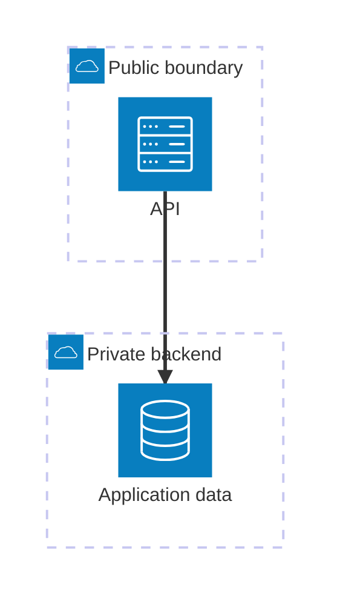

# Mermaid Architecture Diagrams

Architecture diagrams visualize the relationships among clis,desktops,deployable services,
external systems, data stores, and supporting resources. Mermaid introduced
`architecture-beta` in v11.1.0. This project renders with Mermaid v11.16.0.

Use this project-owned guide when creating or reviewing the repository-root
`architecture.md`. Model current repository evidence from inbound and outbound
constructs in `app_interfaces.md`, relevant source or configuration, and deployment
configuration. Do not invent infrastructure, protocols, ownership boundaries, or
dependencies.

This skill ships guidance and has no skill scripts.

## Artifact contract

- Keep the document focused on the current architecture that the repository can
  support with evidence.
- `architecture.md` contains **exactly one** Mermaid fence. Its first non-empty
  diagram line is exactly `architecture-beta`.
- Use stable, lower-case identifiers, and declare every group, service, and
  junction before an edge references it. Labels go in square brackets and are
  concise, reader-facing names.
- **Every `service` declaration must attach exactly one built-in icon.** A bare
  `service <id>[<label>]` renders as an empty dashed placeholder rather than a
  useful component glyph. Select the closest of the five built-ins.
- Declare components and connections justified by deployment evidence,
  relevant source or configuration, and current inbound and outbound constructs
  in `app_interfaces.md` across codebases.

## Role-oriented modeling

Plan the diagram by architectural responsibility before choosing Mermaid ports or
alignment. The primary organization is a small set of logical roles, not a
container runtime, codebase directory, or deployment manifest:

| Canonical role | Classify here when the component's primary responsibility is | Examples |
| --- | --- | --- |
| Consumers and entry points | Initiating product use or exposing a user-facing invocation surface | Web frontend, CLI |
| Backend services | Implementing repository-owned application behavior | API, domain service, ingestion process, query service, worker |
| Platform and infrastructure | Supporting execution, orchestration, communication, or persistence | Database, workflow orchestrator, queue, cache, object/file storage |
| External services | Providing a capability or data source operated outside the system | GitHub API, LLM provider, MCP server, identity provider, third-party API |

Create only role groups that contain at least one supported node. Never emit an
empty group or a group for a codebase whose current evidence contains no
relevant executable, interface, external system, data store, or supporting
resource. Role groups are the primary structure.

Model independently meaningful runtime nodes rather than repository packaging:

- Omit library dependencies, shared source modules, and codebases with no
  relevant inbound or outbound constructs; they are not deployable architecture
  nodes. A common data-model library is one example.

Arrange the non-empty canonical groups from top to bottom: **consumers and entry
points → backend services → platform and infrastructure → external services**.
This is a planning and layout objective:

- Establish interactions and their direction from current inbound/outbound
  constructs, relevant source or configuration, or explicit deployment
  connections. Co-location in Docker Compose or Kubernetes proves deployment
  membership only; it does not establish an interaction.
- Include evidence-backed infrastructure and external-service connections for
  every application service, including platform dependencies shared by multiple services.
- Preserve evidence-backed arrow direction. Do not reverse an arrow to force a
  preferred layout; use an undirected edge when direction is not established,
  as described below.

## Syntax and building blocks

An architecture diagram begins with `architecture-beta` and consists of groups,
services, edges, and junctions. Icons use `()` and labels use `[]`.


```mermaid
architecture-beta
    group public(cloud)[Public boundary]
    group private(cloud)[Private backend]
    service api(server)[API] in public
    service data(database)[Application data] in private

    api:B --> T:data
```

### Groups

Use groups first for the non-empty canonical roles defined above. Deployment,
trust, or network boundaries are optional evidence-backed secondary structure,
not substitutes for the logical organization. Groups may be nested; do not
create a group merely to visually decorate the diagram.

```text
group <id>(<icon>)[<label>] in <parent-id>
```

The icon and parent clauses are optional when no built-in icon is appropriate
or the group is top-level:

```text
group <id>[<label>]
```

### Services

Services model executable components, external systems, data stores, and
relevant resources. Put a service in a previously declared group only when that
membership is supported by evidence. **Always attach one built-in icon to every
service.** Without one, Mermaid produces an empty dashed service box, which is
both visually ambiguous and unlike the intended architecture node.

```text
service <id>(<icon>)[<label>] in <parent-id>
```

When a component does not map perfectly to an icon, choose the closest visual
category instead of omitting it. For example, use `server` for an MCP server,
queue, scheduler, workflow engine, webhook receiver, cache, vector store, or
other application-side endpoint; use `cloud` for a managed/hosted external
service; and use `database` or `disk` for persisted data as applicable. The
reader-facing label supplies the precise meaning.

### Junctions

A junction is an unlabeled four-way connection point:

```text
junction <id> in <parent-id>
```

Use one only for a real fan-out or fan-in that would otherwise obscure the
relationships. For example, a proven dispatcher that distributes work to two
separate workers can be modeled as:


```mermaid
architecture-beta
    service dispatcher(server)[Dispatcher]
    service worker_one(server)[Worker one]
    service worker_two(server)[Worker two]
    junction fan_out

    dispatcher:B --> T:fan_out
    fan_out:B --> T:worker_one
    fan_out:B --> T:worker_two

    align row worker_one worker_two
```

Do not use a junction as a substitute for a labeled service, or for fan-out
that is not established by repository evidence.

## Icons

Mermaid architecture diagrams support these built-in icons:

`cloud`, `database`, `disk`, `internet`, `server`

Use them consistently as lightweight visual cues:

| Component meaning | Built-in icon when appropriate |
| --- | --- |
| Executable application process, service, or CLI | `server` |
| Persisted, queryable data store | `database` |
| Object, file, or filesystem-backed storage | `disk` |
| Hosted or managed external service | `cloud` |
| External client or API beyond the deployment boundary | `internet` |

The icon is not the type system. A queue, workflow engine, webhook receiver,
MCP server, cache, vector store, scheduler, CI/CD component, or conceptual
boundary still needs an icon when modeled as a service: normally `server` for
an application-side endpoint, or `cloud` when it is managed/hosted externally.
Use the label to state its precise role. (Groups and junctions follow their own
syntax and do not require an icon.)

Mermaid itself can use registered Iconify/custom icon packs (for example,
`logos:docker` after installing an icon pack). **This project must not use that
capability.** Do not register, install, reference, or render external icon
packs; never use `logos:*`, Font Awesome, Iconify, or a custom icon. The
packaged renderer does not register them, and the artifact contract allows only
the five built-ins above.

## Edges, ports, direction, and protocols

An edge connects two declared services or junctions. Specify ports explicitly:

```text
<source>{group}?:<T|B|L|R> <arrow> <T|B|L|R>:<target>{group}?
```

`T`, `B`, `L`, and `R` select the top, bottom, left, and right side of an
endpoint. Prefer a top-to-bottom layout: use `B --> T` for a directed edge
from an upstream service to a downstream service, and use `B -- T` when its
direction is not established. Choose other ports only when the supported
topology or a rendered-layout repair requires them.

| Form | Meaning |
| --- | --- |
| `a:B -- T:b` | Undirected vertical relationship (preferred layout) |
| `a:B --> T:b` | Relationship directed from `a` to downstream `b` (preferred layout) |
| `a:B <--> T:b` | Evidence-backed bidirectional vertical relationship |
| `a:R -- L:b` | Undirected horizontal relationship |
| `a:R --> L:b` | Horizontally arranged relationship directed from `a` to `b` |
| `a{group}:B --> T:b{group}` | Vertical edge exiting/entering group boundaries |

Use `--` when direction is not established. Add `>` at the receiving end, or
`<` at the sending end, only where source/configuration/`app_interfaces.md`
establishes it. Group IDs cannot be edge endpoints. The `{group}` modifier is
valid only on a service that belongs to that group.

`architecture-beta` has no edge-label grammar. Do **not** invent flowchart
syntax such as `-->|HTTPS|`. When a protocol (HTTPS, TCP, gRPC, a queue
transport, and so on) is established and materially clarifies the diagram,
communicate it with an evidence-backed endpoint label such as `[GitHub HTTPS
API]` based on inbound and outbound constructs, or in concise prose outside the
Mermaid fence. Do not claim a protocol that the available evidence does not
establish.

## Alignment and layout

Declaration order affects Mermaid's layout. Use explicit ports first. Add
alignment only to fix a concrete sibling-layout issue, not as decoration.

```text
align row <id-a> <id-b> ...
align column <id-a> <id-b> ...
```

- Members must already be declared services or junctions; each directive needs
  at least two members and occupies its own line.
- Prefer `align row` for siblings that connect to a common downstream node via
  the vertical port pair `B --> T:downstream`.
- Use `align column` only when a supported horizontal arrangement is clearer,
  such as siblings connected with `R --> L:downstream`.
- Member order controls their order on the selected axis. It must not contradict
  edge directions or Mermaid may fail to render.

## Evidence, focus, and review workflow

1. Load this skill before drafting. Read the current `app_interfaces.md`,
   deployment/configuration evidence, relevant source sections, and any current
   `architecture.md`.
2. Identify inbound and outbound interfaces first, classify supported nodes by
   their primary canonical role, and model only services and relationships that
   the evidence establishes. Omit empty roles and plan the top-to-bottom layout.
3. Prefer a small system-level diagram over an exhaustive inventory. Keep
   labels specific enough to distinguish components without adding unsupported
   technology claims.
4. Write or update the one owned `architecture.md` diagram with the console
   `write_file` or `edit_file` tool (never a skill script). Re-read the complete
   artifact and verify its one-fence contract, declaration order, labels, **one
   built-in icon on every service** (no bare `service id[label]` declarations),
   built-in-only icons, group membership, ports, arrows, and evidence-backed
   edges.
5. After the final write, call the no-argument
   `validate_architecture` tool. It extracts the diagram as direct Mermaid input,
   streams it to `mmdc`, validates the rendered SVG for Mermaid error-page
   markers, and returns a digest plus the exact rendered PNG. Exit code zero alone
   is not proof of a valid or intuitive diagram.
6. Inspect the attached PNG for clarity, legibility, and an intuitive layout.
   Do not judge layout from Mermaid source alone.
7. If structural validation fails or any visual criterion fails, repair the
   Mermaid diagram and prose in `architecture.md`, re-read it, repeat the review,
   call `validate_architecture` again, and inspect the new PNG. Raw `mmdc` console
   commands are useful
   supplemental probes, but their exit status is not the final signal.
8. Revisit this skill during final review. Confirm the final artifact against
   repository evidence, the official `architecture-beta`
   forms, a built-in icon on every service (so no empty dashed placeholders
   remain), fan-in/fan-out junction necessity, the successful validation digest,
   and a passed visual review of the latest PNG. Finish only when the latest
   digest has both deterministic validation and an intuitive visual review. Do
   not edit the artifact after the digest is confirmed without validating and
   visually reviewing again.

## Reference

- [Official Mermaid Architecture Diagram syntax](https://mermaid.js.org/syntax/architecture.html)
- [Iconify](https://iconify.design) (Mermaid supports it generally, but it is prohibited for this project)
