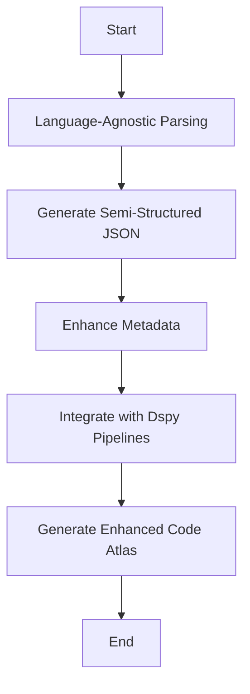

# Unoplat-CodeConfluence - Where Code Meets Clarity


## Goal

Goal of the project is to be the most deterministic and precise code context provider for projects like OpenDevin, Devon, Danswer
Continue Dev etc irrespective of framework and programming language.


## Current Problem with doing Repository level Documentation using AI Tooling 

### Process Overview:

1. Indexing Code Files: All code files are indexed into a vector database using embeddings that capture the semantic meaning of the code.
2. Query Processing: The system uses fine-tuned language models to interpret the user's query about the codebase.
3. Retrieval-Augmented Generation: The language model performs RAG to fetch relevant code snippets or documentation based on the query.
4. Reranking: Retrieved results are reranked to present the most relevant information first based on the context and specifics of the query.

###  Challenges:

1. Limited Context Windows: Most AI tools suffer from limited context windows of large language models, which can hinder their ability to process large blocks of code or extended documentation effectively.
2. Lack of Long-term Memory: These tools generally do not incorporate long-term memory, which affects their ability to remember past interactions or understand extensive codebases deeply.

3. Inefficiency: This process can be computationally expensive and slow, particularly for large codebases, due to the extensive indexing and complex querying mechanisms.
4. Cost: The operational costs can be significant because of the resources required for maintaining up-to-date embeddings and processing queries with advanced AI models.
5. Compliance and Security Issues: Storing and processing entire codebases can lead to compliance issues, especially with code that contains sensitive or proprietary information.
6. First Principles Concern: The approach may not align with first principles of software engineering, which emphasize simplicity and minimizing complexity across programming languages constructs and frameworks.

### Mermaid Diagram of the Process:
Here's a visual representation of the process using a Mermaid diagram:


This diagram helps visualize the workflow from the start of the query to the presentation of results, illustrating the steps where inefficiencies and complexities arise.

### Unoplat Solution to all of these problems

#### Unoplat Solution: Deterministic Information Ingestion for Enhanced Code Understanding
The Unoplat approach offers a significant shift from the conventional AI-powered tools by opting for a deterministic method to manage and understand codebases. Here’s an overview of how Unoplat proposes to resolve the inefficiencies of current AI-powered code assistance tools:

#### Process Overview:

1. Language-Agnostic Parsing: Unoplat uses a language-agnostic parser, similar to generic compilers, to analyze and interpret any programming language or framework. This step involves no AI, focusing solely on deterministic parsing methods.
2. Generating Semi-Structured JSON: From the parsing step, Unoplat generates semi-structured JSON data. This JSON captures essential constructs and elements of the programming languages being analyzed, providing a clear, structured view of the codebase without reliance on AI for code understanding.
3. Enhancing Metadata: The semi-structured JSON is transformed to optimised data model to represent codebase in most optimal fashion.
4. LLM Pipelines: There are tailored dspy pipelines (uncompiled) for function, class, package and codebase summary capture. 
5. Output: The output is a highly detailed, easily navigable representation of the codebase, allowing developers to understand and modify code with much higher accuracy and speed than traditional AI-based tools.

#### Benefits:
1. Deterministic and Transparent: The deterministic nature of the process ensures transparency and reliability in how code is analyzed and understood.
2. Cost-Effective: Reduces the dependency on expensive AI models and the associated computational and maintenance costs.
3. Compliance and Security: By not relying on AI models trained on external data, Unoplat minimizes potential compliance and security issues.
4. Scalability: The approach is highly scalable, as it can handle any programming language or framework without needing specific model training.
##### Mermaid Diagram of the Process:
Here’s a visual representation using a Mermaid diagram to illustrate the Unoplat process:


This diagram outlines the Unoplat process from the initial parsing of the codebase to the generation of an enhanced Code Atlas, highlighting the deterministic and structured approach to managing and understanding codebases.


## Example:

### Input:
```
Local workspace from https://github.com/DataStax-Examples/spring-data-starter.git
```

### Output:
```
springstarterjava1_20240701111627.md
```
## Current Stage

### Status: Alpha
### Roadmap:
1. Generate training data for optimisation of summary generated at function ,class , package and codebase (use argilla for that)
2. Enable Python Language Support (extend current pydantic data models based on chapi for python)
3. Enable Graph based ingestion as well as retrieval 
using multi hop ingestion/dspy pipelines. (basically baleen)
4. Encapsulate the offering in a rest fashion through fastapi
5. Launch custom context provider with help of continue dev.
6. Launch custom context provider with llama index as
llama code parser as a lib.
7. Make the context pluggable to danswer.
8. Make the context pluggable to opendevin and devon.
9. Now the most important Get all heroes/inspirations
on board.


## Tech Stack 

1. [Chapi](https://chapi.phodal.com/)
2. [Litellm](https://docs.litellm.ai/docs/)
3. [ArchGuard](https://github.com/archguard/archguard)
4. [DSPY](https://dspy-docs.vercel.app/)
5. [loguru](https://loguru.readthedocs.io/en/stable/api/logger.html)
6. [PyTest](https://pytest.org/)
7. [Pydantic](https://www.pydantic.dev)


## Credits/heroes/supporters/Inspirations

These are the people because of which this work has been possible. Unoplat code confluence would not exist without them.
1. [Phodal from Chapi and ArcGuard](https://github.com/phodal)
2. [Ishaan & Krrish from Litellm](ishaan@berri.ai / krrish@berri.ai)
3. [Omar Khattab](https://omarkhattab.com/)
3. [Joao Moura from crewai](https://github.com/joaomdmoura)
4. [Vipin Shreyas Kumar](https://github.com/vipinshreyaskumar)
5. [Danswer](https://www.danswer.ai/)
6. [Continue](https://www.continue.dev/)
7. [OpenDevin](https://github.com/OpenDevin/OpenDevin)
8. [Devon](https://github.com/entropy-research/Devon)
7. [Apeksha](https://github.com/apekshamehta)